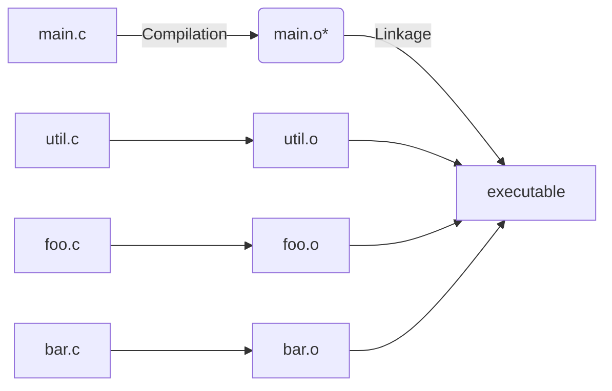
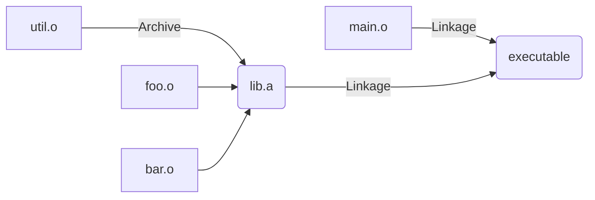
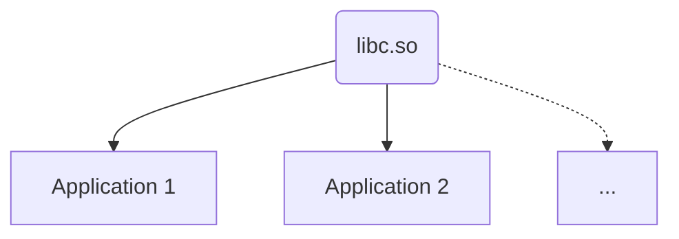
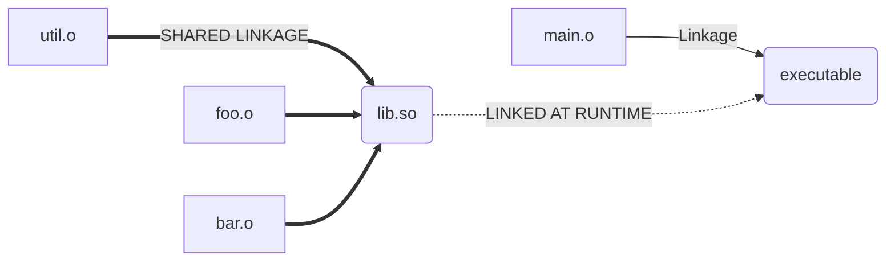
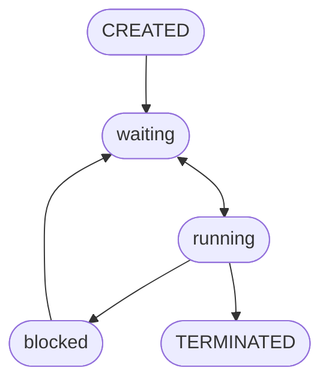
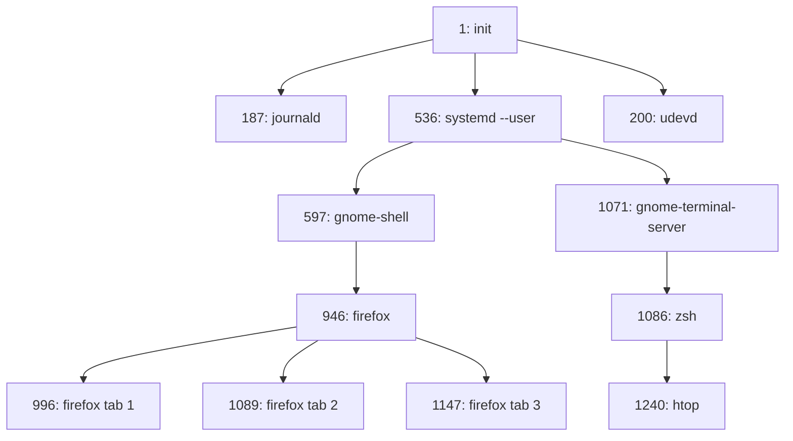

- [1. Why Operating Systems (2023-09-07)](#1-why-operating-systems-2023-09-07)
  - [1.1. Core Operating Systems Concepts:](#11-core-operating-systems-concepts)
  - [1.2. Code example](#12-code-example)
- [2. Kernels (2023-09-18)](#2-kernels-2023-09-18)
  - [2.1. Instruction Set Architecture (ISA)](#21-instruction-set-architecture-isa)
  - [2.2. Inter-Process Communication (IPC)](#22-inter-process-communication-ipc)
  - [2.3. Intro to System calls](#23-intro-to-system-calls)
    - [2.3.1. `write()`](#231-write)
    - [2.3.2. `exit_group()`](#232-exit_group)
    - [2.3.3. Standard File Descriptors](#233-standard-file-descriptors)
  - [2.4. API vs. ABI](#24-api-vs-abi)
    - [2.4.1. ABI Details to Execute OS "Functions"/System Calls](#241-abi-details-to-execute-os-functionssystem-calls)
    - [2.4.2. ELF File Format](#242-elf-file-format)
    - [2.4.3. How ELF Files Are Structured](#243-how-elf-files-are-structured)
  - [2.5. Kernel vs. User Mode](#25-kernel-vs-user-mode)
    - [2.5.1. System Calls](#251-system-calls)
    - [2.5.2. `strace`](#252-strace)
    - [2.5.3. Kernel as a Long Running Program](#253-kernel-as-a-long-running-program)
    - [2.5.4. Types of Kernels](#254-types-of-kernels)
  - [2.6. PRACTICE](#26-practice)
- [3. Libraries (2023-09-13)](#3-libraries-2023-09-13)
  - [3.1. Applications Use Libraries](#31-applications-use-libraries)
  - [3.2. How Libraries Are Used To Compile C Code](#32-how-libraries-are-used-to-compile-c-code)
    - [3.2.1. Compilation in C](#321-compilation-in-c)
    - [3.2.2. Static Libraries](#322-static-libraries)
      - [3.2.2.1. Static libraries included at LINK time](#3221-static-libraries-included-at-link-time)
    - [3.2.3. Dynamic Libraries](#323-dynamic-libraries)
      - [3.2.3.1. Dynamic libraries included at RUN time](#3231-dynamic-libraries-included-at-run-time)
      - [3.2.3.2. `>>> ldd <EXE>`](#3232--ldd-exe)
  - [3.3. Static vs. Dynamic Libraries](#33-static-vs-dynamic-libraries)
    - [3.3.1. HOW Dynamic Libraries Can Break Executables](#331-how-dynamic-libraries-can-break-executables)
      - [3.3.1.1. Dynamic Libraries \& Memory Leaks](#3311-dynamic-libraries--memory-leaks)
    - [3.3.2. How Semantic Versioning Reflects Dynamic Library Changes](#332-how-semantic-versioning-reflects-dynamic-library-changes)
  - [3.4. System Calls vs. C Standard Library Functions](#34-system-calls-vs-c-standard-library-functions)
    - [3.4.1. C `atexit` (vs. System call `exit()` / `exit_group()`)](#341-c-atexit-vs-system-call-exit--exit_group)
  - [3.5. PRACTICE:](#35-practice)
- [4. Process Creation (2023-09-15)](#4-process-creation-2023-09-15)
  - [4.1. Process Control Blocks (PCBs)](#41-process-control-blocks-pcbs)
  - [4.2. Process State Diagrams](#42-process-state-diagrams)
  - [4.3. Reading Process States via `/proc`](#43-reading-process-states-via-proc)
  - [4.4. Creating New Processes (via Cloning)](#44-creating-new-processes-via-cloning)
    - [4.4.1. `fork()`](#441-fork)
      - [4.4.1.1. `getpid()` \& `getppid()`](#4411-getpid--getppid)
      - [4.4.1.2. `fork()` Example](#4412-fork-example)
  - [4.5. PRACTICE](#45-practice)
- [5. Process Management (2023-09-16)](#5-process-management-2023-09-16)
  - [5.1. `execve()`](#51-execve)
    - [5.1.1. `execve()` Example](#511-execve-example)
  - [5.2. Process States](#52-process-states)
    - [5.2.1. Process/Kernel Startup via `init`](#521-processkernel-startup-via-init)
    - [5.2.2. Process Tree (Parent/Child Graph) Example](#522-process-tree-parentchild-graph-example)
    - [5.2.3. pid Logistics](#523-pid-logistics)
    - [5.2.4. Process Address Space](#524-process-address-space)
  - [5.3. Parent/Child `exit()`-ing](#53-parentchild-exit-ing)
    - [5.3.1. Calling `wait()` on Child Processes](#531-calling-wait-on-child-processes)
      - [5.3.1.1. `wait()` Example](#5311-wait-example)
    - [5.3.2. Zombie Process](#532-zombie-process)
      - [5.3.2.1. Zombie Example](#5321-zombie-example)
    - [5.3.3. Orphan Process](#533-orphan-process)
      - [Orphan Example](#orphan-example)
  - [PRACTICE](#practice)


<!--------------------------------{.gray}------------------------------>


<hr style="border:30px solid #FFFF; margin: 100px 0 100px 0; {.gray}"> </hr>


<!--------------------------------{.gray}------------------------------>

<div style="page-break-after: always;"></div>

# 1. Why Operating Systems (2023-09-07)

Pre-requisites:
- C programming and debugging
- Converting between bianry, hex, decimal
- Little-endian, big-endian
- Byte-addressable memory, memory address ala pointers

---

## 1.1. Core Operating Systems Concepts:
1. Virtualization -- share one resource by mimicking multiple independent copies
2. Concurrency -- handle multiple things happening at the same time
3. Persistence -- retain data consistency even w/o power

---


OS Abstractions:
- Program -- a file containing all instructions & data required to run
- Process -- an instance of running a program

---

Basic Requiremnts For A Process:
- Virtual Memory/Registers
  - Stack
  - Heap
    - process assumes it has access to all physical memory in the computer; actual memory management done by os
    - registers are independent from each other

> ---

***Q:*** the compiler needs to pick an address for each variable when compiling; what issues would be present with a global registry of addresses? {.lr}

***A:*** unsafe memory allocation/deletion ala programs read/writing each other's memory. {.lg} 

> ---

## 1.2. Code example


All example code from lectures is available at https://laforge.eecg.utoronto.ca/ece344/2023-fall/student/materials.

Code compilation example:
```cpp
cd lectures/01-why-operating-systems
meson setup build
meson compile -C build

// execute code
build/read-four-bytes <FILE>
```
Source: https://laforge.eecg.utoronto.ca/ece344/2023-fall/student/materials/-/blob/main/lectures/01-why-operating-systems/read-four-bytes.c?ref_type=heads


# 2. Kernels (2023-09-18)

## 2.1. Instruction Set Architecture (ISA)
Refers to machine code that a CPU understands. 

3 main ISAs in use today:
- `x86-64 / amd64` - desktops
- `aarch64 / arm64` - mobile
- `riscv / rv64gc` - open source ARM alternative

## 2.2. Inter-Process Communication (IPC)
- **IPC** -- mechanism that allows OS to transfer data between processes

- **File Descriptor** -- **not just a file**; a resource that users can either read bytes from or write bytes to; is identified by an index stored in a process
  - e.g. .txt file, ANY file, **terminal**

## 2.3. Intro to System calls

System calls are C functions that operate on/using the OS; [system calls](#system-calls) are the interface between [user & kernel mode](#kernel-mode-user-mode).

### 2.3.1. `write()`
```c
/**
 * Writes bytes from a buffer to a file descriptor.
 *
 * @param: fd - The file descriptor to write to.
 * @param: buf - A pointer to the start of the buffer.
 * @param: count - The number of bytes to write from the buffer.
 * 
 * @return: The number of bytes written, or -1 on error.
 */
ssize_t write(int fd, const void *buf, size_t count);
```

### 2.3.2. `exit_group()`
Exits the current process & sets an exit status code (0 status code = no errors; is why `main()` has `return 0`).
```c
/**
 * Terminates all threads in a process and exits with the specified status code.
 *
 * @param: status - The exit status code (0-255).
 * @return: This function does not return.
 */
void exit_group(int status);
```

### 2.3.3. Standard File Descriptors
- `0` (`stdin`) -- standard input (read)
- `1` (`stdout`) -- standard output (write)
- `2` (`stderr`) -- standard error (**write**{.b})

## 2.4. API vs. ABI
- API (Application PROGRAMMING Interface) -- abstracts process details, only describes arguments & return value of a function
- ABI (Application **BINARY** Interface) -- **specifies details**, including how to pass arguments (e.g. on stack) & where the return value is

### 2.4.1. ABI Details to Execute OS "Functions"/System Calls
OS "functions" (i.e. system call) do not have addresses; instead, to run a system call for the OS we need to generate an interrupt with a `svc` instruction **using registers for arguments** (instead of stack).
```c
// e.g.

// x8 - system call number
// x0 - 1st argument
// x1 - 2nd argument
// x2 - ...
```

### 2.4.2. ELF File Format
ELF (Executable & Linkable Format):
- Present in both executables & libraries
- Always starts with either:
  - 4 bytes: `0x7F 0x45 0x4C 0x46`, or
  - ASCII encoding: `DEL 'E' 'L' 'F'`

### 2.4.3. How ELF Files Are Structured
1. **File header** -- endianness, ISA, ABI, entry point
2. **Program header** -- what to load into memory & where
3. **Instructions**
4. **Data**

## 2.5. Kernel vs. User Mode

- **Kernel Mode** -- CPU privilege level that gives access to more instructions; limits what software can interact with hardware (e.g. only kernel can manage virtual memory for processes)


| **CPU MODE**         | **SOFTWARE**            | **PRIVILEGE LEVEL** |
| -------------------- | ----------------------- | ------------------- |
| U-mode (User)        | Applications, libraries | *Least privileged*  |
| S-mode (Supervisor) | Kernel                  | ↓                   |
| H-mode (Hypervisor)  | Virtual Machines        | ↓                   |
| M-mode (Machines)    | Bootloader, firmware    | *Most privileged*   |

### 2.5.1. System Calls

***Q:*** how do we execute software in kernel mode? {.lr}

***A:*** using system calls -- allow us to perform operations in kernel space by executing code in user space; is the only **interface between user space & kernel space in Linux**:
```bash
read write open close stat mmap brk pipe clone fork
execve exit wait4 chdir  mkdir rmdir creat mount
init_module delete_module clock_nanosleep exit_group
```

### 2.5.2. `strace`
Allows us to trace (i.e. see) all system calls a Linux process makes.
```c
// e.g. running strace on Hello world assembly program

// >>> strace ./hello-world-linux-aarch64
execve("./hello_world", ["./hello_world"], 0x7ffd0489de40 /* 46 vars */) = 0
write(1, "Hello world\n", 12)           = 12
exit_group(0)                           = ?
+++ exited with 0 +++
```
- Running `strace` on JS & Python processes shows more lines than C processes because those languages are less efficient & compile to larger files.

### 2.5.3. Kernel as a Long Running Program
- Kernel has no `main()`; instead, code (termed **modules**) is executed on-demand (e.g. new hardware, specific file access, manual loading)
- Kernel modules can execute privileged instructions & access kernel data (i.e. that might be inaccessible via [system calls](#system-calls))

### 2.5.4. Types of Kernels
- **Monolithic** -- runs **all** OS services in kernel mode; kernel codebase is large
- **Microkernel** -- runs **minimum amount** of OS services in kernel mode (minimizes security risk)
- **Hybrid** -- e.g. emulation service to user mode (Windows), device driver to user mode (macOS)

## 2.6. PRACTICE

> ---

***Q:*** what does the following function do? {.r} 
```c
void _start(void) {
  write(1, "Hello world\n", 12);
  exit_group(0);
}
```
***A:*** following line-by-line using the function characteristics of [`write()`](#write) & [`exit_group()`](#exit_group) ... {.lg}
* `write(1, ..., ...)` 
  * Write bytes to standard output file (file descriptor = 1)
* `write(..., "Hello world\n", ...)`
  * Buffer = address of start of byte array; a string in C is an array of characters & passed as the address to the first character, so this is valid
* `write(..., ..., 12)`
  * Number of bytes to write is 12
* `exit_group(0)`
  * Exit process with no errors (status code = 0)

> ---

***Q:*** what is the difference between strings in C and in the OS (e.g. in ELF files)? {.r}

***A:*** C convention requires null-ended (`\0`) strings; ELF strings have no restrictions. {.lg}

> ---


------------------------------{.gray}------------------------------>


<hr style="border:30px solid #FFFF; margin: 100px 0 100px 0; {.gray}"> </hr>


<!--------------------------------{.gray}------------------------------>
<div style="page-break-after: always;"></div>

# 3. Libraries (2023-09-13)
## 3.1. Applications Use Libraries
Applications may pass through multiple layers of libraries to function (e.g. GUI toolkit --> system daemon --> `libc`)
- an OS consists of a kernel + libraries (required for application)
  - e.g. Android & Debian both use the Linux kernel but have different applications (which necessitate different libraries, unless only simple terminal applications are used)
  - "Linux" distributions can be considered GNU/Linux because GNU distributes `libc` (standard C library) & common utilities

## 3.2. How Libraries Are Used To Compile C Code
### 3.2.1. Compilation in C

\*Object (`.o`) files are just [ELF files](#242-elf-file-format) with code for functions!

### 3.2.2. Static Libraries
Static libraries are what our custom C code can be compiled/archived to such that code can be repeatedly linked to an executable w/o requiring recompilation: 

#### 3.2.2.1. Static libraries included at LINK time


### 3.2.3. Dynamic Libraries
Are for reusable code, accessed via `.so` files; can be used by multiple applications by existing in a single memory location that's accessible to applications.
- e.g. `libc.so` (C standard library) is a dynamic library 



#### 3.2.3.1. Dynamic libraries included at RUN time



#### 3.2.3.2. `>>> ldd <EXE>`
Shows which dynamic libraries an executable uses.

## 3.3. Static vs. Dynamic Libraries

| Static Library {.p}                                               | Dynamic Library {.b}                                        |
| ------------------------------------------------------------ | ------------------------------------------------------ |
| Prevents reusing libraries (result in many duplicates) {.lr} | Library changes/bugs can break applications {.lr}      |
| Updates to static library requires recompilation {.lr}       | Dynamic libraries can allow for easier debugging {.lg} |

### 3.3.1. HOW Dynamic Libraries Can Break Executables
Dynamic library `struct`s are laid out in memory with fields mathching the declaration order (see code below); changes in the order of lines can result in changes to the return values of ABI functions (e.g. `get_x(struct ...)`, `get_y(struct ...)` as below).

_e.g._ 
1. consider a dynamic library with a `struct` with multiple fields corresponding to a specific data layout (e.g. C ABI); these fields are accessible by executables
2. If a dynamic library reorders the `struct`'s fields, any executables previously using the library is using the old offsets & is now wrong

```c
// v1
struct point {
  int x; // compiler ==> x->array[0]
  int y; // compiler ==> y->array[1]
}

// v2
struct point {
  int y; // compiler ==> x->array[1] | SWITCHED!
  int x; // compiler ==> y->array[0] | SWITCHED!
}
```

#### 3.3.1.1. Dynamic Libraries & Memory Leaks
Can be investigated using Valgrind & sanitizer tools built into Clang/gcc
- Sanitizers require recompilation via the `-Db_sanitize=address` flag to Meson
  ```bash
  >>> rm -rf build
  >>> meson setup build -Db_sanitize=address
  >>> meson compile -C build
  ```

***Q:*** why would dynamic libraries specifically experience memory bugs? {.lr}

> ***A:*** "The GNU C library, which is used by all programs,
  may allocate memory for its own uses. Usually it doesn't bother to free
  that memory when the program ends—there would be no point, since the Linux
  kernel reclaims all process resources when a process exits anyway, so it
  would just slow things down." {.lg}

### 3.3.2. How Semantic Versioning Reflects Dynamic Library Changes
Given version number `MAJOR.MINOR.PATCH`, increment the:
- MAJOR version when you make incompatible API/ABI changes
- MINOR version when you add functionality in a backwards-compatible manner
- PATCH version when you make backwards-compatible bug fixes

## 3.4. System Calls vs. C Standard Library Functions
Most system calls have corresponding function calls in C, but may:
- set `errno` (explains any error that might happen with the system call if not completed succesfully)
- Buffer reads & writes (i.e. reduce # of system calls; e.g. `printf()` is buffered until its last instance, at which point many `printf()`s may be written to terminal)
- Simplify ABI (e.g. combine 2 system calls)
- Add new features
- (i.e. are not one-to-one)

### 3.4.1. C `atexit` (vs. System call `exit()` / `exit_group()`)
C `atexit(...)` calls the function in its given arguments `(...)` on program exit.

## 3.5. PRACTICE:

***Q:*** why should `printf()` be in a dynamic library? {.lr}

> ***A:*** since it is used by multiple applications, it is more efficient to have one shared copy (dynamic library) instead of a separate library for each program (static library) {.lg}


------------------------------{.gray}------------------------------>


<hr style="border:30px solid #FFFF; margin: 100px 0 100px 0; {.gray}"> </hr>


<!--------------------------------{.gray}------------------------------>
<div style="page-break-after: always;"></div>

# 4. Process Creation (2023-09-15)
Recall: a process is an instance of a running program

| **// PROCESS \\\\** {.b}                    |
| -------------------------- |
| / VIRTUAL REGISTERS (MEMORY) \ {.p} |
| -- Stack {.g}                      |
| -- Heap {.g}|

## 4.1. Process Control Blocks (PCBs)

**PCB** -- keeps track of info regarding processes, including:
- Process state
- CPU registers
- Scheduling information
- Memory management information
- I/O status information
- Any other type of accounting information

## 4.2. Process State Diagrams



## 4.3. Reading Process States via `/proc`
`/proc` directory contains files representing kernel's state
- subdirectories that represent processes are named with a number (process id/pid)
- state of a process is represented within `/proc/<pid>/status` (inc. name, ppid, etc.)

## 4.4. Creating New Processes (via Cloning)
it is more efficient for the os to clone a currently running process than to create a new one.

this is done by pausing the currently running process & copying its [PCB](#process-control-blocks-pcbs) into a new child process.
- Cloning copies all information from the parent (e.g. variables; note that child variables are separate from the parent's); value of information can change starting during/after [`fork()`](#441-fork)

### 4.4.1. `fork()`
`int fork(void)` clones the current process in which it is run & returns a pid in **EACH PROCESS** (parent **AND** child):
- **`0` -- in child process**
- **`>0` -- in parent process**
  - `-1` -- on failure

#### 4.4.1.1. `getpid()` & `getppid()`
- `getpid()` -- returns pid of the current process
- `getppid()` -- returns pid of the current process's parent

#### 4.4.1.2. `fork()` Example
```c
int main(void) {

  pid_t returned_pid = fork();
  /* both parent & child have variable `returned_pid`,
     but with different values */

  if (retured_pid == -1) {
    int err = errno;
    perror("fork failed");
    return err;
  }

  if (returned_pid == 0) {
    printf("Child returned pid: %d\n", returned_pid);
    printf("Child pid: %d\n", getpid()); 
    printf("Child parent pid: %d\n", getppid());

  } else {
    printf("Parent returned pid: %d\n", returned_pid); 
    printf("Parent pid: %d\n", getpid()); 
    printf("Parent parent pid: %d\n", getppid()); 
  }

  return 0;
}
```
```console
Parent returned pid: 2341
Parent pid: 2340
Parent parent pid: 1600
Child returned pid: 0
Child pid: 2341
Child parent pid: 2340
```

## 4.5. PRACTICE


***Q:*** does parent always print before child in the [code example above](#4412-fork-example)? {.lr}

> ***A:*** no; the kernel decides when to run the parent or child process (e.g. could also run in parallel if with multiple cores, again depending on the kernel; i.e. is *non-deterministic*). {.lg}

---

***Q:*** are variables declared after a `fork()` only created in the parent process? {.lr}

> ***A:*** no; since the process is a duplicate, both the parent & child will run the same code before & after `fork()`-ing (including variable declarations after `fork()`). {.lg}
> - to have code specific to the parent or child process, we need to use conditional logic using either the [return value of `fork()`](#441-fork) or using [`getpid()`/`getppid()`](#4411-getpid--getppid).

---

***Q:*** if i `malloc()` before a `fork()`, how do we `free()` the allocated memory? {.lr}

> ***A:*** `malloc()`-ed memory can either be freed at the very end of the process OR in each conditional logic block for the parent & child process. {.lg}

--- 

***Q:*** given the code in the `fork()` example, how could we modify it to create a fork bomb? {.lr}

> ***A:*** calling `fork()` again in either the parent or child conditional code block will cause `fork()` to be called recursively infinitely. {.lg}

---


------------------------------{.gray}------------------------------>


<hr style="border:30px solid #FFFF; margin: 100px 0 100px 0; {.gray}"> </hr>


<!--------------------------------{.gray}------------------------------>
<div style="page-break-after: always;"></div>

# 5. Process Management (2023-09-16)
## 5.1. `execve()`
Replaces the current process with a process indicated by a given filepath:
- `pathname`: Full path of the program to load
- `argv`: Array of strings (array of characters), terminated by a null pointer
  - Represents arguments to the process
- `envp`: Same as `argv`
  - Represents the environment of the process
- Returns an error on failure, does not return if successful

### 5.1.1. `execve()` Example

```c
int main(int argc, char *argv[]) {
  printf("This process going to become another process\n");

  // `execve()` arguments; replace current process with `ls`
  char *exec_argv[] = {"ls", NULL};
  char *exec_envp[] = {NULL};

  int exec_return = execve("/usr/bin/ls", exec_argv, exec_envp);

  if (exec_return == -1) {
    exec_return = errno;
    perror("execve failed");
    return exec_return;
  }

  printf("If execve worked, this will never print\n");
  return 0;
}
```

***Q:*** why is the item at index 0 of the `argv` array argument to `execve()` the same name as the process/executable? {.lr}

> ***A:*** because the item at index 0 is used as the executable name in many programs (e.g. you can call `ls` something else after providing `char *exec_argv[] = {"SOMETHING ELSE", "--help", NULL};`) {.lg}

## 5.2. Process States
Recall that you can look at a process' state by reading the state value from `/proc/<PID>/status` (e.g. via `/proc/<PID>/status| grep State`).

Linux processes can have 1 of 5 possible states:
- R: Running\* and runnable [Running and Waiting]
- S: Interruptible sleep [Blocked]
- D: Uninterruptible sleep [Blocked]
- T: Stopped
- Z: Zombie

\*running processes can be explicitly stopped & resumed by other processes

### 5.2.1. Process/Kernel Startup via `init`
After the kernel starts running/initializes, it creates a single process called `init` via `/sbin/init`, which:
- Is responsible for executing every other process on the machine
- Must always be active (if it exists, kernel shuts down)
- Is `systemd` in Linux

### 5.2.2. Process Tree (Parent/Child Graph) Example
Can be viewed via `htop`



### 5.2.3. pid Logistics
pids are unique for every **active** process (i.e. pids are reused after a process dies)
- pid max value is 32768
- pid value 0 is reserved (invalid)

### 5.2.4. Process Address Space
Each process has an independent view of memory (i.e. virtual memory that maps to physical memory by the kernel).

## 5.3. Parent/Child `exit()`-ing
The OS sets the exit status when a process terminates by calling `exit()`. 

A parent needs to read a child process' exit status before the child process can fully exit. 
- This exit status **must** be acknowledged for a child process exit (otherwise waste of resources since process exits but doesn't execute anything after termination). 

There are 2 possibilities for the order of exits:
- child exists first ([**zombie** process](#532-zombie-process))
- parent exists first ([**orphan** process](#533-orphan-process))

### 5.3.1. Calling `wait()` on Child Processes
To allow the parent process to read the child's exit code, we use `wait()`:
- `status` argument: address to store wait status of child process
- returns: pid of child process (with a change\*), or...
  - -1: on failure
  - 0: for non-blocking calls with no child changes\*

\**non-blocking, meaning that it returns immediately instead of waiting for a child process to exit or change state. If there are no child processes that have exited or changed state, wait returns 0 to indicate that there was no change.*

#### 5.3.1.1. `wait()` Example
Here the code **blocks** until the child process exits.
```c
int main(void) {
  // create child process
  pid_t pid = fork();
  if (pid == -1) {
    return errno;
  }
  
  // do nothing in parent
  if (pid == 0) {
    sleep(2);

  // call `wait` in child to exit process
  }  else {
    printf("Calling wait\n");
    int wstatus;

    // store return value of `wait` in `int wstatus`
    // if no failure, `wait` will return child pid
    pid_t wait_pid = wait(&wstatus);

    // do something on successful child process exit via `wait`
    if (WIFEXITED(wstatus)) {
      // `wait_pid` is return value of `wait()`; child pid since it was successful
      // `WEXITSTATUS(wstatus)` is 0 to indicate non-blocking
      printf("Wait returned for an exited process! pid: %d, status: %d\n", wait_pid, WEXITSTATUS(wstatus));
    }
    else {
      return ECHILD;
    }
  }

  return 0;
}
```

### 5.3.2. Zombie Process
If a process is terminated but hasn't been acknowledged (i.e. had exit status read) by a parent (e.g. due to a bug where child exit process is never read), the OS can *softly interrupt* the parent process via an ignore-able signal (a type [IPC](#22-inter-process-communication-ipc)).

- If parent ignores child termination as above, zombie process can be re-parented
- OS must keep zombie processes until ackowledgement (**meaning [PCB](#41-process-control-blocks-pcbs) of child process remains until acknowledgement**)

#### 5.3.2.1. Zombie Example
```c
int main(void) {
  // fork...

  if (pid == 0) {
    sleep(5);

  } else {
    sleep(1);
    printf("Child process state: %s", print_state(pid));

    sleep(10);
    printf("Child process state: %s", print_state(pid));
  }

  // ...
}
```
```
Child process state: S (sleeping)
Child process state: Z (zombie)
```

### 5.3.3. Orphan Process
If a parent exits before a child process, the OS re-parents the child process to `init` so that the child's exit can be acknowledged by a process.

#### Orphan Example
```c
int main(void) {
  // fork...

  if (pid == 0) {
    // parent process still running
    printf("Child parent pid: %d\n", getppid());
    sleep(5);

    // child re-parented to `init`
    // bc parent has exited by now
    printf("Child parent pid (after sleep): %d\n", getppid());
    
  } else {
    // parent exits before child
    // bc parent sleeps for less time than child
    sleep(1);
  }

  // ...
}
```
```console
Child parent pid: 58061
Child parent pid (after sleep): 1
```

## PRACTICE 

***Q:*** how can zombie (child) processes be acknowledged? {.lr}

> ***A:*** after the zombie's parent dies, the zombie becomes an orphan process & gets re-parented to `init` which can then acknowledge & fully exit it. {.lg}

---

***Q:*** if the parent of a parent process (i.e. grandparent process) terminates, do the child processes become orphans? {.lr}

> ***A:*** no; parent-child process relationship is independent so the parent's parent or the child's child has no impact on whether the child to the parent becomes a zombie or orphan process. {.lg}