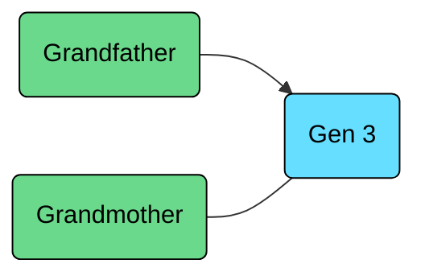

- [2023-09-07 | 1. Why Operating Systems](#2023-09-07--1-why-operating-systems)
  - [Core Operating Systems Concepts:](#core-operating-systems-concepts)
  - [Code example](#code-example)
  - [1.1. course Topics](#11-course-topics)
- [2. Intro to C++](#2-intro-to-c)
  - [2.1. Types](#21-types)


<!--------------------------------{.gray}------------------------------>


<hr style="border:30px solid #FFFF; margin: 100px 0 100px 0; {.gray}"> </hr>


<!--------------------------------{.gray}------------------------------>

<div style="page-break-after: always;"></div>

# 2023-09-07 | 1. Why Operating Systems

Pre-requisites:
- C programming and debugging
- Converting between bianry, hex, decimal
- Little-endian, big-endian
- Byte-addressable memory, memory address ala pointers

---

## Core Operating Systems Concepts:
1. Virtualization -- share one resource by mimicking multiple independent copies
2. Concurrency -- handle multiple things happening at the same time
3. Persistence -- retain data consistency even w/o power

---


OS Abstractions:
- Program -- a file containing all instructions & data required to run
- Process -- an instance of running a program

---

Basic Requiremnts For A Process:
- Virtual Memory/Registers
  - Stack
  - Heap
    - process assumes it has access to all physical memory in the computer; actual memory management done by os
    - registers are independent from each other

> ---

***Q:*** the compiler needs to pick an address for each variable when compiling; what issues would be present with a global registry of addresses? {.lr}

***A:*** unsafe memory allocation/deletion ala programs read/writing each other's memory. {.lg} 

> ---

## Code example


All example code from lectures is available at https://laforge.eecg.utoronto.ca/ece344/2023-fall/student/materials.

Code compilation example:
```cpp
cd lectures/01-why-operating-systems
meson setup build
meson compile -C build

// execute code
build/read-four-bytes <FILE>
```
Source: https://laforge.eecg.utoronto.ca/ece344/2023-fall/student/materials/-/blob/main/lectures/01-why-operating-systems/read-four-bytes.c?ref_type=heads


## 1.1. course Topics

C
- Pointers
- Compilation

C++ OO Features
- Class & Objects
- Inheritance
- Templates

$$
\left( \sum_{k=1}^n a_k b_k \right)^2 \leq \left( \sum_{k=1}^n a_k^2 \right) \left( \sum_{k=1}^n b_k^2 \right)
$$

```math
\left( \sum_{k=1}^n a_k b_k \right)^2 \leq \left( \sum_{k=1}^n a_k^2 \right) \left( \sum_{k=1}^n b_k^2 \right)
```



Problem Solving
- Data Structures: Linked List, Trees, Graphs, Etc.
- Recursion
- Exception Handling
- Complexity Analysis

<!--------------------------------{.gray}------------------------------>


<hr style="border:30px solid #FFFF; margin: 100px 0 100px 0; {.gray}"> </hr>


<!--------------------------------{.gray}------------------------------>
<div style="page-break-after: always;"></div>


# 2. Intro to C++
## 2.1. Types

integers -- signed (default) or unsigned (- 1 bit)
- int32 bits
- short 16 bits
- long int (>=32 bits)

real
- float
- double
- long double

text
- char (1 byte) -- 'a'
- NOT string -- "ab" {.lr}

logic
- bool

void