- [1. Why Operating Systems (2023-09-07)](#1-why-operating-systems-2023-09-07)
  - [1.1. Core Operating Systems Concepts:](#11-core-operating-systems-concepts)
  - [1.2. Code example](#12-code-example)
- [2. Kernels (2023-09-18)](#2-kernels-2023-09-18)
  - [2.1. Instruction Set Architecture (ISA)](#21-instruction-set-architecture-isa)
  - [2.2. Inter-Process Communication (IPC)](#22-inter-process-communication-ipc)
  - [2.3. Intro to System calls](#23-intro-to-system-calls)
    - [2.3.1. `write()`](#231-write)
    - [2.3.2. `exit_group()`](#232-exit_group)
    - [2.3.3. Standard File Descriptors](#233-standard-file-descriptors)
  - [2.4. API vs. ABI](#24-api-vs-abi)
    - [2.4.1. ABI Details to Execute OS "Functions"/System Calls](#241-abi-details-to-execute-os-functionssystem-calls)
    - [2.4.2. ELF File Format](#242-elf-file-format)
    - [2.4.3. How ELF Files Are Structured](#243-how-elf-files-are-structured)
  - [2.5. Kernel vs. User Mode](#25-kernel-vs-user-mode)
    - [2.5.1. System Calls](#251-system-calls)
    - [2.5.2. `strace`](#252-strace)
    - [2.5.3. Kernel as a Long Running Program](#253-kernel-as-a-long-running-program)
    - [2.5.4. Types of Kernels](#254-types-of-kernels)
  - [2.6. SUMMARY](#26-summary)
  - [2.7. PRACTICE](#27-practice)
- [3. Libraries (2023-09-13)](#3-libraries-2023-09-13)
  - [3.1. Applications Use Libraries](#31-applications-use-libraries)
  - [3.2. How Libraries Are Used To Compile C Code](#32-how-libraries-are-used-to-compile-c-code)
    - [3.2.1. Compilation in C](#321-compilation-in-c)
    - [3.2.2. Static Libraries](#322-static-libraries)
      - [3.2.2.1. Static libraries included at LINK time](#3221-static-libraries-included-at-link-time)
    - [3.2.3. Dynamic Libraries](#323-dynamic-libraries)
      - [3.2.3.1. Dynamic libraries included at RUN time](#3231-dynamic-libraries-included-at-run-time)
      - [3.2.3.2. `>>> ldd <EXE>`](#3232--ldd-exe)
  - [3.3. Static vs. Dynamic Libraries](#33-static-vs-dynamic-libraries)
    - [3.3.1. HOW Dynamic Libraries Can Break Executables](#331-how-dynamic-libraries-can-break-executables)
      - [3.3.1.1. Dynamic Libraries \& Memory Leaks](#3311-dynamic-libraries--memory-leaks)
    - [3.3.2. How Semantic Versioning Reflects Dynamic Library Changes](#332-how-semantic-versioning-reflects-dynamic-library-changes)
  - [3.4. System Calls vs. C Standard Library Functions](#34-system-calls-vs-c-standard-library-functions)
    - [3.4.1. C `atexit` (vs. System call `exit()` / `exit_group()`)](#341-c-atexit-vs-system-call-exit--exit_group)
  - [3.5. SUMMARY](#35-summary)
  - [3.6. PRACTICE:](#36-practice)
- [4. Process Creation (2023-09-15)](#4-process-creation-2023-09-15)
  - [4.1. Process Control Blocks (PCBs)](#41-process-control-blocks-pcbs)
  - [4.2. Process State Diagrams](#42-process-state-diagrams)
  - [4.3. Reading Process States via `/proc`](#43-reading-process-states-via-proc)
  - [4.4. Creating New Processes (via Cloning)](#44-creating-new-processes-via-cloning)
    - [4.4.1. `fork()`](#441-fork)
      - [4.4.1.1. `getpid()` \& `getppid()`](#4411-getpid--getppid)
      - [4.4.1.2. `fork()` Example](#4412-fork-example)
  - [4.5. SUMMARY](#45-summary)
  - [4.6. PRACTICE](#46-practice)
- [5. Process Management (2023-09-16)](#5-process-management-2023-09-16)
  - [5.1. `execve()`](#51-execve)
    - [5.1.1. `execve()` Example](#511-execve-example)
  - [5.2. Process States](#52-process-states)
    - [5.2.1. Process/Kernel Startup via `init`](#521-processkernel-startup-via-init)
    - [5.2.2. Process Tree (Parent/Child Graph) Example](#522-process-tree-parentchild-graph-example)
    - [5.2.3. pid Logistics](#523-pid-logistics)
    - [5.2.4. Process Address Space](#524-process-address-space)
  - [5.3. Parent/Child `exit()`-ing](#53-parentchild-exit-ing)
    - [5.3.1. Calling `wait()` on Child Processes](#531-calling-wait-on-child-processes)
      - [5.3.1.1. `wait()` Example](#5311-wait-example)
    - [5.3.2. Zombie Process](#532-zombie-process)
      - [5.3.2.1. Zombie Example](#5321-zombie-example)
    - [5.3.3. Orphan Process](#533-orphan-process)
      - [5.3.3.1. Orphan Example](#5331-orphan-example)
  - [5.4. SUMMARY](#54-summary)
  - [5.5. PRACTICE](#55-practice)
- [6. Basic IPC (2023-09-19)](#6-basic-ipc-2023-09-19)
  - [6.1. Reading/Writing to Files/Standard-(In/Out)](#61-readingwriting-to-filesstandard-inout)
    - [6.1.1. `cat` Terminal Example (echo input)](#611-cat-terminal-example-echo-input)
    - [6.1.2. `cat` File Example (read file)](#612-cat-file-example-read-file)
  - [6.2. Redirecting Standard File Descriptors Using The Shell (`<`, `>`, `|`)](#62-redirecting-standard-file-descriptors-using-the-shell---)
  - [6.3. Signals](#63-signals)
    - [6.3.1. `sigaction()`](#631-sigaction)
      - [6.3.1.1. Common Signal Numbers (in Linux)](#6311-common-signal-numbers-in-linux)
    - [6.3.2. How Signal Handlers Work](#632-how-signal-handlers-work)
      - [6.3.2.1. `sigaction()` Example 1](#6321-sigaction-example-1)
      - [6.3.2.2. `sigaction()` Example 2 (`read()` Error Handling)](#6322-sigaction-example-2-read-error-handling)
    - [6.3.3. Sending Signals via `kill` in the Terminal](#633-sending-signals-via-kill-in-the-terminal)
    - [6.3.4. `pidof`](#634-pidof)
  - [6.4. Non-blocking Calls](#64-non-blocking-calls)
    - [6.4.1. Blocking vs. Non-blocking Calls](#641-blocking-vs-non-blocking-calls)
    - [6.4.2. `waitpid()` vs. `wait()`](#642-waitpid-vs-wait)
    - [6.4.3. Polling](#643-polling)
    - [6.4.4. Using Interrupt Handlers](#644-using-interrupt-handlers)
      - [6.4.4.1. Interrupt Handlers Run to Completion](#6441-interrupt-handlers-run-to-completion)
      - [6.4.4.2. 3 Terms for "Interrupts" on RISC-V CPUs](#6442-3-terms-for-interrupts-on-risc-v-cpus)
  - [6.5. PRACTICE](#65-practice)
- [7. Process Practice (2023-09-21)](#7-process-practice-2023-09-21)
  - [7.1. Multiprogramming](#71-multiprogramming)
    - [7.1.1. Scheduler](#711-scheduler)
    - [7.1.2. How Switching/Swapping Processes Works (via Core Scheduling Loop)](#712-how-switchingswapping-processes-works-via-core-scheduling-loop)
    - [7.1.3. COOPERATIVE vs. TRUE Multitasking](#713-cooperative-vs-true-multitasking)
    - [7.1.4. Context Switching = Swapping Processes](#714-context-switching--swapping-processes)
  - [7.2. `pipe()`](#72-pipe)
    - [7.2.1. `pipe()` Example](#721-pipe-example)
  - [7.3. Using `&` in Shell](#73-using--in-shell)
  - [7.4. PRACTICE](#74-practice)
    - [7.4.1. 2022 Final Q2](#741-2022-final-q2)
- [8. Subprocess (2023-09-22)](#8-subprocess-2023-09-22)
  - [8.1. Lab 2 Goals](#81-lab-2-goals)
  - [8.2. Easier to Use C APIs](#82-easier-to-use-c-apis)
    - [8.2.1. `execlp()`](#821-execlp)
    - [8.2.2. `dup()` \& `dup2()`](#822-dup--dup2)
  - [8.3. Subprocess Example](#83-subprocess-example)
    - [8.3.1. Skeleton](#831-skeleton)
    - [8.3.2. Tasks To Do](#832-tasks-to-do)
    - [8.3.3. Completed Code](#833-completed-code)
      - [8.3.3.1. Visualization of Pipes](#8331-visualization-of-pipes)
- [9. Basic Scheduling (2023-09-27)](#9-basic-scheduling-2023-09-27)
  - [9.1. PREEMPTIBLE vs. NON-PREEMPTIBLE Resources](#91-preemptible-vs-non-preemptible-resources)
  - [9.2. Dispatcher \& Scheduler](#92-dispatcher--scheduler)
  - [9.3. Basic Scheduling DETAILS](#93-basic-scheduling-details)
    - [9.3.1. scheduler runs whenever a process changes state](#931-scheduler-runs-whenever-a-process-changes-state)
    - [9.3.2. Scheduler Goals](#932-scheduler-goals)
  - [9.4. Basic Scheduling TECHNIQUES](#94-basic-scheduling-techniques)
    - [9.4.1. FCFS (First Come First Served) / FIFO](#941-fcfs-first-come-first-served--fifo)
    - [9.4.2. SJF (Shortest Job First)](#942-sjf-shortest-job-first)
      - [9.4.2.1. Tradeoffs with SJF](#9421-tradeoffs-with-sjf)
    - [9.4.3. SRTF (Shortest Remaining Time First)](#943-srtf-shortest-remaining-time-first)
      - [9.4.3.1. Tradeoffs with SRTF](#9431-tradeoffs-with-srtf)
    - [9.4.4. (RR) Round-Robin](#944-rr-round-robin)
      - [9.4.4.1. Tradeoffs with RR](#9441-tradeoffs-with-rr)
  - [9.5. SUMMARY](#95-summary)
  - [9.6. PRACTICE](#96-practice)
- [10. Advanced Scheduling (2023-09-28)](#10-advanced-scheduling-2023-09-28)
  - [10.1. Prioritizing Special Processes](#101-prioritizing-special-processes)
    - [10.1.1. Mapping Priority to Integers](#1011-mapping-priority-to-integers)
    - [10.1.2. Preventing Starvation via Dynamic Priority Changes](#1012-preventing-starvation-via-dynamic-priority-changes)
    - [10.1.3. Priority Inheritance (ala Priority Inversion)](#1013-priority-inheritance-ala-priority-inversion)
  - [10.2. Scheduling FOREGROUND vs. BACKGROUND Processes](#102-scheduling-foreground-vs-background-processes)
    - [10.2.1. How to Prioritize FOREGROUND vs. BACKGROUND Processes](#1021-how-to-prioritize-foreground-vs-background-processes)
  - [10.3. Multiprocessor Scheduling](#103-multiprocessor-scheduling)
    - [10.3.1. Symmetric Multiprocessing (SMP) Setup for CPUs](#1031-symmetric-multiprocessing-smp-setup-for-cpus)
    - [10.3.2. Global (Single) CPU Schedulers](#1032-global-single-cpu-schedulers)
    - [10.3.3. Per-CPU Schedulers](#1033-per-cpu-schedulers)
    - [10.3.4. Compromise Between Global \& Per-CPU Schedulers](#1034-compromise-between-global--per-cpu-schedulers)
    - [10.3.5. Gang/Co-Scheduling](#1035-gangco-scheduling)
    - [10.3.6. Real-time Scheduling](#1036-real-time-scheduling)
      - [10.3.6.1. Scheduling in Linux (Digress)](#10361-scheduling-in-linux-digress)
      - [10.3.6.2. Mapping Soft Real-time Priority to Integers](#10362-mapping-soft-real-time-priority-to-integers)
    - [10.3.7. How Linux Priority Unifies Soft Real-time \& Normal Processes](#1037-how-linux-priority-unifies-soft-real-time--normal-processes)
  - [10.4. IFS (Ideal Fair Scheduling)](#104-ifs-ideal-fair-scheduling)
  - [10.5. CFS (Completely Fair Scheduler)](#105-cfs-completely-fair-scheduler)
    - [10.5.1. CFS Implemented via Red-Black Trees](#1051-cfs-implemented-via-red-black-trees)
      - [10.5.1.1. Red-Black Tree Refresher](#10511-red-black-tree-refresher)
  - [10.6. SUMMARY](#106-summary)
- [11. Virtual Memory (2023-10-03)](#11-virtual-memory-2023-10-03)
  - [11.1. Virtual Memory Requirements](#111-virtual-memory-requirements)
    - [11.1.1. Recall memory is byte addressable](#1111-recall-memory-is-byte-addressable)
  - [11.2. Segmentation/Segments are Coarse Grained](#112-segmentationsegments-are-coarse-grained)
    - [11.2.1. Segmentation Details](#1121-segmentation-details)
  - [11.3. First Insight: Divide Memory into Fixed-Sized Chunks](#113-first-insight-divide-memory-into-fixed-sized-chunks)
  - [11.4. Memory Management Unit (MMU)](#114-memory-management-unit-mmu)
  - [11.5. Why Not To Use All 64 Virtual Address Bits](#115-why-not-to-use-all-64-virtual-address-bits)
    - [11.5.1. VPN (Virtual Page Number) \& PPN (Physical Page Number)](#1151-vpn-virtual-page-number--ppn-physical-page-number)
  - [11.6. Page Table](#116-page-table)
    - [11.6.1. Page Table Entry (PTE)](#1161-page-table-entry-pte)
  - [11.7. PRACTICE](#117-practice)
  - [11.8. Each Process Gets Its Own Page Table](#118-each-process-gets-its-own-page-table)
    - [11.8.1. `vfork()`](#1181-vfork)
  - [11.9. Using Pages for Memory Translation](#119-using-pages-for-memory-translation)
- [12. Page Tables (2023-10-05)](#12-page-tables-2023-10-05)
  - [12.1. Reducing Page Table Memory Wastage](#121-reducing-page-table-memory-wastage)
    - [12.1.1. Fit Page Table on a Page](#1211-fit-page-table-on-a-page)
    - [12.1.2. Multi-Level Page Tables (Save Space for Sparse Allocations)](#1212-multi-level-page-tables-save-space-for-sparse-allocations)
  - [12.2. Page Allocation (Uses a Free List)](#122-page-allocation-uses-a-free-list)
    - [12.2.1. TODO: ADD MERMAID DIAGRAM OF FREE LIST](#1221-todo-add-mermaid-diagram-of-free-list)
    - [12.2.2. Page Allocation USING A PAGE FOR EACH SMALLER PAGE TABLE](#1222-page-allocation-using-a-page-for-each-smaller-page-table)
    - [12.2.3. ANALOGY: Smaller Page Tables \<==\> Arrays](#1223-analogy-smaller-page-tables--arrays)
  - [12.3. PRACTICE](#123-practice)
    - [12.3.1. TODO: REFORMAT AS QUESTION OF HOW MUCH SPACE IS SAVED IF WE USING 2-LEVEL VS. SINGLE-LEVEL PAGE TABLE](#1231-todo-reformat-as-question-of-how-much-space-is-saved-if-we-using-2-level-vs-single-level-page-table)
    - [12.3.2. Translating `3FFFF008` with 2 Page Tables](#1232-translating-3ffff008-with-2-page-tables)
  - [12.4. EXAMPLE CODE IMPLEMENTATION](#124-example-code-implementation)
- [13. Page Table Implementation (2023-10-06)](#13-page-table-implementation-2023-10-06)
  - [13.1. ALIGNMENT: Memory Eventually Lines Up With Byte 0](#131-alignment-memory-eventually-lines-up-with-byte-0)
  - [13.2. PRACTICE: How Many Page Tables Do We Need?](#132-practice-how-many-page-tables-do-we-need)
  - [13.3. PRACTICE: How Many Levels Do I Need?](#133-practice-how-many-levels-do-i-need)
  - [13.4. Speeding Up Page Table Implementation via Caching](#134-speeding-up-page-table-implementation-via-caching)
    - [13.4.1. Using the Page Tables for Every Memory Access is Slow](#1341-using-the-page-tables-for-every-memory-access-is-slow)
    - [13.4.2. Translation Look-Aside Buffer (TLB)](#1342-translation-look-aside-buffer-tlb)
      - [13.4.2.1. Effective Access Time (EAT)](#13421-effective-access-time-eat)
      - [13.4.2.2. Context Switches Require Handling the TLB](#13422-context-switches-require-handling-the-tlb)
    - [13.4.3. `test-tlb.c` Results](#1343-test-tlbc-results)
  - [13.5. Using `sbrk()` for Userspace Allocation](#135-using-sbrk-for-userspace-allocation)
  - [13.6. Kernel Initializes the Process' Address Space](#136-kernel-initializes-the-process-address-space)
  - [13.7. Kernel Can Provide Fixed Virtual Addresses](#137-kernel-can-provide-fixed-virtual-addresses)
    - [13.7.1. Page Faults Allow the Operating System to Handle Virtual Memory](#1371-page-faults-allow-the-operating-system-to-handle-virtual-memory)
  - [13.8. SUMMARY](#138-summary)
- [14. Priority Scheduling and Memory Mapping (2023-10-10)](#14-priority-scheduling-and-memory-mapping-2023-10-10)
  - [14.1. Dynamic Priority (Feedback) Scheduling](#141-dynamic-priority-feedback-scheduling)
    - [14.1.1. Dynamic Priority Calculations](#1411-dynamic-priority-calculations)
      - [14.1.1.1. Priority Interval](#14111-priority-interval)
    - [14.1.2. PRACTICE](#1412-practice)
  - [14.2. Memory Mapping (NOT TESTABLE)](#142-memory-mapping-not-testable)
    - [14.2.1. `mmap`](#1421-mmap)
  - [14.3. `mmap` Example](#143-mmap-example)
    - [14.3.1. Why `mmap` Is More Efficient](#1431-why-mmap-is-more-efficient)
    - [14.3.2. `mmap` Details](#1432-mmap-details)
    - [14.3.3. `mmap` Page Table Calculations](#1433-mmap-page-table-calculations)
- [15. Sockets (2023-10-12)](#15-sockets-2023-10-12)
  - [15.1. Sockets = IPC Between Machines](#151-sockets--ipc-between-machines)
  - [15.2. Socket System Calls](#152-socket-system-calls)
    - [15.2.1. SERVER vs. CLIENT Socket System Calls](#1521-server-vs-client-socket-system-calls)
      - [15.2.1.1. System Calls to Use Sockets on SERVERS](#15211-system-calls-to-use-sockets-on-servers)
      - [15.2.1.2. System Calls to Use Sockets on CLIENTS](#15212-system-calls-to-use-sockets-on-clients)
    - [15.2.2. `socket` (Sets the Protocol and Type of Socket)](#1522-socket-sets-the-protocol-and-type-of-socket)
      - [15.2.2.1. Socket Protocols](#15221-socket-protocols)
        - [15.2.2.1.1. Stream Sockets Use TCP](#152211-stream-sockets-use-tcp)
        - [15.2.2.1.2. Datagram Sockets Use UDP](#152212-datagram-sockets-use-udp)
    - [15.2.3. `bind` (Sets a Socket to an Address)](#1523-bind-sets-a-socket-to-an-address)
    - [15.2.4. `listen` (Sets Queue Limits for Incoming Connections)](#1524-listen-sets-queue-limits-for-incoming-connections)
    - [15.2.5. `accept` (Blocks Until There's a Connection)](#1525-accept-blocks-until-theres-a-connection)
    - [15.2.6. `connect` (Allows a Client to Connect to an Address)](#1526-connect-allows-a-client-to-connect-to-an-address)
    - [15.2.7. `send`/`recv` (Instead Of `read`/`write`)](#1527-sendrecv-instead-of-readwrite)
  - [15.3. Server Example](#153-server-example)
  - [15.4. Why Use Sockets?](#154-why-use-sockets)
  - [15.5. SUMMARY](#155-summary)
- [16. Threads (2023-10-13)](#16-threads-2023-10-13)
  - [16.1. CONCURRENCY vs. PARALLELISM](#161-concurrency-vs-parallelism)
  - [16.2. THREADS vs. (FORKED) PROCESSES](#162-threads-vs-forked-processes)
    - [16.2.1. Threads as Processes With Shared Memory](#1621-threads-as-processes-with-shared-memory)
      - [16.2.1.1. Memory Diagram of a Process With Multiple Threads](#16211-memory-diagram-of-a-process-with-multiple-threads)
    - [16.2.2. Each Process Can Have Multiple Threads](#1622-each-process-can-have-multiple-threads)
    - [16.2.3. Thread Concurrency Using A Single CPU](#1623-thread-concurrency-using-a-single-cpu)
    - [16.2.4. Summary of THREADS vs. PROCESSES](#1624-summary-of-threads-vs-processes)
  - [16.3. Using Threads in C via `pthread`](#163-using-threads-in-c-via-pthread)
    - [16.3.1. `pthread_create`](#1631-pthread_create)
      - [16.3.1.1. `pthread` Example](#16311-pthread-example)
    - [16.3.2. `pthread_join`](#1632-pthread_join)
      - [16.3.2.1. PRACTICE](#16321-practice)
    - [16.3.3. `pthread_exit`](#1633-pthread_exit)
  - [16.4. DETACHED Threads](#164-detached-threads)
    - [16.4.1. `pthread_detach`](#1641-pthread_detach)
      - [16.4.1.1. `pthread_attr_setdetachstate`](#16411-pthread_attr_setdetachstate)
    - [16.4.2. PRACTICE](#1642-practice)
  - [16.5. Using ATTRIBUTES To Get/Set Thread Variables](#165-using-attributes-to-getset-thread-variables)
  - [16.6. Multiple Threads Example](#166-multiple-threads-example)
  - [16.7. SUMMARY](#167-summary)
- [17. Threads Implementation (2023-10-17)](#17-threads-implementation-2023-10-17)
  - [17.1. USER vs. KERNEL Level Threads (WHERE do we implement threads?)](#171-user-vs-kernel-level-threads-where-do-we-implement-threads)
  - [17.2. Thread Support Requires a Thread Table](#172-thread-support-requires-a-thread-table)
  - [17.3. Threading Libraries](#173-threading-libraries)
    - [17.3.1. User-\>Kernel Thread MAPPING IMPLEMENTATIONS](#1731-user-kernel-thread-mapping-implementations)
      - [17.3.1.1. MANY-TO-ONE User-Kernel Threads](#17311-many-to-one-user-kernel-threads)
      - [17.3.1.2. ONE-TO-ONE User-Kernel Threads](#17312-one-to-one-user-kernel-threads)
      - [17.3.1.3. MANY-TO-MANY User-Kernel Threads](#17313-many-to-many-user-kernel-threads)
  - [17.4. Thread Details](#174-thread-details)
    - [17.4.1. `fork()`-ing With Threads](#1741-fork-ing-with-threads)
    - [17.4.2. Signals Sent to a Process With Multiple Threads](#1742-signals-sent-to-a-process-with-multiple-threads)
    - [17.4.3. Thread Pools](#1743-thread-pools)
  - [17.5. Lab 4 Overview **(END OF MIDTERM CONTENT)**](#175-lab-4-overview-end-of-midterm-content)
    - [17.5.1. Many-To-One State Diagram](#1751-many-to-one-state-diagram)
    - [17.5.2. Scheduling](#1752-scheduling)
  - [17.6. Thread Races](#176-thread-races)
  - [17.7. SUMMARY](#177-summary)
- [18. Lab 4 Helper Libraries: `ucontext` \& `TAILQ` (2023-10-19)](#18-lab-4-helper-libraries-ucontext--tailq-2023-10-19)
  - [18.1. `ucontext-example.c` (Threading Library)](#181-ucontext-examplec-threading-library)
  - [18.2. `tailq-example.c` (Linked List Library)](#182-tailq-examplec-linked-list-library)
  - [18.3. PRACTICE](#183-practice)
- [19. Locks (2023-10-20)](#19-locks-2023-10-20)
  - [19.1. Data Races](#191-data-races)
  - [19.2. Atomic Instruction/Operation](#192-atomic-instructionoperation)
  - [19.3. Three Address Code (TAC)](#193-three-address-code-tac)
    - [19.3.1. GIMPLE (TAC used by `gcc`)](#1931-gimple-tac-used-by-gcc)
      - [19.3.1.1. GIMPLE Example](#19311-gimple-example)
  - [19.4. Mutexes](#194-mutexes)
    - [19.4.1. STATIC vs. DYNAMIC Mutex Creation](#1941-static-vs-dynamic-mutex-creation)
    - [19.4.2. Critical Sections via `pthread_mutex_lock()` \& `pthread_mutex_unlock()`](#1942-critical-sections-via-pthread_mutex_lock--pthread_mutex_unlock)
      - [19.4.2.1. How to Choose a Critical Section](#19421-how-to-choose-a-critical-section)
    - [19.4.3. Lock Preventing Data Race Example](#1943-lock-preventing-data-race-example)
    - [19.4.4. Similar to Libraries, You Want Layers of Synchronization](#1944-similar-to-libraries-you-want-layers-of-synchronization)
  - [19.5. DIY Locks Using a Single CPU/Thread](#195-diy-locks-using-a-single-cputhread)
    - [19.5.1. DIY Locks in C](#1951-diy-locks-in-c)
- [20. Locks Implementation (2023-10-24)](#20-locks-implementation-2023-10-24)
  - [20.1. Minimal Hardware Requirements for Implementing Locks in Software](#201-minimal-hardware-requirements-for-implementing-locks-in-software)
  - [20.2. Steps to Build a DIY Lock](#202-steps-to-build-a-diy-lock)
    - [20.2.1. DIY SPINLOCK via Adding `compare_and_swap()` To Our Naive Implementation](#2021-diy-spinlock-via-adding-compare_and_swap-to-our-naive-implementation)
    - [20.2.2. ADDING A YIELD to our Spinlock](#2022-adding-a-yield-to-our-spinlock)
    - [20.2.3. ADDING A WAIT QUEUE to our Spinlock](#2023-adding-a-wait-queue-to-our-spinlock)
      - [20.2.3.1. Lost Wakeup EXAMPLE](#20231-lost-wakeup-example)
      - [20.2.3.2. Wrong Thread Getting the Lock EXAMPLE](#20232-wrong-thread-getting-the-lock-example)
    - [20.2.4. Add LOCK \& GUARD Variables to FIX WAIT QUEUE ISSUES](#2024-add-lock--guard-variables-to-fix-wait-queue-issues)
  - [20.3. Read-Write Locks](#203-read-write-locks)
    - [20.3.1. Why Read-Write Locks Can Exist](#2031-why-read-write-locks-can-exist)
    - [20.3.2. Read-Write Lock Details](#2032-read-write-lock-details)
    - [20.3.3. Using a Guard Variable to Keep Track of Readers](#2033-using-a-guard-variable-to-keep-track-of-readers)
  - [20.4. SUMMARY](#204-summary)
- [21. Semaphores (2023-10-26)](#21-semaphores-2023-10-26)
  - [21.1. Why Semaphores Are Needed: Ordering](#211-why-semaphores-are-needed-ordering)
    - [21.1.1. Example: Threads Have No Default Order](#2111-example-threads-have-no-default-order)
    - [21.1.2. Example: Unsuccessful DIY Attempt to Maintain Order Using Mutexes](#2112-example-unsuccessful-diy-attempt-to-maintain-order-using-mutexes)
      - [21.1.2.1. THREAD-SAFE Meaning](#21121-thread-safe-meaning)
  - [21.2. Semaphore Details](#212-semaphore-details)
    - [21.2.1. Example: Semaphore Values](#2121-example-semaphore-values)
  - [21.3. Semaphore API](#213-semaphore-api)
    - [21.3.1. `sem_init()`](#2131-sem_init)
    - [21.3.2. `sem_destroy()`](#2132-sem_destroy)
    - [21.3.3. `sem_wait()`](#2133-sem_wait)
      - [21.3.3.1. `sem_trywait()`](#21331-sem_trywait)
    - [21.3.4. `sem_post()`](#2134-sem_post)
    - [21.3.5. Example: Adding Order to Threads](#2135-example-adding-order-to-threads)
  - [21.4. Mutexes Are A Specific Type of Semaphore](#214-mutexes-are-a-specific-type-of-semaphore)
  - [21.5. PRACTICE](#215-practice)
    - [21.5.1. Problem 1: Ensure Producers Never Overwrite Filled Slots](#2151-problem-1-ensure-producers-never-overwrite-filled-slots)
      - [21.5.1.1. Use a Semaphore to Track the Number of Empty Slots](#21511-use-a-semaphore-to-track-the-number-of-empty-slots)
    - [21.5.2. Problem 2: Ensure Consumers Never Read From Empty Slots](#2152-problem-2-ensure-consumers-never-read-from-empty-slots)
    - [21.5.3. Two Semaphores Ensure Proper Order for Producers and Consumers](#2153-two-semaphores-ensure-proper-order-for-producers-and-consumers)
    - [21.5.4. FULL SOLUTION](#2154-full-solution)
    - [21.5.5. SAMPLE OUTPUTS](#2155-sample-outputs)
  - [21.6. SUMMARY](#216-summary)
- [22. Locking (2023-10-27)](#22-locking-2023-10-27)
  - [22.1. Momitors](#221-momitors)
    - [22.1.1. Monitor Example: Java’s `synchronized` Keyword](#2211-monitor-example-javas-synchronized-keyword)
  - [22.2. Condition Variables (via `pthread`)](#222-condition-variables-via-pthread)
    - [22.2.1. Condition Variables MUST Be Paired With a Mutex](#2221-condition-variables-must-be-paired-with-a-mutex)
    - [22.2.2. `pthread_cond_wait()` Does NOT Contain Data Races](#2222-pthread_cond_wait-does-not-contain-data-races)
      - [22.2.2.1. Example: Using Condition Variables for Producer/Consumer Problem](#22221-example-using-condition-variables-for-producerconsumer-problem)
    - [22.2.3. Semaphores Are A Special Case of Condition Variables](#2223-semaphores-are-a-special-case-of-condition-variables)
  - [22.3. Locking Granularity](#223-locking-granularity)
    - [22.3.1. Considerations for Locking Granularity](#2231-considerations-for-locking-granularity)
    - [22.3.2. Overheads of Locking](#2232-overheads-of-locking)
    - [22.3.3. Deadlocks](#2233-deadlocks)
      - [22.3.3.1. Conditions for Deadlocks](#22331-conditions-for-deadlocks)
      - [22.3.3.2. Example: High-level Deadlock](#22332-example-high-level-deadlock)
      - [22.3.3.3. Ways to Prevent Deadlocks](#22333-ways-to-prevent-deadlocks)
        - [22.3.3.3.1. Preventing Deadlocks by Ensuring Order](#223331-preventing-deadlocks-by-ensuring-order)
        - [22.3.3.3.2. Preventing Deadlocks by Using `trylock`](#223332-preventing-deadlocks-by-using-trylock)
  - [22.4. SUMMARY](#224-summary)
- [23. Parallelization Example (2023-10-31)](#23-parallelization-example-2023-10-31)
  - [23.1. Overview](#231-overview)
  - [23.2. Serial (Inefficient) Code](#232-serial-inefficient-code)
  - [23.3. Parallelized Code (With Data Races)](#233-parallelized-code-with-data-races)
    - [23.3.1. ERRORS](#2331-errors)
      - [23.3.1.1. Thread-safe Code](#23311-thread-safe-code)
      - [23.3.1.2. Speeding Up Library Functions From Reading Documentation](#23312-speeding-up-library-functions-from-reading-documentation)
      - [23.3.1.3. Solving The Data Race](#23313-solving-the-data-race)
  - [23.4. Tools to Make Thread Debugging Easier](#234-tools-to-make-thread-debugging-easier)
    - [23.4.1. `meson` Thread Sanitizer](#2341-meson-thread-sanitizer)


<!--------------------------------{.gray}------------------------------>


<hr style="border:30px solid #FFFF; margin: 100px 0 100px 0; {.gray}"> </hr>


<!--------------------------------{.gray}------------------------------>

<div style="page-break-after: always;"></div>

# 1. Why Operating Systems (2023-09-07)

Pre-requisites:
- C programming and debugging
- Converting between bianry, hex, decimal
- Little-endian, big-endian
- Byte-addressable memory, memory address ala pointers

---

## 1.1. Core Operating Systems Concepts:
1. Virtualization -- share one resource by mimicking multiple independent copies
2. Concurrency -- handle multiple things happening at the same time
3. Persistence -- retain data consistency even w/o power

---


OS Abstractions:
- Program -- a file containing all instructions & data required to run
- Process -- an instance of running a program

---

Basic Requiremnts For A Process:
- Virtual Memory/Registers
  - Stack
  - Heap
    - process assumes it has access to all physical memory in the computer; actual memory management done by os
    - registers are independent from each other

> ---

***Q:*** the compiler needs to pick an address for each variable when compiling; what issues would be present with a global registry of addresses? {.lr}

***A:*** unsafe memory allocation/deletion ala programs read/writing each other's memory. {.lg}

> ---

## 1.2. Code example


All example code from lectures is available at https://laforge.eecg.utoronto.ca/ece344/2023-fall/student/materials.

Code compilation example:
```cpp
cd lectures/01-why-operating-systems
meson setup build
meson compile -C build

// execute code
build/read-four-bytes <FILE>
```
Source: https://laforge.eecg.utoronto.ca/ece344/2023-fall/student/materials/-/blob/main/lectures/01-why-operating-systems/read-four-bytes.c?ref_type=heads


# 2. Kernels (2023-09-18)

## 2.1. Instruction Set Architecture (ISA)
Refers to machine code that a CPU understands.

3 main ISAs in use today:
- `x86-64 / amd64` - desktops
- `aarch64 / arm64` - mobile
- `riscv / rv64gc` - open source ARM alternative

## 2.2. Inter-Process Communication (IPC)
- **IPC** -- mechanism that allows OS to transfer data between processes

- **File Descriptor** -- **not just a file**; a resource that users can either read bytes from or write bytes to; is identified by an index stored in a process
  - e.g. .txt file, ANY file, **terminal**

## 2.3. Intro to System calls

System calls are C functions that operate on/using the OS; [system calls](#system-calls) are the interface between [user & kernel mode](#kernel-mode-user-mode).

### 2.3.1. `write()`
```c
/**
 * Writes bytes from a buffer to a file descriptor.
 *
 * @param: fd - The file descriptor to write to.
 * @param: buf - A pointer to the start of the buffer.
 * @param: count - The number of bytes to write from the buffer.
 *
 * @return: The number of bytes written, or -1 on error.
 */
ssize_t write(int fd, const void *buf, size_t count);
```

### 2.3.2. `exit_group()`
Exits the current process & sets an exit status code (0 status code = no errors; is why `main()` has `return 0`).
```c
/**
 * Terminates all threads in a process and exits with the specified status code.
 *
 * @param: status - The exit status code (0-255).
 * @return: This function does not return.
 */
void exit_group(int status);
```

### 2.3.3. Standard File Descriptors
- `0` (`stdin`) -- standard input (read)
- `1` (`stdout`) -- standard output (write)
- `2` (`stderr`) -- standard error (**write**{.b})

## 2.4. API vs. ABI
- API (Application PROGRAMMING Interface) -- abstracts process details, only describes arguments & return value of a function
- ABI (Application **BINARY** Interface) -- **specifies details**, including how to pass arguments (e.g. on stack) & where the return value is

### 2.4.1. ABI Details to Execute OS "Functions"/System Calls
OS "functions" (i.e. system call) do not have addresses; instead, to run a system call for the OS we need to generate an interrupt with a `svc` instruction **using registers for arguments** (instead of stack).
```c
// e.g.

// x8 - system call number
// x0 - 1st argument
// x1 - 2nd argument
// x2 - ...
```

### 2.4.2. ELF File Format
ELF (Executable & Linkable Format):
- Present in both executables & libraries
- Always starts with either:
  - 4 bytes: `0x7F 0x45 0x4C 0x46`, or
  - ASCII encoding: `DEL 'E' 'L' 'F'`

### 2.4.3. How ELF Files Are Structured
1. **File header** -- endianness, ISA, ABI, entry point
2. **Program header** -- what to load into memory & where
3. **Instructions**
4. **Data**

## 2.5. Kernel vs. User Mode

- **Kernel Mode** -- CPU privilege level that gives access to more instructions; limits what software can interact with hardware (e.g. only kernel can manage virtual memory for processes)


| **CPU MODE**         | **SOFTWARE**            | **PRIVILEGE LEVEL** |
| -------------------- | ----------------------- | ------------------- |
| U-mode (User)        | Applications, libraries | *Least privileged*  |
| S-mode (Supervisor) | Kernel                  | ↓                   |
| H-mode (Hypervisor)  | Virtual Machines        | ↓                   |
| M-mode (Machines)    | Bootloader, firmware    | *Most privileged*   |

### 2.5.1. System Calls

***Q:*** how do we execute software in kernel mode? {.lr}

***A:*** using system calls -- allow us to perform operations in kernel space by executing code in user space; is the only **interface between user space & kernel space in Linux**:
```bash
read write open close stat mmap brk pipe clone fork
execve exit wait4 chdir  mkdir rmdir creat mount
init_module delete_module clock_nanosleep exit_group
```

### 2.5.2. `strace`
Allows us to trace (i.e. see) all system calls a Linux process makes.
```c
// e.g. running strace on Hello world assembly program

// >>> strace ./hello-world-linux-aarch64
execve("./hello_world", ["./hello_world"], 0x7ffd0489de40 /* 46 vars */) = 0
write(1, "Hello world\n", 12)           = 12
exit_group(0)                           = ?
+++ exited with 0 +++
```
- Running `strace` on JS & Python processes shows more lines than C processes because those languages are less efficient & compile to larger files.

### 2.5.3. Kernel as a Long Running Program
- Kernel has no `main()`; instead, code (termed **modules**) is executed on-demand (e.g. new hardware, specific file access, manual loading)
- Kernel modules can execute privileged instructions & access kernel data (i.e. that might be inaccessible via [system calls](#system-calls))

### 2.5.4. Types of Kernels
- **Monolithic** -- runs **all** OS services in kernel mode; kernel codebase is large
- **Microkernel** -- runs **minimum amount** of OS services in kernel mode (minimizes security risk)
- **Hybrid** -- e.g. emulation service to user mode (Windows), device driver to user mode (macOS)

## 2.6. SUMMARY
Kernel Interfaces Operate Between CPU Mode Boundaries:
- The kernel is the part of the OS that interacts with hardware (it runs in kernel mode)
- System calls are the interface between user and kernel mode
  - Every program must use this interface!
- File format and instructions to define a simple ``Hello world'' (in 168 bytes)
  - Difference between API and ABI
  - How to explore system calls
- Different kernel architectures shift how much code runs in kernel mode

## 2.7. PRACTICE

> ---

***Q:*** what does the following function do? {.r}
```c
void _start(void) {
  write(1, "Hello world\n", 12);
  exit_group(0);
}
```
***A:*** following line-by-line using the function characteristics of [`write()`](#write) & [`exit_group()`](#exit_group) ... {.lg}
* `write(1, ..., ...)`
  * Write bytes to standard output file (file descriptor = 1)
* `write(..., "Hello world\n", ...)`
  * Buffer = address of start of byte array; a string in C is an array of characters & passed as the address to the first character, so this is valid
* `write(..., ..., 12)`
  * Number of bytes to write is 12
* `exit_group(0)`
  * Exit process with no errors (status code = 0)

> ---

***Q:*** what is the difference between strings in C and in the OS (e.g. in ELF files)? {.r}

***A:*** C convention requires null-ended (`\0`) strings; ELF strings have no restrictions. {.lg}

> ---


<!--------------------------------{.gray}------------------------------>


<hr style="border:30px solid #FFFF; margin: 100px 0 100px 0; {.gray}"> </hr>


<!--------------------------------{.gray}------------------------------>
<div style="page-break-after: always;"></div>

# 3. Libraries (2023-09-13)
## 3.1. Applications Use Libraries
Applications may pass through multiple layers of libraries to function (e.g. GUI toolkit --> system daemon --> `libc`)
- an OS consists of a kernel + libraries (required for application)
  - e.g. Android & Debian both use the Linux kernel but have different applications (which necessitate different libraries, unless only simple terminal applications are used)
  - "Linux" distributions can be considered GNU/Linux because GNU distributes `libc` (standard C library) & common utilities

## 3.2. How Libraries Are Used To Compile C Code
### 3.2.1. Compilation in C
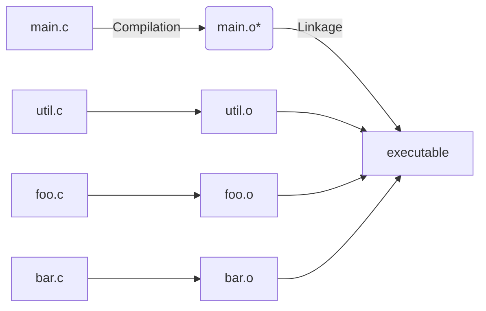
\*Object (`.o`) files are just [ELF files](#242-elf-file-format) with code for functions!

### 3.2.2. Static Libraries
Static libraries are what our custom C code can be compiled/archived to such that code can be repeatedly linked to an executable w/o requiring recompilation:

#### 3.2.2.1. Static libraries included at LINK time
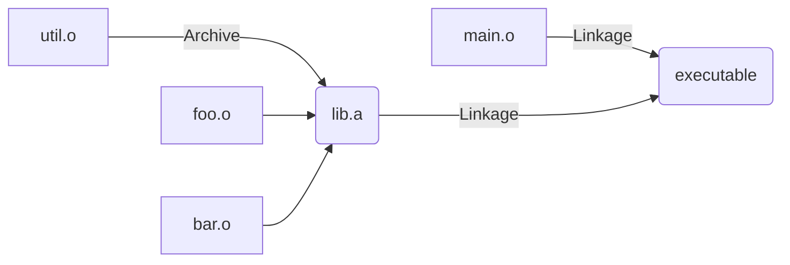

### 3.2.3. Dynamic Libraries
Are for reusable code, accessed via `.so` files; can be used by multiple applications by existing in a single memory location that's accessible to applications.
- e.g. `libc.so` (C standard library) is a dynamic library

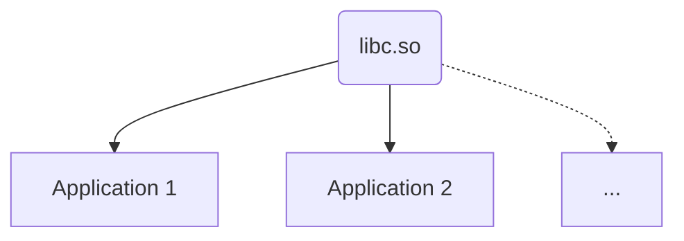

#### 3.2.3.1. Dynamic libraries included at RUN time

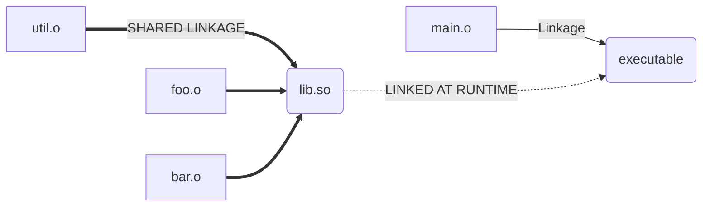

#### 3.2.3.2. `>>> ldd <EXE>`
Shows which dynamic libraries an executable uses.

## 3.3. Static vs. Dynamic Libraries

| Static Library {.p}                                               | Dynamic Library {.b}                                        |
| ------------------------------------------------------------ | ------------------------------------------------------ |
| Prevents reusing libraries (result in many duplicates) {.lr} | Library changes/bugs can break applications {.lr}      |
| Updates to static library requires recompilation {.lr}       | Dynamic libraries can allow for easier debugging {.lg} |

### 3.3.1. HOW Dynamic Libraries Can Break Executables
Dynamic library `struct`s are laid out in memory with fields mathching the declaration order (see code below); changes in the order of lines can result in changes to the return values of ABI functions (e.g. `get_x(struct ...)`, `get_y(struct ...)` as below).

_e.g._
1. consider a dynamic library with a `struct` with multiple fields corresponding to a specific data layout (e.g. C ABI); these fields are accessible by executables
2. If a dynamic library reorders the `struct`'s fields, any executables previously using the library is using the old offsets & is now wrong

```c
// v1
struct point {
  int x; // compiler ==> x->array[0]
  int y; // compiler ==> y->array[1]
}

// v2
struct point {
  int y; // compiler ==> x->array[1] | SWITCHED!
  int x; // compiler ==> y->array[0] | SWITCHED!
}
```

#### 3.3.1.1. Dynamic Libraries & Memory Leaks
Can be investigated using Valgrind & sanitizer tools built into Clang/gcc
- Sanitizers require recompilation via the `-Db_sanitize=address` flag to Meson
  ```bash
  >>> rm -rf build
  >>> meson setup build -Db_sanitize=address
  >>> meson compile -C build
  ```

***Q:*** why would dynamic libraries specifically experience memory bugs? {.lr}

> ***A:*** "The GNU C library, which is used by all programs,
  may allocate memory for its own uses. Usually it doesn't bother to free
  that memory when the program ends—there would be no point, since the Linux
  kernel reclaims all process resources when a process exits anyway, so it
  would just slow things down." {.lg}

### 3.3.2. How Semantic Versioning Reflects Dynamic Library Changes
Given version number `MAJOR.MINOR.PATCH`, increment the:
- MAJOR version when you make incompatible API/ABI changes
- MINOR version when you add functionality in a backwards-compatible manner
- PATCH version when you make backwards-compatible bug fixes

## 3.4. System Calls vs. C Standard Library Functions
Most system calls have corresponding function calls in C, but may:
- set `errno` (explains any error that might happen with the system call if not completed succesfully)
- Buffer reads & writes (i.e. reduce # of system calls; e.g. `printf()` is buffered until its last instance, at which point many `printf()`s may be written to terminal)
- Simplify ABI (e.g. combine 2 system calls)
- Add new features
- (i.e. are not one-to-one)

### 3.4.1. C `atexit` (vs. System call `exit()` / `exit_group()`)
C `atexit(...)` calls the function in its given arguments `(...)` on program exit.

## 3.5. SUMMARY
Operating Systems Provide the Foundation for Libraries, so you should know about:
- Dynamic libraries and a comparison to static libraries
  - How to manipulate the dynamic loader
- Example of issues from ABI changes without API changes

## 3.6. PRACTICE:

***Q:*** why should `printf()` be in a dynamic library? {.lr}

> ***A:*** since it is used by multiple applications, it is more efficient to have one shared copy (dynamic library) instead of a separate library for each program (static library) {.lg}


<!--------------------------------{.gray}------------------------------>


<hr style="border:30px solid #FFFF; margin: 100px 0 100px 0; {.gray}"> </hr>


<!--------------------------------{.gray}------------------------------>
<div style="page-break-after: always;"></div>

# 4. Process Creation (2023-09-15)
Recall: a process is an instance of a running program

| **// PROCESS \\\\** {.b}                    |
| -------------------------- |
| / VIRTUAL REGISTERS (MEMORY) \ {.p} |
| -- Stack {.g}                      |
| -- Heap {.g}|

## 4.1. Process Control Blocks (PCBs)

**PCB** -- keeps track of info regarding processes, including:
- Process state
- CPU registers
- Scheduling information
- Memory management information
- I/O status information
- Any other type of accounting information

## 4.2. Process State Diagrams


## 4.3. Reading Process States via `/proc`
`/proc` directory contains files representing kernel's state
- subdirectories that represent processes are named with a number (process id/pid)
- state of a process is represented within `/proc/<pid>/status` (inc. name, ppid, etc.)

## 4.4. Creating New Processes (via Cloning)
it is more efficient for the os to clone a currently running process than to create a new one.

this is done by pausing the currently running process & copying its [PCB](#process-control-blocks-pcbs) into a new child process.
- Cloning copies all information from the parent (e.g. variables; note that child variables are separate from the parent's); value of information can change starting during/after [`fork()`](#441-fork)

### 4.4.1. `fork()`
`int fork(void)` clones the current process in which it is run & returns a pid in **EACH PROCESS** (parent **AND** child):
- **`0` -- in child process**
- **`>0` -- in parent process**
  - `-1` -- on failure

#### 4.4.1.1. `getpid()` & `getppid()`
- `getpid()` -- returns pid of the current process
- `getppid()` -- returns pid of the current process's parent

#### 4.4.1.2. `fork()` Example
```c
int main(void) {

  pid_t returned_pid = fork();
  /* both parent & child have variable `returned_pid`,
     but with different values */

  if (retured_pid == -1) {
    int err = errno;
    perror("fork failed");
    return err;
  }

  if (returned_pid == 0) {
    printf("Child returned pid: %d\n", returned_pid);
    printf("Child pid: %d\n", getpid());
    printf("Child parent pid: %d\n", getppid());

  } else {
    printf("Parent returned pid: %d\n", returned_pid);
    printf("Parent pid: %d\n", getpid());
    printf("Parent parent pid: %d\n", getppid());
  }

  return 0;
}
```
```console
Parent returned pid: 2341
Parent pid: 2340
Parent parent pid: 1600
Child returned pid: 0
Child pid: 2341
Child parent pid: 2340
```

## 4.5. SUMMARY
The Operating System Creates Processes, and has to:
- Maintain process control blocks, including state
- Create new processes
- Load a program, and re-initialize a process with context

## 4.6. PRACTICE


***Q:*** does parent always print before child in the [code example above](#4412-fork-example)? {.lr}

> ***A:*** no; the kernel decides when to run the parent or child process (e.g. could also run in parallel if with multiple cores, again depending on the kernel; i.e. is *non-deterministic*). {.lg}

---

***Q:*** are variables declared after a `fork()` only created in the parent process? {.lr}

> ***A:*** no; since the process is a duplicate, both the parent & child will run the same code before & after `fork()`-ing (including variable declarations after `fork()`). {.lg}
> - to have code specific to the parent or child process, we need to use conditional logic using either the [return value of `fork()`](#441-fork) or using [`getpid()`/`getppid()`](#4411-getpid--getppid).

---

***Q:*** if i `malloc()` before a `fork()`, how do we `free()` the allocated memory? {.lr}

> ***A:*** `malloc()`-ed memory can either be freed at the very end of the process OR in each conditional logic block for the parent & child process. {.lg}

---

***Q:*** given the code in the `fork()` example, how could we modify it to create a fork bomb? {.lr}

> ***A:*** calling `fork()` again in either the parent or child conditional code block will cause `fork()` to be called recursively infinitely. {.lg}


<!--------------------------------{.gray}------------------------------>


<hr style="border:30px solid #FFFF; margin: 100px 0 100px 0; {.gray}"> </hr>


<!--------------------------------{.gray}------------------------------>
<div style="page-break-after: always;"></div>

# 5. Process Management (2023-09-16)
## 5.1. `execve()`
Replaces the current process with a process indicated by a given filepath:
- `pathname`: Full path of the program to load
- `argv`: Array of strings (array of characters), terminated by a null pointer
  - Represents arguments to the process
- `envp`: Same as `argv`
  - Represents the environment of the process
- Returns an error on failure, does not return if successful

### 5.1.1. `execve()` Example

```c
int main(int argc, char *argv[]) {
  printf("This process going to become another process\n");

  // `execve()` arguments; replace current process with `ls`
  char *exec_argv[] = {"ls", NULL};
  char *exec_envp[] = {NULL};

  int exec_return = execve("/usr/bin/ls", exec_argv, exec_envp);

  if (exec_return == -1) {
    exec_return = errno;
    perror("execve failed");
    return exec_return;
  }

  printf("If execve worked, this will never print\n");
  return 0;
}
```

***Q:*** why is the item at index 0 of the `argv` array argument to `execve()` the same name as the process/executable? {.lr}

> ***A:*** because the item at index 0 is used as the executable name in many programs (e.g. you can call `ls` something else after providing `char *exec_argv[] = {"SOMETHING ELSE", "--help", NULL};`) {.lg}

## 5.2. Process States
Recall that you can look at a process' state by reading the state value from `/proc/<PID>/status` (e.g. via `/proc/<PID>/status| grep State`).

Linux processes can have 1 of 5 possible states:
- R: Running\* and runnable [Running and Waiting]
- S: Interruptible sleep [Blocked]
- D: Uninterruptible sleep [Blocked]
- T: Stopped
- Z: Zombie

\*running processes can be explicitly stopped & resumed by other processes

### 5.2.1. Process/Kernel Startup via `init`
After the kernel starts running/initializes, it creates a single process called `init` via `/sbin/init`, which:
- Is responsible for executing every other process on the machine
- Must always be active (if it exists, kernel shuts down)
- Is `systemd` in Linux

### 5.2.2. Process Tree (Parent/Child Graph) Example
Can be viewed via `htop`

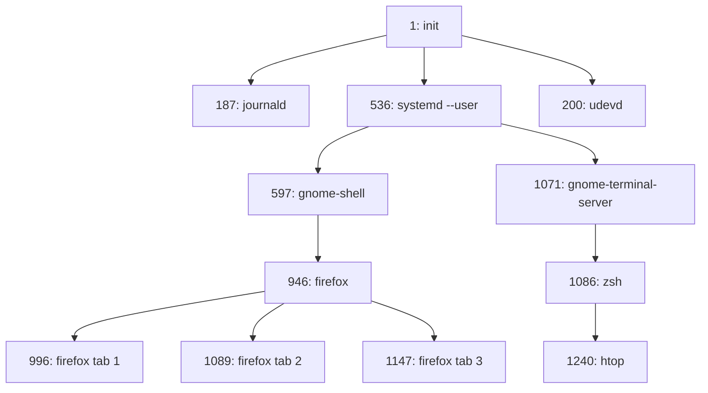

### 5.2.3. pid Logistics
pids are unique for every **active** process (i.e. pids are reused after a process dies)
- pid max value is 32768
- pid value 0 is reserved (invalid)

### 5.2.4. Process Address Space
Each process has an independent view of memory (i.e. virtual memory that maps to physical memory by the kernel).

## 5.3. Parent/Child `exit()`-ing
The OS sets the exit status when a process terminates by calling `exit()`.

A parent needs to read a child process' exit status before the child process can fully exit.
- This exit status **must** be acknowledged for a child process to fully exit (otherwise waste of resources since process exists but doesn't execute anything after termination).

There are 2 possibilities for the order of exits:
- child exists first ([**zombie** process](#532-zombie-process))
- parent exists first ([**orphan** process](#533-orphan-process))

### 5.3.1. Calling `wait()` on Child Processes
To allow the parent process to read the child's exit code, we use `wait()`:
- `status` argument: address to store wait status of child process
- returns: pid of child process (with a change\*), or...
  - -1: on failure
  - 0: for non-blocking calls with no child changes\*

\**non-blocking, meaning that it returns immediately instead of waiting for a child process to exit or change state. If there are no child processes that have exited or changed state, wait returns 0 to indicate that there was no change.*

#### 5.3.1.1. `wait()` Example
Here the code **blocks** until the child process exits.
```c
int main(void) {
  // create child process
  pid_t pid = fork();
  if (pid == -1) {
    return errno;
  }

  // do nothing in parent
  if (pid == 0) {
    sleep(2);

  // call `wait` in child to exit process
  }  else {
    printf("Calling wait\n");
    int wstatus;

    // store return value of `wait` in `int wstatus`
    // if no failure, `wait` will return child pid
    pid_t wait_pid = wait(&wstatus);

    // do something on successful child process exit via `wait`
    if (WIFEXITED(wstatus)) {
      // `wait_pid` is return value of `wait()`; child pid since it was successful
      // `WEXITSTATUS(wstatus)` is 0 to indicate non-blocking
      printf("Wait returned for an exited process! pid: %d, status: %d\n", wait_pid, WEXITSTATUS(wstatus));
    }
    else {
      return ECHILD;
    }
  }

  return 0;
}
```

### 5.3.2. Zombie Process
If a process is terminated but hasn't been acknowledged (i.e. had exit status read) by a parent (e.g. due to a bug where child exit process is never read), the OS can *softly interrupt* the parent process via an ignore-able signal (a type [IPC](#22-inter-process-communication-ipc)).

- If parent ignores child termination as above, zombie process can be re-parented
- OS must keep zombie processes until ackowledgement (**meaning [PCB](#41-process-control-blocks-pcbs) of child process remains until acknowledgement**)

#### 5.3.2.1. Zombie Example
```c
int main(void) {
  // fork...

  if (pid == 0) {
    sleep(5);

  } else {
    sleep(1);
    printf("Child process state: %s", print_state(pid));

    sleep(10);
    printf("Child process state: %s", print_state(pid));
  }

  // ...
}
```
```
Child process state: S (sleeping)
Child process state: Z (zombie)
```

### 5.3.3. Orphan Process
If a parent exits before a child process, the OS re-parents the child process to `init` so that the child's exit can be acknowledged by a process.

#### 5.3.3.1. Orphan Example
```c
int main(void) {
  // fork...

  if (pid == 0) {
    // parent process still running
    printf("Child parent pid: %d\n", getppid());
    sleep(5);

    // child re-parented to `init`
    // bc parent has exited by now
    printf("Child parent pid (after sleep): %d\n", getppid());

  } else {
    // parent exits before child
    // bc parent sleeps for less time than child
    sleep(1);
  }

  // ...
}
```
```console
Child parent pid: 58061
Child parent pid (after sleep): 1
```

## 5.4. SUMMARY
The operating system maintains a strict parent/child relationship; you should be able to identify (and prevent) the following:
- Zombie processes
- Orphan processes

## 5.5. PRACTICE

***Q:*** how can zombie (child) processes be acknowledged? {.lr}

> ***A:*** after the zombie's parent dies, the zombie becomes an orphan process & gets re-parented to `init` which can then acknowledge & fully exit it. {.lg}

---

***Q:*** if the parent of a parent process (i.e. grandparent process) terminates, do the child processes become orphans? {.lr}

> ***A:*** no; parent-child process relationship is independent so the parent's parent or the child's child has no impact on whether the child to the parent becomes a zombie or orphan process. {.lg}


<!--------------------------------{.gray}------------------------------>


<hr style="border:30px solid #FFFF; margin: 100px 0 100px 0; {.gray}"> </hr>


<!--------------------------------{.gray}------------------------------>
<div style="page-break-after: always;"></div>

# 6. Basic IPC (2023-09-19)
## 6.1. Reading/Writing to Files/Standard-(In/Out)
### 6.1.1. `cat` Terminal Example (echo input)
We `read()` from standard input (fd 0) & `write()` to standard output (fd 1):
- Note: `write()` returns the number of bytes written (not always succesful!)
```c
int main() {
  char buffer[4096];
  ssize_t bytes_read;

  // `read(0, ...)` reads from STANDARD IN
  while ((bytes_read = read(0, buffer, sizeof(buffer))) > 0) {
    // `write(1, ...)` writes to STANDARD OUT (i.e. terminal)
    ssize_t bytes_written = write(1, buffer, bytes_read);

    // error handling...

    if (bytes_written == -1) {
      int err = errno;
      perror("write");
      return err;
    }
    assert(bytes_read == bytes_written);
  }

  if (bytes_read == -1) {
    int err = errno;
    perror("read");
    return err;
  }

  assert(bytes_read == 0);
  return 0;
}
```

### 6.1.2. `cat` File Example (read file)
Linux uses the lowest available file descriptor for new files, so we can close standard input (freeing file descriptor 0 as below) to open a file instead:
```c
int main(int argc, char *argv[]) {
  if (argc > 2) {
    return EINVAL;
  }

  if (argc == 2) {
    // `close` STANDARD IN file descriptor
    close(0);
    // `open` sets file descriptor 0 to given file
    int fd = open(argv[1], O_RDONLY);
    if (fd == -1) {
      int err = errno;
      perror("open");
      return err;
    }
  }

  // ...same code as 6.1.1. `cat` Example...

}
```

## 6.2. Redirecting Standard File Descriptors Using The Shell (`<`, `>`, `|`)
Replacing standard input:
```console
>>> ./program-or-file-input < program-or-file-for-output.c
```
Redirecting across multiple processes:
- 2 processes:
  ```console
  >>> cat input-file.c | ./program-or-file-that-receives-input.c
  ```
- \>2 processes:
  ```console
  >>> ./input-program-1 | ./2-program-that-receives-input-from-1 | ./3-program-that-receives-input-from-2 | ...
  ```

## 6.3. Signals
SIGINT (`Ctrl+C`) & EOF (`Ctrl+D`) are **signals** -- type of IPC that interrupts processes; *signals are sent to processes & the process' kernel default handlers *\**{.b} either ignore the signal or terminate the process*:

- `CTRL+D` -- sends EOF (end-of-file) character to current process; signals end of input; **same as `read` returning 0 bytes reads bc it reached end of file** (*note that there is _no_ null termination to indicate EOF or end-of-string in Linux; there is only `read` returning 0 bytes*)
  - Kernel returns 0 on closed file descriptor
  - Need to check for errors (by saving `errno`)!

- `CTRL+C` -- sends SIGINT (keyboard interrupt) to current process

*\**{.b} **Default kernel handler EXIT CODE:** $128 + signal\_number$ (outputted to terminal!)

### 6.3.1. `sigaction()`
Enables setting custom signal handlers (instead of using kernel default handlers); involves declaring a function with no return (`void`) & has `int` argument of signal number.

#### 6.3.1.1. Common Signal Numbers (in Linux)
- 2: SIGINT (interrupt from keyboard)
- **9: SIGKILL (terminate immediately)** -- useful!
- 11: SIGSEGV (memory access violation)
- 15: SIGTERM (terminate)

### 6.3.2. How Signal Handlers Work
When a process receives a signal, the process pauses & then resumes after the signal handler finishes (concurrency).
- Processes can be interrupted at any point in execution.

#### 6.3.2.1. `sigaction()` Example 1
```c
// custom signal handler code
void handle_signal(int signum) {
  printf("Ignoring signal %d\n", signum);
}

// boilerplate code to set custom signal handler
void register_signal(int signum) {
  struct sigaction new_action = {0};
  sigemptyset(&new_action.sa_mask);
  new_action.sa_handler = handle_signal; // setting our custom signal handler

  // error checking
  if (sigaction(signum, &new_action, NULL) == -1) {
    int err = errno;
    perror("sigaction");
    exit(err);
  }
}

int main(void) {
  // ...

  register_signal(SIGINT); // CTRL+C
  register_signal(SIGTERM); // CTRL+D

  // ...

  return 0;
}
```

#### 6.3.2.2. `sigaction()` Example 2 (`read()` Error Handling)
Signals (e.g. SIGINT: `CTRL+C`) can cause errors by interrupting `read()` & `write()` system calls, so they need additional error handling (via checking `errno` after checking error conditional logic [i.e. `if (... = -1)`]):
```c
// modifying our `cat` example above...

  // ...

  char buffer[4096];
  ssize_t bytes_read;
  while ((bytes_read = read(0, buffer, sizeof(buffer))) != 0) {
    if (bytes_read == -1) {
      /*-------------------*/
      if (errno == EINTR) { // represents interrupted system calls
      	continue;
      /*-------------------*/
      } else {
    	break;
      }
    }

    // ...
  }

  // ...
```

### 6.3.3. Sending Signals via `kill` in the Terminal
- `>>> kill <pid>` -- sends [SIGTERM](#6211-common-signal-numbers-in-linux) to process with given pid; is ignored by default
- `>>> kill <pid> -SIGNAL_NUMBER` -- sends signal corresponding to [`SIGNAL_NUMBER`](#6211-common-signal-numbers-in-linux)
  - e.g. SIGKILL via `>>> kill -9 <pid>` terminates immediately by [default kernel handler](#63-how-signal-handlers-work) *unless process in [uninterruptible sleep](#52-process-states)*

### 6.3.4. `pidof`
Terminal command used to find pids of processes given program names.

e.g.
```console
>>> pidof ./running-program
```

## 6.4. Non-blocking Calls
Non-blocking call return immediately (allows for checking if something occurs).
- To turn [`wait` into a non-blocking call](#531-calling-wait-on-child-processes), use `waitpid()` with `WNOHANG` in options
- Can use a poll or interrupt to react to changes in non-blocking calls

### 6.4.1. Blocking vs. Non-blocking Calls
- Blocking call -- parent process is suspended until child process terminates (**including being acknowledged by `wait()` or `waitpid()`**)
- Non-blocking call -- parent process continues executing while child process terminates

### 6.4.2. `waitpid()` vs. `wait()`
- [`wait()`](#5311-wait-example)
  - waits for ANY child process to terminate
  - is ONLY a blocking call
- [`waitpid()`](#64-non-blocking-calls)
  - can be used to wait for a SPECIFIC pid of a child process
  - can be set as a non-blocking call

***Q:*** what are some usecases for `waitpid()` & `wait()`? {.lr}
> ***A:*** can set `waitpid()` or `wait()` so that a specific or any child process will always run before the next running period for the parent processe (e.g. [2022 Final Q2](#731-2022-final-q2)) {.lg}

### 6.4.3. Polling
Calling `waitpid` repeatedly until the child process exists before `wait`

```c
// wait-poll-example.c


int main() {
  pid_t pid = fork();
  if (pid == -1) {
    return errno;
  }

  // child process
  if (pid == 0) {
    sleep(2);

  // parent process
  } else {
    pid_t wait_pid = 0;
    int wstatus;

    unsigned int count = 0;

    // POLLING `waitpid()` repeatedly
    while (wait_pid == 0) {
      ++count;
      printf("Calling wait (attempt %u)\n", count);
      // set waitpid() to non-blocking call via WNOHANG
      wait_pid = waitpid(pid, &wstatus, WNOHANG);
    }

    if (wait_pid == -1) {
      int err = errno;
      perror("wait_pid");
      exit(err);
    }
    // do something on successful child process exit via `wait`
    // see #### 5.3.1.1. `wait()` Example for more details
    if (WIFEXITED(wstatus)) {
      printf("Wait returned for an exited process! pid: %d, status: %d\n", wait_pid, WEXITSTATUS(wstatus));
    } else {
      return ECHILD;
    }
  }
  return 0;
}
```

### 6.4.4. Using Interrupt Handlers
Instead of calling `wait()` or `waitpid()` in `main()`, we can do it in the interrupt handler since the kernel sends the SIGCHLD signal whenever a child process exits.
- Similar to hardware generating interrupts in the kernel
- Interrupt handler defined using [`sigaction()`](#631-sigaction)

```c
// wait-interrupt-example.c
void handle_signal(int signum) {
  // ignore non-child process exits
  if (signum != SIGCHLD) {
    printf("Ignoring signal %d\n", signum);
  }

  printf("Calling wait\n");
  int wstatus;
  // no longer need to poll since signal must be from child
  // waitpid(-1, ...) means waiting for ANY process (same as `wait()`, except as a non-blocking call bc of `waitpid()`)
  pid_t wait_pid = waitpid(-1, &wstatus, WNOHANG);
  if (wait_pid == -1) {
    int err = errno;
    perror("wait_pid");
    exit(err);
  }
  if (WIFEXITED(wstatus)) {
    printf("Wait returned for an exited process! pid: %d, status: %d\n", wait_pid, WEXITSTATUS(wstatus));
  }
  else {
    exit(ECHILD);
  }
  exit(0);
}

void register_signal(int signum) {
  struct sigaction new_action = {0};
  sigemptyset(&new_action.sa_mask);
  new_action.sa_handler = handle_signal;
  if (sigaction(signum, &new_action, NULL) == -1) {
    int err = errno;
    perror("sigaction");
    exit(err);
  }

int main() {
  register_signal(SIGCHLD);

  pid_t pid = fork();
  if (pid == -1) {
    return errno;
  }

  if (pid == 0) {
    sleep(2);
  } else {
    while (true) {
      printf("Time to go to sleep\n");
      sleep(9999);
    }
  }
  return 0;
}
```

#### 6.4.4.1. Interrupt Handlers Run to Completion
Interrupts can occur while an interrupt handler is already running, so all interrupt handler code must be reentrant:
- RENTRANT -- able to pause execution (*of 1st call to interrupt handler*), execute another call (*to 2nd call to same interrupt handler function*), & resume execution of 1st call after finishing 2nd call


#### 6.4.4.2. 3 Terms for "Interrupts" on RISC-V CPUs
- **Interrupt**
  - Triggered by external hardware
  - Handled by kernel (*needs to respond quickly*)
- **Exception**
  - Triggered by an instruction (e.g. divide-by-0, illegal memory access)
  - Default handler is kernel (calling process suspended)
  - Process can optionally handle exceptions
    - **not**{.lr} like C++ exceptions, but **hardware** exceptions
- **Trap**
  - Basically just an interrupt handler
  - Transfer of control to a trap handler caused by either an exception or an interrupt
    - e.g. system calls are *requested* traps
      - because system call is an instruction so it would generate an exception to be handled by the kernel (e.g. `read()`, `write()`, `open()`)
      - "I want the kernel to run some specific code"

## 6.5. PRACTICE

***Q:*** what does file descriptor 0 represent by default? {.lr}
> ***A:*** standard input (to terminal). {.lg}

---

***Q:*** what happens if we read from file descriptor 1? {.lr}
> ***A:*** indeterminate behaviour; file descriptor 1 is for writing, so this shouldn't be done but if it was then it might act as file descriptor 0 (read) or it could fail. {.lg}

---
> ---

***Q: a)*** how to use shell to redirect output from one program (`a.exe`) as input to another program (`b.exe`)? {.lr}
> ***A:*** `>>> ./a.exe < ./b.exe` {.lg}

> ---

***Q: b)*** how to use shell to redirect output from one program (`a.exe`) as input to another program (`b.exe`), *and use output from `b.exe` as input to `c.exe*? {.lr}
> ***A:*** `./a.exe | ./b.exe | ./c.exe` {.lg}

> ---

***Q:*** how to get the exit code $c$ of a process given a terminal exit code $x$? {.lr}
> ***A:*** $c = 128 - x$ {.lg}

---

***Q:*** what type of OS concept is used in signal handling? {.lr}
> ***A:*** concurrency; switching between running processes to simulate simulataneous execution. {.lg}

---

***Q:*** what happens to child processes after a process is killed via `kill -9 <pid>`? {.lr}
> ***A:*** since parent is being terminated first, [orphan child processes](#533-orphan-process) get reparented by [`init`](#521-processkernel-startup-via-init), which continually terminates all orphan processes. {.lg}

---
> ---

***Q: a)*** how to make continuous polling (for `waitpid()` in a loop) less resource-intensive w/o using interrupts? {.lr}
> ***A:*** add a delay (e.g. $1 \frac{poll}{second}$) {.lg}

```c
  // ...
  // e.g. delayed polling
  while (wait_pid == 0) {
    sleep(1)
    wait_pid = waitpid(pid, &wstatus, WNOHANG);
  }
  // ...
```

> ---

***Q: b) what are the tradeoffs of excluding vs. adding the delay?***  {.lr}
> ***A:*** adding the delay means less resource usage at the expense of response time; excluding the delay means faster response time at the expense of waste of resources. {.lg}

> ---
---


<!--------------------------------{.gray}------------------------------>


<hr style="border:30px solid #FFFF; margin: 100px 0 100px 0; {.gray}"> </hr>


<!--------------------------------{.gray}------------------------------>
<div style="page-break-after: always;"></div>

# 7. Process Practice (2023-09-21)
## 7.1. Multiprogramming
- **UNI**programming
  - only one process running at a time
  - multiple processes **not** running in parallel or concurrently
- **MULTI**programming
  - allows multiple processes (can run in parallel OR concurrently)

### 7.1.1. Scheduler
Before a process is created but after a signal has been to the OS to create it, the process is in the [waiting state](#52-process-states) until it is loaded into memory.
- While waiting, the scheduler decides when to run the process

### 7.1.2. How Switching/Swapping Processes Works (via Core Scheduling Loop)


### 7.1.3. COOPERATIVE vs. TRUE Multitasking
We can let each process indicate when it can be paused OR have the OS pause processes itself:
- **COOPERATIVE** Multitasking -- processes use a system call to tell OS to pause it
- **TRUE** Multitasking -- OS retains control over pausing processes
  - OS gives processes set time slices
  - OS can wake up periodically using interrupts to do scheduling (instead of spending all clock cycles scheduling)


### 7.1.4. Context Switching = Swapping Processes
- At minimum requires saving all current registers of process
  - Need to save all values **using the same CPU that is being saved**
- Context switching is pure overhead; need to be as fast as possible

## 7.2. `pipe()`
```c
int pipe(int pipefd[2])
```
- Returns:
  - `0` -- on success (*created* 2 file descriptors)
  - `-1` -- on failure (sets `errno`; *couldn't create* 2 file descriptors)
- Forms a one-way communication channel using 2 file descriptors
  - `pipefd[0]` -- read end of pipe
  - `pipefd[1]` -- write end of pipe
- e.g. [`|` forms a pipe between 2 processes](#62-redirecting-standard-file-descriptors-using-the-shell)


Can think of `pipe()` as a kernel-managed buffer
- Kernel handles memory allocation, etc.
- We only interface with writing to one end & reading from other end.

### 7.2.1. `pipe()` Example

```c
// pipes.c

// error handler
void check(int ret, const char* message) {
    if (ret != -1) { return; }
    int error = errno;
    perror(message);
    exit(error);
}

int main(void) {
  // file descriptor array of size 2 for `pipe()`
  int fds[2];
  // initialize pipe via `pipe(fds)`
  check(pipe(fds), "pipe");

  pid_t pid = fork();
  check(pid, "fork");

  // parent
  if (pid > 0) {
    const char* str = "Hello from parent to child";
    int len = strlen(str);
    // write `str` to write end of pipe (`fds[1]`)
    int bytes_written = write(fds[1], str, len);
    check(bytes_written, "write");

  // child
  } else {
    char buffer[4096];
    // read end of pipe (`fds[0]`)
    int bytes_read = read(fds[0], buffer, sizeof(buffer));
    check(bytes_read, "read");
    printf("Child reads: %.*s\n", bytes_read, buffer);
  }

  // REMEMBER TO CLOSE PIPE ENDS!
  close(fds[0]);
  close(fds[1]);

  return 0;
}
```

***Q:*** what happens to the child process if we remove the `write()` call in the parent process? {.lr}
> ***A:*** the child process will block indefinitely on the `read()` call since it will not receive any data from that end of the pipe. {.lg}
  - Moreover, since nothing will happen in the parent process, after the parent process finishes the child will become an orphan & get reparented to `init` (where it will continue waiting for read data)

---

***Q:*** what are the values of `fds[0]` & `fds[1]` in the code above? {.lr}
> ***A:*** **file descriptors 0, 1, 2 (open, read, write) already exist, so the kernel created file descriptors starting at the next lowest number (3);** `fds[0]` = 3 (read end of pipe) & `fds[1]` = 4 (write end of pipe) {.lg}
  > Note that at the time of the `fork()`, all variables **INCLUDING FILE DESCRIPTORS**{.p} are copied from the parent to the child process

---

***Q:*** does this mean that the parent & child process refer to different file descriptors wrt pipe? {.lr}
> ***A:*** no; use of pipe is identical in parent & child processes {.lg}

---

***Q:*** what is output if we modify the code as below, and why? {.lr}
```c
  // ...

  // parent
  if (pid > 0) {
    const char* str = "Hello from parent to child";
    int len = strlen(str);
    // write `str` to write end of pipe (`fds[1]`)
    int bytes_written = write(fds[1], str, len);
    check(bytes_written, "write");
    // ---------------------------
    close(fds[0]) // read
    close(fds[1]) // write
    // ---------------------------

  // child
  } else {
    // ---------------------------
    close(fds[1]) // write
    // ---------------------------
    char buffer[4096];
    // read end of pipe (`fds[0]`)
    int bytes_read = read(fds[0], buffer, sizeof(buffer));
    check(bytes_read, "read");
    printf("Child reads: %.*s\n", bytes_read, buffer);
    // ---------------------------
    close(fds[0]) // read
    // ---------------------------
  }

  // ...
```
> ***A:*** prints `Child read:          ` {.lg}
- `read()` is able to receive 0 bytes so it does not wait indefinitely (unlike in previous example)
- works because the kernel keeps track of how many processes have a file descriptor that refer to the write end of the pipe; if `read()` is called on a (read) file descriptor & it is not possible for that pipe to read any more data (because it was closed), then the kernel sends 0 bytes to close that (read) file descriptor

## 7.3. Using `&` in Shell
Starts a given process & outputs pid on finish
e.g.
```console
>>> sleep 10 &
[1] 57827

>>> # ...wait 10 s...
[1] * 57827 done     sleep 1

>>>
```

## 7.4. PRACTICE

### 7.4.1. 2022 Final Q2

***Q:*** For each program shown below, state whether it will produce the same output each time it is run, or whether it may produce different outputs when run multiple times. Explain why the program behaves like this. {.lr}
- a){.lr}
  ```c
  int main() {
    int i = 4;
    while (i != 0) {
      int pid = fork();
      if (pid == 0) {
        i--;
      } else {
        printf("%d\n", i);
        exit(0);
      }
    }
    return 0;
  }
  ```
- ***A:*** `pid == 0` is child process code {.lg}
  - each time `fork()` is called, a child process is created with a copy of `i`.
  - the kernel non-deterministically decides whether to run the parent or child process first, so there could be different outputs each time the program is ran.
  - <!-- REPLACE BELOW WITH CORRECTM NESTED MERMAID DIAGRAM -->
  - e.g. 1: `fork()` 1 -> parent (`print 4`) -> child (`i = 3`) -> `fork()` 2 -> parent (`print 3`) -> child (`i = 3`) -> ...
    ```console
    4
    3
    ...
    ```
  - vs. e.g. 2: `fork()` 1 -> child (`i = 3`) -> parent (`print 3`) ->  `fork()` 2 -> parent (`print 3`) -> ...
    ```console
    3
    3
    ...
    ```

- b){.lr}
  ```c
  int main() {
    int i = 4;
    while (i != 0) {
      int pid = fork();
      if (pid == 0) {
        i--;
      } else {
        waitpid(pid, NULL, 0);
        printf("%d\n", i);
        exit(0);
      }
    }
    return 0;
  }
  ```
- ***A:***  {.lg}
  - [`waitpid(..., ..., 0)`](#642-waitpid-vs-wait) means that the parent process waits for (i.e. is "blocked" by) the child process to exit before running.
  - as a result, the child process code will always run before the parent process code every iteration of the loop
  - since printing is in parent process code, this means each process will `fork()` until `i == 0`, at which point the deepest-nested child process exits & its parent runs (printing `i == 1`), thus printing `1 2 3 4`
  - `fork()` 1 -> child (`i = 3`) ->  -> parent (`print 3`) -> `fork()` 2 -> child (`i = 2`) -> ...
    ```console
    3
    2
    1
    0
    ```

***Q:*** does it matter whether pipe is called before or after forking? What would be different in both cases? {.lr}
> ***A:*** {.lg}
  - Because when you fork, the file descriptors are copied in the child, so both the parent and child can access the same things through their independent file descriptors.
    - The memory for the pipe exists in the kernel, and you can only access it through the file descriptors returned by pipe.
    - So when the fork happens, the kernel copies everything, including all the file descriptors and what they "point to" or what they represent.
    - So if the pipe is before the fork, both processes would have the same file descriptors pointing to the same thing
  - If pipe is after fork, both processes would make independent pipes, and they wouldn't share anything
    - They're independent after the fork, so if one process closes file descriptor 3, it doesn't close it for the other process


<!--------------------------------{.gray}------------------------------>


<hr style="border:30px solid #FFFF; margin: 100px 0 100px 0; {.gray}"> </hr>


<!--------------------------------{.gray}------------------------------>
<div style="page-break-after: always;"></div>

# 8. Subprocess (2023-09-22)
## 8.1. Lab 2 Goals
- Create a new process that launches the command line argument
- Send the string `Testing\n` to that process
- Receive any data it writes to standard output

## 8.2. Easier to Use C APIs
### 8.2.1. `execlp()`
More convenient alternative to `execve()`
```c
int execlp(const char *file, const char *arg /* ..., (char *) NULL */);
```
- Returns:
  - Does not return on success
  - ...`-1` on failure
- Allows for skipping use of string arrays via C varargs
  - 1st argument `const char *file` does not need to be a path to a file, can simply be program name
  - Can handle any number of arguments via C varargs (`const char *arg`)
- Will search executables using directories under the `PATH` environment variable

### 8.2.2. `dup()` & `dup2()`
Creates a new file descriptor that refers to the object described by a given file descriptor
```c
int dup(int oldfd)
int dup2(int oldfd, int newfd);
```

- Returns:
  - ...a new file descriptor on success
  - ...`-1` on failure
- `dup()` returns the lowest file descriptor available
- `dup2()` closes the `newfd` argument if open (i.e. if its a valid file descriptor) & then sets `newfd` to refer to the `oldfd`
  - useful so you don't have to close `newfid` before calling `dup2()`

## 8.3. Subprocess Example
### 8.3.1. Skeleton
```c
// subprocess.c

#include <assert.h>
#include <errno.h>
#include <stdio.h>
#include <stdlib.h>
#include <string.h>
#include <sys/wait.h>
#include <unistd.h>

static void check_error(int ret, const char *message) {
    if (ret != -1) {
        return;
    }
    int err = errno;
    perror(message);
    exit(err);
}

static void parent(int in_pipefd[2], int out_pipefd[2], pid_t child_pid) {
}

static void child(int in_pipefd[2], int out_pipefd[2], const char *program) {
    execlp(program, program, NULL);
}

int main(int argc, char* argv[]) {
    if (argc != 2) {
        return EINVAL;
    }

    int in_pipefd[2] = {0};

    int out_pipefd[2] = {0};

    pid_t pid = fork();
    if (pid > 0) {
        parent(in_pipefd, out_pipefd, pid);
    } else {
        child(in_pipefd, out_pipefd, argv[1]);
    }

    return 0;
}
```

### 8.3.2. Tasks To Do
- create pipe (before `fork()`)
- modify file descriptor to allow reading from `stdout = 1` (write) via `dup2()`
- close file descriptors
- modify file descriptors to allow writing to `stdout = 0` (read)

### 8.3.3. Completed Code
```c
#include <assert.h>
#include <errno.h>
#include <stdio.h>
#include <stdlib.h>
#include <string.h>
#include <sys/wait.h>
#include <unistd.h>

#define STDIN 0 // == STDIN_FILENO
#define STDOUT 1 // == STDOUT_FILENO
#define STDERR 2 // == STDERR_FILENO

#define READ 0
#define WRITE 1

static void check_error(int ret, const char *message) {
    if (ret != -1) {
        return;
    }
    int err = errno;
    perror(message);
    exit(err);
}

static void child(int in_pipefd[2], int out_pipefd[2], const char *program) {
  // 0: stdin
  // 1: stdout
  // 2: stderr
  // 3: output_pipefd[0] = read end of pipe
  // 4: output_pipefd[1] = write end of pipe

  // modify fds so stdin redirects to input of pipe used to input something to output pipe...
  // ---> take the "file" pointed to by `in_pipefd[READ]` & make STDIN point to it
  check_error(dup2(in_pipefd[READ], STDIN), "dup2");
  close(in_pipefd[READ]);
  close(in_pipefd[WRITE]);

  // ...and so stdout redirects to write to pipe used to read some output
  // ---> take the "file" pointed to by `out_pipefd[WRITE]` & make STDOUT point to it
  check_error(dup2(out_pipefd[WRITE], STDOUT), "dup2");
  close(out_pipefd[READ]);
  close(out_pipefd[WRITE]);
  // 0: stdin --> read end of pipe
  // 1: stdout --> write end of pipe
  // 2: stderr
  // 3: output_pipefd[0] = read end of pipe
  // 4: output_pipefd[1] = write end of pipe

  execlp(program, program, NULL);
}

static void parent(int in_pipefd[2], int out_pipefd[2], pid_t child_pid) {
  close(in_pipefd[READ]); // we are not reading from the pipe used to input something
  close(out_pipefd[WRITE]); // we are not writing to the pipe used to read some output

  // write to the input pipe
  const char* message = "Testing\n";
  ssize_t bytes_written = write(in_pipefd[WRITE], message, strlen(message));
  check_error(bytes_written, "write");
  close(in_pipefd[WRITE]); // close input pipe after writing

  // wait for child process to exit via `waitpid`
  int wstatus;
  check_error(waitpid(child_pid, &wstatus, 0), "wait");
  assert(WIFEXITED(wstatus));
  assert(WEXITSTATUS(wstatus) == 0);

  // output pipe reads from stdout now
  char buffer[4096];
  ssize_t bytes_read = read(out_pipefd[READ], buffer, sizeof(buffer));
  check_error(bytes_read, "read");
  printf("Got: %.*s", (int) bytes_read, buffer);
  close(out_pipefd[READ]); // close output pipe after reading
}

int main(int argc, char* argv[]) {
  if (argc != 2) {
    return EINVAL;
  }

  int in_pipefd[2] = {0};
  check_error(pipe(in_pipefd), "in_pipe");

  int out_pipefd[2] = {0};
  check_error(pipe(out_pipefd), "out_pipe");

  pid_t pid = fork();
  if (pid > 0) {
    parent(in_pipefd, out_pipefd, pid);
  } else {
    child(in_pipefd, out_pipefd, argv[1]);
  }

  return 0;
}
```

#### 8.3.3.1. Visualization of Pipes


<div align="right">
<table><td>
<a href="#start-of-content">👆 Scroll to top</a>
</td></table>
</div>


<!--------------------------------{.gray}------------------------------>


<hr style="border:30px solid #FFFF; margin: 100px 0 100px 0; {.gray}"> </hr>


<!--------------------------------{.gray}------------------------------>
<div style="page-break-after: always;"></div>

# 9. Basic Scheduling (2023-09-27)
## 9.1. PREEMPTIBLE vs. NON-PREEMPTIBLE Resources
- **Preemptible Resource**
  - can be taken away from a process (by the kernel) & used for a different process
  - is shared by process scheduling
  - e.g. CPU
- **Non-Preemptible Resource**
  - cannot be taken away from a process **WITHOUT ACKNOWLEDGEMENT** (by the process, say, terminating)
  - is shared via allocations/deallocations (of resources to a process by the kernel)
  - e.g. disk memory

## 9.2. Dispatcher & Scheduler
- **Dispatcher**
  - responsible for context switching between processes
  - low-level mechanism
- **Scheduler**
  - responsible for deciding which process to run (& only *sometimes* when)
  - high-level policy

## 9.3. Basic Scheduling DETAILS
### 9.3.1. scheduler runs whenever a process changes state
- **Non-Preemptible Resources**
  - once a non-preemptible process starts, it runs until completion
  - scheduler only makes a decision when process non-preemptible terminate
- **Preemptible Resources**
  - preemptive processes/mode allows OS to run scheduler at will (inc. during process runtime)

### 9.3.2. Scheduler Goals
- Minimize response (waiting) time
  - don't have a process waiting too long (or too long to start)
- Maximize CPU utilization
  - avoid CPU idling
- Maximize throughput (number of proceses completed)
- Fairness
  - attempt to give each process the same percentage of CPU

## 9.4. Basic Scheduling TECHNIQUES
### 9.4.1. FCFS (First Come First Served) / FIFO
- most basic scheduler
- first process arrived gets CPU time
- new processes are stored in a FIFO queue in arrival order
- *avg waiting time depends on arrival order*

> ---
***Q: a)*** given the following process info, what is the process schedule? {.lr}

| Process | Arrival Time | Burst Time |
| ------- | ------------ | ---------- |
| $P_1$   | 0            | 7          |
| $P_2$   | 0            | 4          |
| $P_3$   | 0            | 1          |
| $P_4$   | 0            | 4          |

> ***A:*** assuming ${P_1} \rightarrow {P_2} \rightarrow {P_3} \rightarrow {P_4}$, the process schedule is... {.lg}

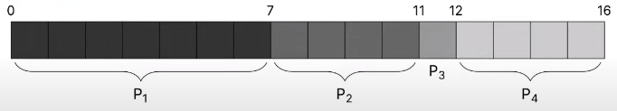

> ---

***Q: b)*** what is the average waiting time? {.lr}

> ***A:*** $\text{avg waiting time} = \frac{\Sigma \text{ (waiting time for process } p_i)}{\text{num processes}} = \frac{0 + 7 + 11 + 12 + 16}{4} = 7.5$ {.lg}

> ---

***Q: c)*** what is the process schedule *if the process arrival order is inverted*? {.lr}

> ***A:*** now ${P_4} \rightarrow {P_3} \rightarrow {P_2} \rightarrow {P_1}$, ... {.lg}

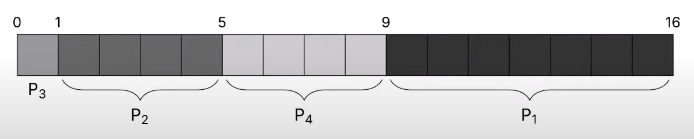

***Q: d)*** what is the average waiting time *if the process arrival order is inverted*? {.lr}

> ***A:*** $\text{avg waiting time} = \frac{\Sigma \text{ (waiting time for process } p_i)}{\text{num processes}} = \frac{0 + 1 + 5 + 9 + 16}{4} = 3.75$ {.lg}

> ---

### 9.4.2. SJF (Shortest Job First)

- Always schedules the job with the shortest burst time first
  - For queued processes with the same burst time, the process that arrived first is scheduled first (i.e. [FCFS](#fcfs-first-come-first-served--fifo) for same burst times)
- Assumes no premeption

#### 9.4.2.1. Tradeoffs with SJF
- PROS
  - reduces avg. wait time
- CONS
  - cannot know burst times of each process
  - predictions of future processes can starve longer processes (i.e. never execute)

***Q:*** given the following process info, what is the process schedule & avg. waiting time? {.lr}

| Process | Arrival Time | Burst Time |
| ------- | ------------ | ---------- |
| $P_1$   | 0            | 7          |
| $P_2$   | 2            | 4          |
| $P_3$   | 4            | 1          |
| $P_4$   | 5            | 4          |

> ***A:*** $\text{avg waiting time} = \frac{\Sigma \text{ (waiting time for process } p_i)}{\text{num processes}} = \frac{0 + 6 + 3 + 7}{4} = 4$ {.lg}
  - note that $P_1$ (& every process) runs to completion ($P_2$-$P_4$ arrive during $P_1$ execution but only run after $P_1$ completion)
  - after $P_1$ ends, the scheduler runs the process with the shortest burst time amongst the queued processes ($P_3$ out of $P_2$-$P_4$)
  - $P_2$ & $P_4$ have the same burst time, but $P_2$ arrived first so it runs before $P_4$

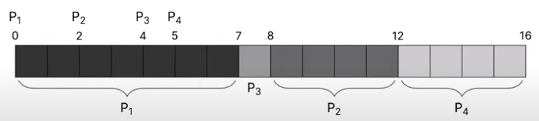

> ---

### 9.4.3. SRTF (Shortest Remaining Time First)

- SJF **WITH**{.g} preemption
  - currently executing processes can be interrupted by newly arrived, *shorter* processes
  - assumes minimum execution time is 1 unit
  - optimizes avg. waiting time better than [SJF](#sjf-shortest-job-first)

#### 9.4.3.1. Tradeoffs with SRTF
- PROS
  - optimizes lowest waiting time (even lower than [SJF](#sjf-shortest-job-first))
- CONS
  - more context switching can mean more wasted time
  - starvation remains an issue

***Q:*** given the following process info, what is the process schedule & avg. waiting time? {.lr}

| Process | Arrival Time | Burst Time |
| ------- | ------------ | ---------- |
| $P_1$   | 0            | 7          |
| $P_2$   | 2            | 4          |
| $P_3$   | 4            | 1          |
| $P_4$   | 5            | 4          |

> ***A:*** $\text{avg. waiting time} = \frac{\Sigma \text{ (waiting time for process } p_i)}{\text{num processes}} = \frac{9+1+0+2}{4} = 3$ {.lg}
  - when a process arrives with a shorter  burst time than the currently executing process' **remaining** burst time, it runs first (e.g. $P_2$ while $P_1$ is running, $P_3$ while $P_2$ is running)
    - after the new interrupting process finishes, execution returns to the process it interrupted (e.g. from $P_3$ back to $P_2$, back to $P_1$)
    - if a newly arrived process does *not* have a shorter burst time than the currently running process, it waits on the queue

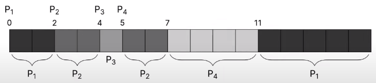

### 9.4.4. (RR) Round-Robin
- OS divides execution into time slices/quanta for each process based on fairness (more important process = larger time slice)
- circular FIFO queue of FCFS processes (processes that don't finish by the end of their time slice/quantum get re-added to the **back** of the queue)

#### 9.4.4.1. Tradeoffs with RR
- PROS
  - low avg. response time
  - low avg. waiting time
  - fair allocation of CPY
- CONS
  - poor avg. waiting time when jobs have similar lengths
  - performance depends on manually set quantum length
    - too high: equivalent to [FCFS](#fcfs-first-come-first-served--fifo)
    - too low: too many context switches (overhead)

## 9.5. SUMMARY
Scheduling Algorithms Involve Different Trade-Offs:
- First Come First Served (FCFS) is the most basic scheduling algorithm
- Shortest Job First (SJF) is a tweak that reduces waiting time
- Shortest Remaining Time First (SRTF) uses SJF ideas with preemptions
- SRTF optimizes lowest waiting time (or turnaround time)
- Round-robin (RR) optimizes fairness and response time

## 9.6. PRACTICE

> ---

***Q: a)*** given the following process info, what is the process schedule **GIVEN A QUANTUM LENGTH OF $3$**{.r}? {.lr}

| Process | Arrival Time | Burst Time |
| ------- | ------------ | ---------- |
| $P_1$   | 0            | 7          |
| $P_2$   | 2            | 4          |
| $P_3$   | 4            | 1          |
| $P_4$   | 5            | 4          |

> ***A:*** {.lg}

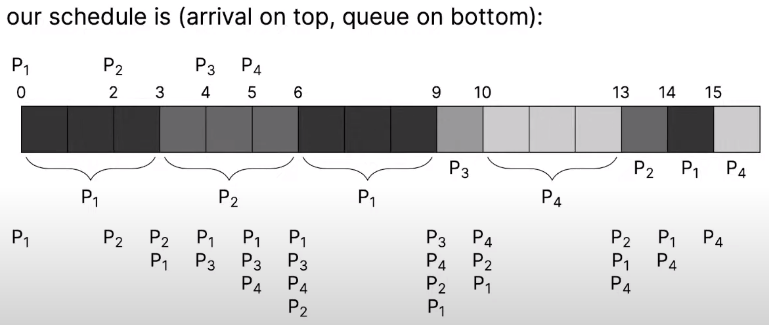

> ---

***Q: b)*** what is the average waiting time? {.lr}

> ***A:*** $\text{avg waiting time} = \frac{\Sigma (\text{waiting time for process } p_i)}{\text{num processes}} = \frac{(15-0-7) + (14-2-4) + (10-4-1) + (16-5-4)}{4} = \frac{(8) + (8) + (2) + (7)}{4} = 7$ {.lg}

  - **TRICK:** for each process, $\text{waiting time}_{P_i} = \text{completion time} - \text{arrival time} - \text{num units } P_i \text{ ran for}$
    - e.g. for $P_1$:  $\text{waiting time}_{P_i} = 15 - 0 - 7 = 8$
    - highlighted in yellow: $7 = \text{num units } P_i \text{ ran for}$
    - 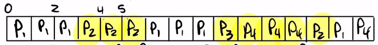

> ---

***Q: c)*** what is the average response time? {.lr}

> ***A:*** $\text{avg. RESPONSE time} = \frac{\Sigma (\text{waiting time UNTIL FIRST EXECUTION})}{\text{num processes}} = \frac{0 + 1 + 5 + 5}{4} = 2.75$ {.lg}
- response time = number of units until preemption/first execution

> ---

***Q: d)*** why is response time important? {.lr}
> ***A:*** user-facing GUIs need to respond quickly otherwise they can be perceived as lagging/slow {.lg}

> ---

***Q: e)*** how many context switches occurred? {.lr}
> ***A:*** $7$ {.lg}

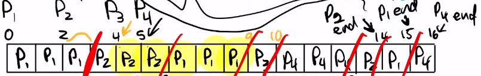

> ---

***Q: e)*** given the previous process info, what are the process schedule, avg. waiting time, avg. response time, & number of context switches **GIVEN A QUANTUM LENGTH OF $1$**{.r}? {.lr}

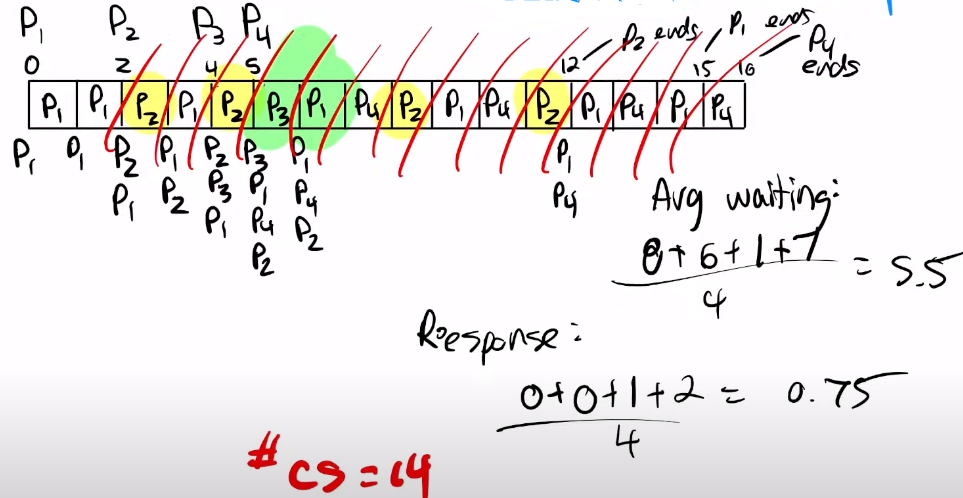

> ---

***Q:*** given the previous process info & a RR scheduler, what are the process schedule, avg. waiting time, avg. response time, & number of context switches **GIVEN A QUANTUM LENGTH OF $10$**{.r}? {.lr}

| Process | Arrival Time | Burst Time |
| ------- | ------------ | ---------- |
| $P_1$   | 0            | 7          |
| $P_2$   | 2            | 4          |
| $P_3$   | 4            | 1          |
| $P_4$   | 5            | 4          |

- ***A:***  {.lg}
  - number of context switches = 3
  - avg. waiting time = (0+5+7+7)/4 = 4.75
  - avg. response time - (0+5+7+7)/4 = 4.75
  - ^METRICS WERE SAME AS FCFS W/O PREEMPTIONS!

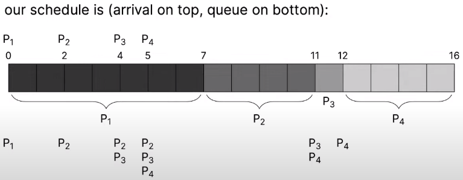


<!--------------------------------{.gray}------------------------------>


<hr style="border:30px solid #FFFF; margin: 100px 0 100px 0; {.gray}"> </hr>


<!--------------------------------{.gray}------------------------------>
<div style="page-break-after: always;"></div>

# 10. Advanced Scheduling (2023-09-28)
## 10.1. Prioritizing Special Processes
By assigning each process a priority, we can favor running some processes over others
- run higher priority processes first
- for processes of the same priority, run them using [round-robin](#944-round-robin-rr) scheduler

### 10.1.1. Mapping Priority to Integers
Linux process priorities range from `-20` to `19` (highest -> lowest)
  - `-20` -- highest priority
  - `19` -- lowest priority

### 10.1.2. Preventing Starvation via Dynamic Priority Changes
Having many higher priority processes will mean that lower prioritiy processes will get starved if process priority is static
  - OS dynamically changes priority to increase priority of old processes that haven't been executed in a long time

### 10.1.3. Priority Inheritance (ala Priority Inversion)
When a high priority process depends on a low priority, the high priority process can be starved since the lower priority process is unlikely to run; solution: **priority inheritance**
- when low priority process is a dependency of higher priority processes, the lower priority process can inherit the highest priority\* of the waiting processes & *then revert back to original priority after dependency is complete*
- \*called **priority inversion** bc priority goes from low->high, then high->low
- can chain multiple inheritances/dependencies

## 10.2. Scheduling FOREGROUND vs. BACKGROUND Processes
 - **Foreground processes**
   - can receive user input
   - are interactable so they *need good response time*
 - **Background processes**
   - {cannot}{.lr} receive user input
   - may not need good response time, just throughput (amount of data processed)

### 10.2.1. How to Prioritize FOREGROUND vs. BACKGROUND Processes
e.g. use different queues for foreground vs. background processes
- use [RR](#944-rr-round-robin) for foreground (bc low response & waiting time)
- use [FCFS](#941-fcfs-first-come-first-served--fifo) for background (bc minimal context switching so least overhead)

**^REQUIRES SCHEDULING BETWEEN FOREGROUND/BACKGROUND QUEUES!**{.p}
- e.g. [RR](#944-rr-round-robin) between queues, assign a priority to each queue

## 10.3. Multiprocessor Scheduling
### 10.3.1. Symmetric Multiprocessing (SMP) Setup for CPUs
Default setup for CPUs
- all CPUs are connected to the same physical memory
- each CPUs has their own private cache (at least the lowest levels)

### 10.3.2. Global (Single) CPU Schedulers
Keep adding processes while there's available CPUs

- PROS
  - good CPU utilization
  - fair to all processes
- CONS
  - not scaleable (everything blocks on global scheduler)
  - poor cache locality (cache lost when process switches between CPUs)

### 10.3.3. Per-CPU Schedulers
Assign each new process to 1/n available CPUs (with the lowest number of processes)

- PROS
  - easy to implement
  - scaleable (no blocking on a resource)
  - good cache locality (since processes remain on single CPU)
- CONS
  - load imbalance between CPUs
    - some CPUs may have fewer or less intensive processes

### 10.3.4. Compromise Between Global & Per-CPU Schedulers
- keep a global scheduler that can rebalance per-CPU queues
  - if a CPU is idle, take over a process from another CPU (work stealing)
  - retain control over which processes switch CPUs (based on cache requirements)
  - uses PROCESSOR AFFINITY -- preference of a process to be scheduled on the same core

### 10.3.5. Gang/Co-Scheduling
- useful for groups of processes that are codependent on each other (i.e. need to be scheduled simulataneously)
- enables running processes simulataneously as a unit across all CPUs
- reuqires a global context-switch across all CPUs (as they switch from gang to gang)

### 10.3.6. Real-time Scheduling
**Real-time requires predictability**
- imposes time constraints on process completion
  - HARD real-time system -- required to **guarantee** a task completes within a given timeframe (e.g. audio, autopilot)
  - SOFT real-time system -- prioritizes critical processes, meeting deadlines is not required but optimized for

#### 10.3.6.1. Scheduling in Linux (Digress)
- Linux uses FCFS (`SCHED_FIFO`) & RR (`SCHED_RR`) scheduling
- a multilevel queue scheduler is used for processes with same priority (OS can dynamically adjust priority)
  - **SOFT REAL-TIME PROCESSES** -- always schedules highest priority proceses first
  - **NORMAL PROCESSES** -- adjust priority based on aging

#### 10.3.6.2. Mapping Soft Real-time Priority to Integers
- **SOFT REAL-TIME PROCESS *SCHEDULING POLICY***
  - 100 static priority levels (0—99) (lowest->highest)
  - `SCHED_FIFO` or `SCHED_RR` in Linux
- **NORMAL PROCESS *SCHEDULING POLICY***
  - default priority is 0;
  - priority ranges from [-20, 19] (highest->lowest);
  - processes change/indicate their own priorities via system calls
    - e.g. `nice`, `sched_setscheduler`
  - `SCHED_NORMAL` in Linux


### 10.3.7. How Linux Priority Unifies Soft Real-time & Normal Processes

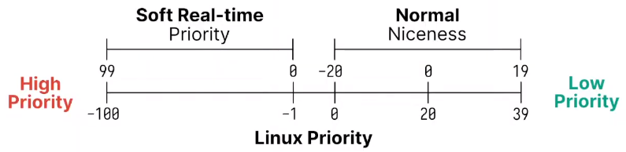

## 10.4. IFS (Ideal Fair Scheduling)
Divide CPU usage equally among every process:
- assume you can have infinitely small time slice -> if we have $n$ processes, each runs at $1/n$ rate

38:23 ifs scheduling example

e.g. consider the following process info:

| Process | Arrival Time | Burst Time |
| ------- | ------------ | ---------- |
| $P_1$   | 0            | 8          |
| $P_2$   | 0            | 4          |
| $P_3$   | 0            | 16         |
| $P_4$   | 0            | 4          |

If each box represents the time units spend executing, then each vertical slice can execute 4 time units:
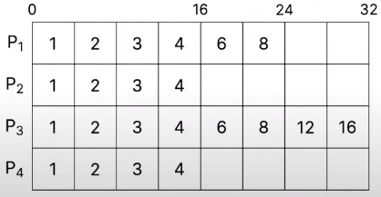

- PROS
  - fairest policy (every process gets equal amount of CPU time)
  - high response time
- CONS
  - impractical bc too many context switches
  - requires constantly scanning all processes ($O(N)$)

## 10.5. CFS (Completely Fair Scheduler)
Tries to model ideal fairness.
- For each runnable process, assign it a assign it a "virtual runtime"
  - At each scheduling point where the process runs for time $t$
  - Increase the virtual runtime by $t \dot weight$ (based on priority)
- Virtual runtime for each process monotonically (i.e. always) increases
  - Scheduler selects the process based on the lowest virtual runtime
    - Compute its dynamic time slice based on the IFS
- If the time slice for a process ends before it finishes running, the process is repeated starting off from that point (i.e. not left hanging)

### 10.5.1. CFS Implemented via Red-Black Trees
- CFS uses a red-black tree with nanosecond granularity, so it doesn't need to guess the interactivity of a process
- CFS tends to favour I/O bound processes by default
  - Small CPU bursts translate to a low virtual runtime
  - It will get a larger time slice, in order to catch up to the ideal

#### 10.5.1.1. Red-Black Tree Refresher
- A red-black tree is a self-balancing binary search tree
  - Keyed by virtual runtime
    - $O(lgN)$ for: insert, delete, update, find minimum

## 10.6. SUMMARY
Scheduling can get complex:
- Introducing priority also introduces priority inversion
- Some processes need good interactivity, others not so much
- Multiprocessors may require per-CPU queues
- Real-time requires predictability
- Completely Fair Scheduler (CFS) tries to model the ideal fairness


<!--------------------------------{.gray}------------------------------>


<hr style="border:30px solid #FFFF; margin: 100px 0 100px 0; {.gray}"> </hr>


<!--------------------------------{.gray}------------------------------>
<div style="page-break-after: always;"></div>

# 11. Virtual Memory (2023-10-03)
## 11.1. Virtual Memory Requirements
- Multiple processes must be able to co-exist
- Processes are not aware they are sharing physical memory
- Processes cannot access each others data (unless allowed explicitly)
- Performance close to using physical memory
- Limit the amount of fragmentation (wasted memory)

### 11.1.1. Recall memory is byte addressable
- Smallest unit we can use to address memory is 1 byte
  - can read/write 1 byte at a time at minimum
- Each "address" is similar to an index of an array

## 11.2. Segmentation/Segments are Coarse Grained
- Divide the virtual address space into segments for: code, data, stack, and heap
  - Note: this looks like an ELF file, large sections of memory with permissions
  - No longer used in modern OS
- Each segment is a variable size, and can be dynamically resized
- Segments can be large and very costly to relocate
  - It also leads to fragmentation (gaps of unused memory)

### 11.2.1. Segmentation Details
Each segment contains a: base, limit, and permissions
- You get a physical address by using: `segment selector:offset`

MMU checks that your offset is within the limit (size)
- If it is, it calculates base + offset, and does permission checks
- Otherwise, it's a segmentation fault

e.g. `0x1:0xFF` with segment `0x1` base = `0x2000`, limit = `0x1FF`
- Translates to `0x20FF`
- Note: Linux sets every base to 0, and limit to the maximum amount

## 11.3. First Insight: Divide Memory into Fixed-Sized Chunks


## 11.4. Memory Management Unit (MMU)
- Maps virtual address to physical address
  - Also checks permissions
- One technique is to divide memory up into fixed-size pages (typically 4096 bytes)
  - A page in virtual memory is called a page
    - the location/index of a virtual memory page is represented by a [VPN](#1151-vpn-virtual-page-number--ppn-physical-page-number)
  - A page in physical memory is called a frame
    - the location/index of a physical memory page is represented by a [PPN](#1151-vpn-virtual-page-number--ppn-physical-page-number)

## 11.5. Why Not To Use All 64 Virtual Address Bits
- CPUs may have different levels of virtual addresses you can use
  - Implementation ideas are the same
- We'll assume a 39 bit virtual address space used by RISC-V and other architectures
  - Allows for 512 GiB of addressable memory (called Sv39)

### 11.5.1. VPN (Virtual Page Number) & PPN (Physical Page Number)
- Implemented with a page table indexed by Virtual Page Number (VPN)
  - Looks up the Physical Page Number (PPN)

## 11.6. Page Table
Translates virtual to physical addresses:

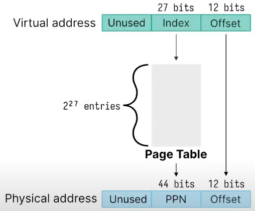

### 11.6.1. Page Table Entry (PTE)
Page Table Entry (PTE) also stores flags in the lower bits:

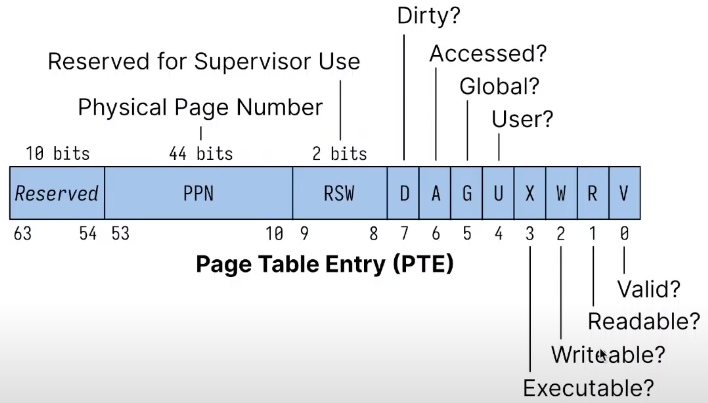

e.g. Considering the following page table:

| VPN | PPN |
| --- | --- |
| 0x0 | 0x1 |
| 0x1 | 0x4 |
| 0x2 | 0x3 |
| 0x3 | 0x7 |

We would get the following virtual-->physical address translations:

| ...                   |
| --------------------- |
| `0x0AB0` --> `0x1AB0` |
| `0x1FA0` --> `0x4FA0` |
| `0x2884` --> `0x3884` |
| `0x32D0` --> `0x72D0` |

***Q:*** how does the above translation work? {.lr}
> ***A:*** offset is 12 bits & each hex digit is 4 bits, so the last 3 hex digits in the virtual address represents the offset (location in page) {.lg}
  - remaining bits before offset is the index used to get the corresponding [PPN](#116-vpn-virtual-page-number--ppn-physical-page-number), which occupies the bits before the offset in the physical address

## 11.7. PRACTICE

> ---

***Q:*** Assume you have a 8-bit virtual address, 10-bit physical address, and each page is 64 bytes. {.lr}
> ***A:*** translate page size of 64 bytes to "$n$-bit page size to make calculations easier: $2^n = 64 \rightarrow n=6 \rightarrow$ 6-bit page size{.lg}

> ---

***Q: a)*** How many virtual pages are there? {.lr}
> ***A:*** $\frac{2^8}{2^6} = 4$ {.lg}
  - $\text{\# of virtual pages} = \frac{\text{\# of virtual addresses}}{\text{\# of bits per page}}$

> ---

***Q: b)*** How many physical pages are there? {.lr}
> ***A:*** $\frac{2^{10}}{2^6} = 16$ {.lg}
  - $\text{\# of physical pages} = \frac{\text{\# of physical addresses}}{\text{\# of bits per page}}$

> ---

***Q: c)*** How many entries are in the page table (i.e. # of PTEs)? {.lr}
> ***A:*** $4$ {.lg}
  - $\text{\# of PTEs} = 2^{\text{(\# of physical bits) - (\# of virtual bits)}}$
    - **if $\text{\# of physical bits} > \text{\# of virtual bits}$**
    - otherwise $1$ (since there are more than enough virtual addresses to represent each physical address in one page, so only one PTE)

> ---

***Q: *** Given the following page table, what's the physical address of virtual address `0xF1`? {.lr}

| VPN | PPN |
| --- | --- |
| 0x0 | 0x2 |
| 0x1 | 0x5 |
| 0x2 | 0x1 |
| 0x3 | 0x8 | {.lr}

- ***A:*** `0x231`{.g} {.lg}
  - convert virtual address from hex digits to bits: `0xF1` <=> `0b1111_0001`
  - need 2 bits for VPN (`0b11...`); remainder is offset (`...110001`)
  - translate from VPN to PP using page table (VPN: `0b11` <=> `0x3` --> PPN: `0x8` <=> `0b1000`) & keep offset as is to get physical address: `0b1000·110001` <=> `0x231`{.g}
    - `binary` -> `hex` via grouping by 4 bits from LSB

## 11.8. Each Process Gets Its Own Page Table
- When you `fork()` a process, it will copy the page table from the parent
   -  Turn off the write permission so the kernel can implement copy-on-write
- Problem is there are $2^{27}}$ entries in the page table, each one is 8 bytes
  - means the page table would be 1 GiB
- Note that RISC-V translates a 39-bit virtual to a 56-bit physical address
  - It has 10 bits to spare in the PTE and could expand
  - Page size is 4096 bytes (size of offset field)

### 11.8.1. `vfork()`
Shares all memory with the parent (means less overhead since page tables aren't copied)
- undefined behavior to modify anything
- only used in very performance sensitive programs

## 11.9. Using Pages for Memory Translation
- Divide memory into blocks, so we only have to translate once per block
- Use page tables (array of PTEs) to access the PPN (and flags)
- New problem: these page tables are always huge!


<!--------------------------------{.gray}------------------------------>


<hr style="border:30px solid #FFFF; margin: 100px 0 100px 0; {.gray}"> </hr>


<!--------------------------------{.gray}------------------------------>
<div style="page-break-after: always;"></div>

# 12. Page Tables (2023-10-05)
## 12.1. Reducing Page Table Memory Wastage
- We left off talking about [how large page tables can get & how `fork()`-ing can cause unnecessary duplications of large volumes of data](#each
)
- most programs don't use all virtual memory space; how can we take advantage?

### 12.1.1. Fit Page Table on a Page

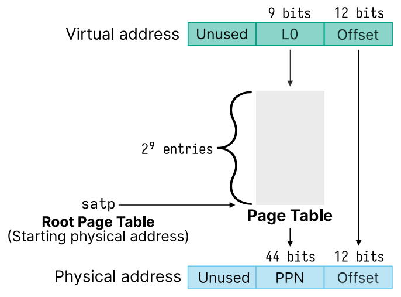

### 12.1.2. Multi-Level Page Tables (Save Space for Sparse Allocations)

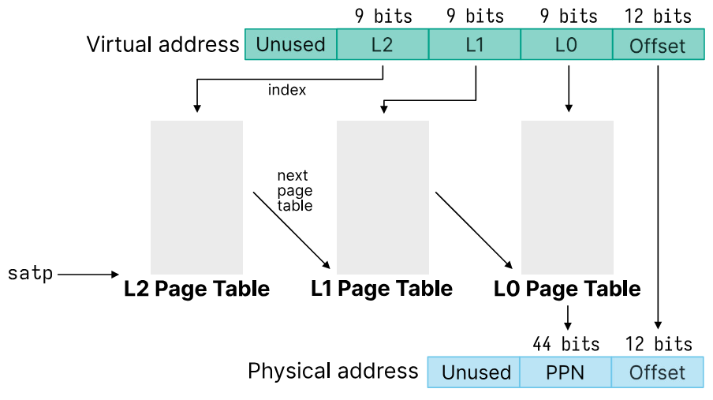

- processes use a register like `satp` to set the root page table (see diagram; `satp` just points to the L2 page table)
- procedure to translate virtual address to physical address:
  1. `L2` bits indicate index in L2 page table that points to which L1 page table to look at
  2. `L1` bits indicate index in L1 page table (given by value in `L2` bits) that points to which L0 page table to look at
  3. `L0` bits point to a PPN in the L0 page table

- is like a tree diagram

---

***Q:*** how does using a multi-level page table save space? {.lr}
- ***A:***  {.lg}
  - by breaking up the page table with $2^{27} \approx \text{1 GiB}$ entries into multiple page tables (each taking up/fitting on a page), we no longer need to copy the entire page table to translate a single address
  - we also don't have to fully fill out each page table (i.e. make all L2 page tables have entries all pointing to a L2 page table, etc.)
  - e.g. to translate a single address, we only need one L2 page table, one L1 page table, & one L0 page table = 3 pages ($\times 4 \text{ KiB} = 12 \text{ KiB vs. >1 GiB}$)

---

***Q:*** how many page tables does each page table point to? {.lr}
- ***A:***{.lg}
  - each L2 page table points to $2^9$ L1 page tables
    - each L1 page table points to $2^9$ L0 page tables
      - each L0 page table points to $2^9$ PPNs
  - $\text{total \# of PPNs} = (2^9)^3 = 2^{27} =$ same # of pages as a single page table

---

***Q:*** what disadvantages do multi-level page tables have compared to single-level page tables? {.lr}
> ***A:*** single-level page table has single translation, while multi-level has 3. {.lg}

## 12.2. Page Allocation (Uses a Free List)
Given physical pages, the operating system maintains a free list (linked list)
- The unused pages themselves contain the `next` pointer in the free list
  - Physical memory gets initialized at boot
- Linked list setup allows for fast addition/removal of pages
  - To allocate a page, you remove it from the free list
  - To deallocate a page you add it back to the free list

### 12.2.1. TODO: ADD MERMAID DIAGRAM OF FREE LIST

### 12.2.2. Page Allocation USING A PAGE FOR EACH SMALLER PAGE TABLE
- $512 = 2^9 \text{entries}$ of $8 = 2^3 \text{bytes} = 4096 \text{bytes}$
- `PTE` for `L(N)` points to the page table for the next lowest level `L(N-1)`
- Follow page tables until `L0` (which contains `PPN`)

***Q:*** what if we wanted 4 levels in our multi-level page table? {.lr}
> ***A:*** then we would need an additional 9 bits for the 4th level (L3), meaning that we would need $(9*3+12)+9 = (27+12)+9 = 39+9 = 48$ bits to represent virtual addresses {.lg}

### 12.2.3. ANALOGY: Smaller Page Tables <==> Arrays
Instead of...
```c
int page_table[512]; // What's the size of this?
/* or */
x = page_table[2]; // What's the offset of index 2?
```
...we have...
```c
PTE page_table[512];
/* where: */
sizeof(page_table) == PAGE_SIZE;
/* and */
sizeof(page_table) = number of entries * sizeof(PTE);
```

***Q:*** what does the above analogy mean? {.lr}
- ***A:*** answer {.lg}
  - `int page_table[512];` -- $512 \text{ ints} \times \frac{4 \text{ bytes}}{\text{int}} = 2048 \text{ bytes} = 2^{11} \text{ bytes (B)} = 2 \text{ KiB}$

<!-- WHITEBOARD EXAMPLE -->

## 12.3. PRACTICE
### 12.3.1. TODO: REFORMAT AS QUESTION OF HOW MUCH SPACE IS SAVED IF WE USING 2-LEVEL VS. SINGLE-LEVEL PAGE TABLE

Assume our process uses just one virtual address at `0x3FFFF008`
```c
   0x3FFFF008
// =
   0b11_1111_1111_1111_1111_0000_0000_1000
// =
   0b111111111_111111111_000000001000
```
- offset is `0x008`
- L0 index (9 bits): `0b111 111 111` = 511
- L1 index (9 bits): `0b111 111 111` = 511

If we consider a 30-bit virtual address with a page size of 4096 bytes:
- ***A:*** need a 2 MiB page table if single-level page table ($2^{18} \times 2^{3}$) {.lg}

If we instead have a 4 KiB L1 page table ($2^9 \times 2^{3}$) and a 4 KiB L0 page table
- ***A:*** Total of 8 KiB instead of 2 MiB {.lg}

NOTE: worst case if we used all virtual addresses we would consume 2 MiB + 4 KiB {.p}

<!-- DIAGRAM ILLUSTRATING SCENARIO -->

### 12.3.2. Translating `3FFFF008` with 2 Page Tables
Consider the L1 table with the entry...

| **Index** | **PPN** |
| --------- | ------- |
| 511       | `0x8`   |

...and the L0 table located at `0x8000` with the entry:

| **Index** | **PPN**  |
| --------- | -------- |
| 511       | `0xCAFE` |

> ***A:*** final translated physical address would be: `0xCAFE008` {.lg}

## 12.4. EXAMPLE CODE IMPLEMENTATION
```c
// mmusim.c

#include <assert.h>
#include <errno.h>
#include <stdint.h>
#include <stdio.h>
#include <stdlib.h>
#include <sys/mman.h>
#include <unistd.h>

static uint64_t* allocate_page_table();
static void deallocate_page_table(void* page);
static uint64_t mmu(uint64_t virtual_address);
uint64_t pte_from_ppn(uint64_t ppn);
uint64_t pte_from_page_table(uint64_t* page_table);

// -----------------

#define PAGE_SIZE 4096

#define LEVELS 3
#define PTE_VALID (1 << 0)

static uint64_t* root_page_table = NULL;

// -----------------

int main() {
  // sanity check: kernel page size matches my code's assumed page size (4096 B)
  assert(sysconf(_SC_PAGE_SIZE) == PAGE_SIZE);

  // returns a new page table
  uint64_t* l2_page_table_1 = allocate_page_table();

  // set root page table (L2)
  root_page_table = l2_page_table_1;

  uint64_t* l1_page_table_1 = allocate_page_table();
  l2_page_table_1[0] = pte_from_page_table(l1_page_table_1);

  uint64_t* l0_page_table_1 = allocate_page_table();
  l1_page_table_1[5] = pte_from_page_table(l0_page_table_1);

  l0_page_table_1[188] = pte_from_ppn(0xCAFE);

  mmu(0xABCDEF); // returns PPN using VPN
  mmu(0x1ABCDEF); // address does not exist; page fault

  deallocate_page_table(root_page_table);
  root_page_table = NULL;

  return 0;
}

// -----------------

static uint64_t* allocate_page_table() {
  void* page = mmap(NULL, PAGE_SIZE, PROT_READ|PROT_WRITE, MAP_ANONYMOUS|MAP_PRIVATE, -1, 0);
  if (page == MAP_FAILED) {
    int err = errno;
    perror("mmap");
    exit(err);
  }
  return page;
}

static void deallocate_page_table(void* page) {
  if (munmap(page, PAGE_SIZE) == -1) {
    int err = errno;
    perror("munmap");
    exit(err);
  }
}

static uint64_t mmu(uint64_t virtual_address) {
  uint64_t* page_table = root_page_table;
  uint64_t va = (uint64_t) virtual_address;
  for (int i = LEVELS - 1; i >= 0; --i) {
    uint8_t start_bit = 9 * i + 12;
    uint64_t mask = (uint64_t) 0x1FF << start_bit;
    uint16_t index = (mask & va) >> start_bit;

    uint64_t pte = page_table[index];
    if (!(pte & PTE_VALID)) {
      printf("0x%lX: page fault\n", va);
      return 0;
    }

    if (i != 0) {
      page_table = (uint64_t*) ((pte >> 10) << 12);
      continue;
    }

    uint64_t pa = ((pte & ~0x3FF) << 2) | (va & 0xFFF);
    printf("0x%lX: 0x%lX\n", va, pa);
    return pa;
  }
  __builtin_unreachable();
}


uint64_t pte_from_ppn(uint64_t ppn) {
  uint64_t pte = ppn << 10;
  pte |= PTE_VALID;
  return pte;
}

uint64_t pte_from_page_table(uint64_t* page_table) {
  return pte_from_ppn(((uint64_t) page_table) >> 12);
}
```

***Q:*** manually translate virtual address `0xABCDEF` {.lr}
- ***A:***  {.lg}
  - `0xDEF` is offset
  - L0 index: `0b0_1011_1100` = 188
  - L1 index: `0b0_0000_0101` = 5
  - L2 index: `0` = `0b0_0000_0000`

<!-- DIAGRAM ILLUSTRATING CONCEPT -->


<!--------------------------------{.gray}------------------------------>


<hr style="border:30px solid #FFFF; margin: 100px 0 100px 0; {.gray}"> </hr>


<!--------------------------------{.gray}------------------------------>
<div style="page-break-after: always;"></div>

# 13. Page Table Implementation (2023-10-06)
## 13.1. ALIGNMENT: Memory Eventually Lines Up With Byte 0
- If pages are **`4096` byte aligned** in memory, this means pages always start when the lower 12 bits are zero, in computing we like alignment.
  - if pages are aligned, this makes our lives easier since we know where page ends automatically

```c
page starting at address `0x7C00` --> last byte would be at address `0x8BFF`
// vs.
page starting at address `0x7000` --> last byte would be at address `0x7FFF`
```

***Q:*** Is address `0xEC` 8-byte aligned? {.lr}
- ***A:*** 8 byte aligned = address is a multiple of 8 {.lg}
  - `0xC` $= 12$ --> **not a multiple of 8**{.r} ! --> $\therefore$ not 8-byte aligned
  - recall for pages: `0xFFF` $= 4096$ --> $\therefore$ 4096 byte aligned

***Q:*** Is address `0x4F` 16-byte aligned? {.lr}
> ***A:*** no; 16-byte aligned requires LSB to be 0 (e.g. `0x10` -> `0x20` is 16-byte aligned) {.lg}

## 13.2. PRACTICE: How Many Page Tables Do We Need?
***Q:*** assume our program uses 512 pages; ***a)*** What's the minimum number of page tables we need? {.lr}
- ***A:*** 3; $\text{1 page table } = 512 \text{ pages}$, so we only need 1 L0 page table (and then one L1 & one L2 table pointing to it) {.lg}
  - 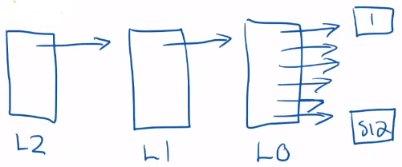

***Q: b)*** What's the maximum number of page tables? {.lr}
- ***A:*** 1025 $= 512 + 512 + 1$ {.lg}
  - 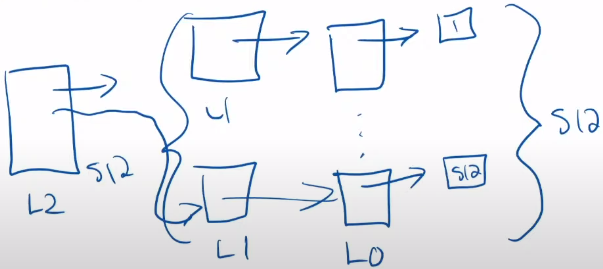


## 13.3. PRACTICE: How Many Levels Do I Need?
Assume we have a 32-bit virtual address with a page size of 4096 bytes and a PTE size of 4 bytes.

Want each page table to fit into a single page
- Find the number of PTEs we could have in a page ($2^{10}$)
  - ${log_2(\text{\# PTEs per page})}$ is the number of bits to index a page table
- $\text{\# of levels} = \lceil \frac{\text{(VIRTUAL bits) - (OFFSET bits)}}{\text{INDEX bits}} \rceil$

***Q: a)*** given a 32-bit virtual address, 4096-byte page size, & 4-byte PTE, how many entries can we fit onto our (page-sized) page table? {.lr}
> ***A:*** $\frac{2^{12}}{2^2} = 2^{10}  = 1024$ entries {.lg}
  - $\frac{\text{\# of PTEs}}{page} = \frac{\text{\# of pages}}{\text{\# of PTEs}}$

***Q: b)*** how many levels of page tables do we need given the previous requirements? {.lr}
- ***A:*** $\text{\# of levels} = \lceil \frac{\text{(VIRTUAL bits) - (OFFSET bits)}}{\text{INDEX bits}} \rceil = \lceil \frac{32 - 12}{10} \rceil = \lceil \frac{20}{10} \rceil = \lceil 2 \rceil = 2$ levels of page tables {.lg}
  - makes sense since the size of each level (= \# of entries in each page table) is 10 bits ($2^{10}$ entries), so: L1 (10 bits), L0 (10 bits), offset (12 bits) ==> **32 bits (given size of virtual address!)**{.g}


## 13.4. Speeding Up Page Table Implementation via Caching
### 13.4.1. Using the Page Tables for Every Memory Access is Slow
- We need to follow pointers across multiple levels of page tables!
- We'll likely access the same page multiple times (close to the first access time)
- A process may only need a few VPN $\rightarrow$ PPN mappings at a time
- Classic CS solution: **caching**

### 13.4.2. Translation Look-Aside Buffer (TLB)
A TLB Caches PTEs

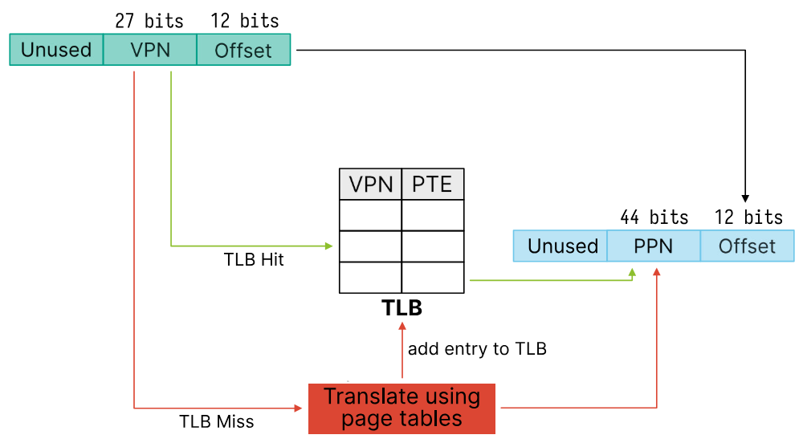

#### 13.4.2.1. Effective Access Time (EAT)
Assume a single page table (there's only one additional memory access in the page table)

$$\begin{aligned}
  & \text{TLB Hit Time} = \text{TLB Search} &&+ \text{Mem} \\
  & \text{TLB Miss Time} = \text{TLB Search} &&+ 2 \times \text{Mem}
\end{aligned}$$

$$\begin{aligned}
  \text{EAT} = &\ &&(\alpha) \times (\text{TLB Hit Time}) \\
  &+ &&(1 - \alpha) \times (\text{TLB Miss Time})
\end{aligned}$$

***Q:*** if $\alpha = 0.8$, $\text{TLB Search} = 10\ ns$, & memory accesses take `100 ns`, calculate EAT. {.lr}
- ***A:*** {.lg}
  $$\begin{aligned}
    \text{EAT}
    &= 0.8 \times \text{110 ns} + 0.2 \times \text{210 ns} \\
    &= \text{130 ns}
  \end{aligned}$$

#### 13.4.2.2. Context Switches Require Handling the TLB
You can either flush the cache, or attach a process ID to the TLB.

- Most implementations just flush the TLB
  - RISC-V uses a `sfence.vma` instruction to flush the TLB
  - On x86 loading the base page table will also flush the TLB

### 13.4.3. `test-tlb.c` Results
```c
./test-tlb <size> <stride>

/* Creates a <size> memory allocation and acccesses it every <stride> bytes */
```

Results:
```c
> ./test-tlb 4096 4 // ALL cache HITS, since within page size
      1.93ns (~7.5 clock cycles) // BEST performance

> ./test-tlb 536870912 4096 // ALL cache MISSES, since larger than page size
      155.51ns (~606.5 clock cycles) // WORST performance

> ./test-tlb 16777216 128 // 50-50 cache hits-misses
      14.78ns (~57.6 clock cycles) // avg. performance
```

## 13.5. Using `sbrk()` for Userspace Allocation
This call grows or shrinks your heap (the stack has a set limit)
- For growing, it'll grab pages from the free list to fulfill the request
  - The kernel sets `PTE_V` (valid) and other permissions
- In memory allocators this is difficult to use, you'll rarely shrink the heap
  - It'll stay claimed by the process, and the kernel cannot free pages

- Memory allocators use `mmap` to bring in large blocks of virtual memory

## 13.6. Kernel Initializes the Process' Address Space

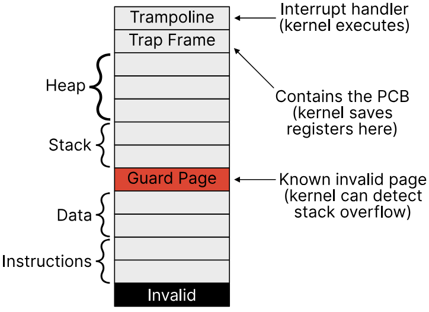

## 13.7. Kernel Can Provide Fixed Virtual Addresses
Allows the process to access kernel data without using a system call
- e.g. `clock_gettime` does not do a system call; instead it just reads from a virtual address mapped by the kernel

### 13.7.1. Page Faults Allow the Operating System to Handle Virtual Memory
- Page faults are a type of exception for virtual memory access
  - Generated if it cannot find a translation, or permission check fails
- This allows the operating system to handle it however it wants
  - e.g. lazily allocate pages, implement copy-on-write, or swap to disk

## 13.8. SUMMARY
The MMU is the hardware that uses page tables, which may:
- Be a single large table (wasteful, even for 32-bit machines)
- Use the kernel allocated pages from a free list
- Be a multi-level to save space for sparse allocations
- Use a TLB to speed up memory accesses


<!--------------------------------{.gray}------------------------------>


<hr style="border:30px solid #FFFF; margin: 100px 0 100px 0; {.gray}"> </hr>


<!--------------------------------{.gray}------------------------------>
<div style="page-break-after: always;"></div>

# 14. Priority Scheduling and Memory Mapping (2023-10-10)
## 14.1. Dynamic Priority (Feedback) Scheduling

- use set time slices, and measure CPU usage
- let the algorithm manage the priorities
  - Increase the priority of processes that don't use their time slice
  - Decrease the priority of processes that use their full time slice

### 14.1.1. Dynamic Priority Calculations

- Each processes gets assigned a priority when started, $P_n$
- Pick the lowest priority number to schedule, if it yields, pick the next lowest number
  - Breaks ties with arrival order!
  - If a lower priority number becomes ready, switch to it
- Record how much time each process executes for in this priority interval, $\mathsf{C_n}$
  - Timer interrupts still occur
- At the end of the priority interval, update the priority of each process with:
  - $\mathsf{P_n =  \frac{P_n}{2} + C_n}$
  - and reset the value of $\mathsf{C_n}$ back to 0

#### 14.1.1.1. Priority Interval

Time between recalculations of priority using the dynamic priority algorithm.
- Means that processes will have the same priority between priority intervals, even if one or multiple processes terminate within an interval

### 14.1.2. PRACTICE

- ***Q:*** Assume we have 4 processes (each with an initial priority of 0 & infinite runtime) ready to execute arriving in order: X, Y, A, B {.lr}
  - A and B are CPU bound processes
  - X and Y are I/O bound processes that execute for 1 and block for 5
  - Timer interrupts occur every 1, and each time slice is 10, priority interval is 10

What is the scheduling? (each box is a timer interrupt) {.lr}

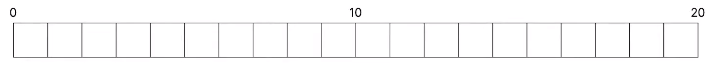 {.lr}

- ***A:***  {.lg}
  1. Since each process has the same initial priority, we schedule the earliest arriving one first (X)
  2. X is I/O bound; executes from 0->1, then blocks until 6 (Y goes next; executes from 1->2, then blocks until 7)
  3. A goes after X,Y and executes from 2->10 (when priority is recalculated); we do not context-switch to X,Y after they have finished blocking at 6,7 because they have the same priority as A
  4. at t=10, we recalculate priorities:
     - $\mathsf{P_X} = \frac{0}{2} + 1 = 1$}
     - $\mathsf{P_Y} = \frac{0}{2} + 1 = 1$}
     - $\mathsf{P_A} = \frac{0}{2} + 8 = 8$}
     - $\mathsf{P_B} = \frac{0}{2} + 0 = 0$}
    - new order of priorities (highest-->lowest): **B(0), X(1), Y(1), A(8)**
  5. since B has the highest priority, it will run for the full time interval from 10->20
  - 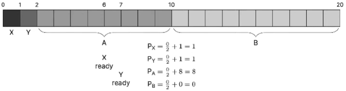

---

- ***Q:*** Assume we have 4 processes (**A, B have priority 6; X, Y have priority 0**; infinite runtime) ready to execute arriving in order: X, Y, A, B {.lr}
  - A and B are CPU bound processes
  - X and Y are I/O bound processes that execute for 1 and block for 5
  - Timer interrupts occur every 1, and each time slice is 10, priority interval is 10

What is the scheduling? (each box is a timer interrupt) {.lr}

 {.lr}

- ***A:*** {.lg}
  1. X, Y run first from 0->1, 1->2; blocks from 1->6, 2->7
  2. A then runs from 2->6; **at t=6, X (higher priority than A) has finished blocking, so we context-switch back to X for 1 time unit** (6->7); same idea for Y (7->8)
     - X, Y blocks from 7->12, 8->13
  3. A resumes from 8->10 (A still has priority over B because A came before & priority hasn't been recalculated)
  4. at t=10, we recalculate priorities:
     - $\mathsf{P_X} = \frac{0}{2} + 2 = 2$;
     - $\mathsf{P_Y} = \frac{0}{2} + 2 = 2$;
     - $\mathsf{P_A} = \frac{6}{2} + 6 = 9$;
     - $\mathsf{P_B} = \frac{6}{2} + 0 = 3$;
     - new order of priorities (highest-->lowest): **X(2), Y(2), B(3), A(9)**
  5. X,Y have lower priority but still blocked, so B runs until X, Y unblocked; then after X,Y re-execute, B resumes because it has higher priority than A
  - 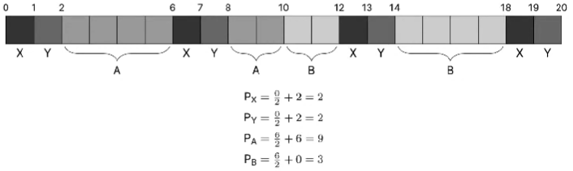

## 14.2. Memory Mapping (NOT TESTABLE)

Memory map, or `mmap`` is used to map files to a processes' virtual address space.
- The pointer (virtual address) returned will allow you to access the file directly

### 14.2.1. `mmap`

`mmap` takes 6 arguments:
1. **`void *addr`**: suggested starting address (**`NULL`** means you don't care)
2. **`size\_t length`**: number of bytes to map
3. **`int prot`**: protection flags (read/write/execute)
4. **`int flags`**: mapping flags (shared/private/anonymous)
   - anonymous means the mapping isn't backed by a file
5. **`int fd`**: file descriptor to map (ignored for anonymous)
6. **`off\_t offset`**: offset to start the mapping (must be a multiple of page size)

## 14.3. `mmap` Example
```c
// mmap.c

#include <assert.h>
#include <fcntl.h>
#include <stdio.h>
#include <sys/mman.h>
#include <sys/stat.h>
#include <unistd.h>

int main(void) {
    int fd = open("mmap.c", O_RDONLY);
    assert(fd == 3);
    struct stat stat;
    assert(fstat(fd, &stat) == 0);
    char* data = mmap(NULL, stat.st_size, PROT_READ, MAP_PRIVATE, fd, 0);
    assert(data != MAP_FAILED);
    assert(close(fd) == 0);

    for (int i = 0; i < stat.st_size; ++i) {
        printf("%c", data[i]);
    }

    assert(munmap(data, stat.st_size) == 0);
    return 0;
}

```

### 14.3.1. Why `mmap` Is More Efficient

Since `mmap` is able to read/write data w/o having to setup a buffer, use system calls, it is more efficient than the alternative (setup a buffer, use system calls).

### 14.3.2. `mmap` Details
- It just sets up the page tables, it doesn't actually read from the file
- It would create an invalid PTE during the `mmap` call
- The kernel uses the remaining bits of the PTE for bookkeeping
  - Where on the disk is this entry
- The first access to the page would generate a page fault
  - The kernel would then read from disk into memory
- This ensures only the used parts of the file get read

### 14.3.3. `mmap` Page Table Calculations

- ***Q:*** How much space would the kernel need for page tables? Is this correct? Why or why not? {.lr}
  - Someone posted you'd need 40 MB of page tables:
    - $(20*(1024*1024*1024)/4096*8) / (1024*1024)$
  - Someone else clarified it's:
    - $(20GB / 4KB Page size * 8 bytes per PTE) / 1KB$
    - (i.e. the 1KB at the end should be 1MB)

> ***A:*** you also need to take into account the multiple levels of page tables! {.lg}

***Q:*** How much space do our page tables need in the best case? {.lr}

- ***A:*** {.lg}
  - $\mathsf{\frac{20 \times 2^{30}}{2^{12}} = 20 \times 2^{18}}$ PTEs
    - However, these are how many PTEs we need across only the L0 page tables!
  - $\mathsf{\frac{20 \times 2^{18}}{2^{9}} = 20 \times 2^{9} = 10240}$ full L0 page tables (40 MB)
  - Each L1 page table can point to 512 L0 page tables
    -  $\mathsf{\frac{10240}{512} = 20}$ full L1 page tables
   -  **So we'd need `10250` full page tables $\mathsf{= \frac{10260 \times 4096}{2^{20}} = 40.078125}$ MiB**


<!--------------------------------{.gray}------------------------------>


<hr style="border:30px solid #FFFF; margin: 100px 0 100px 0; {.gray}"> </hr>


<!--------------------------------{.gray}------------------------------>
<div style="page-break-after: always;"></div>

# 15. Sockets (2023-10-12)
## 15.1. Sockets = IPC Between Machines
- Pipes and signals; shared memory (seen previously)
  - IPC that assume that the processes are on the same physical machine
- **Sockets**
  - enable **IPC between physical machines, typically over the network**

## 15.2. Socket System Calls
### 15.2.1. SERVER vs. CLIENT Socket System Calls
#### 15.2.1.1. System Calls to Use Sockets on SERVERS

4 system calls (each of which have C wrappers):
1. `socket`
   - Create the socket
2. `bind`
   - Attach the socket to some location (a file, IP:port, etc.)
3. `listen`
   - Indicate you're accepting connections, and set the queue limit
4. `accept`
   - Return the next incoming connection for you to handle

#### 15.2.1.2. System Calls to Use Sockets on CLIENTS

1. `socket`
   - Create the socket
2. `connect`
   - Connect to some location (socket can now send/receive data)

### 15.2.2. `socket` (Sets the Protocol and Type of Socket)

```c
int socket(int domain, int type, int protocol);
```

- `domain` is the general protocol, further specified with `protocol` (mostly unused)
  - `AF_UNIX` is for local communication (on the same physical machine)
  - `AF_INET` is for IPv4 protocol using your network interface
  - `AF_INET6` is for IPv6 protocol using your network interface
- `type` is (usually) one of two options: stream or datagram sockets

#### 15.2.2.1. Socket Protocols
##### 15.2.2.1.1. Stream Sockets Use TCP
- All data sent by a client appears in the same order on the server
- Forms a persistent connection between client and server
- Reliable, but may be slow

##### 15.2.2.1.2. Datagram Sockets Use UDP
- Sends messages between the client and server
- No persistent connection between client and server
- Fast but messages may be reordered, or dropped

### 15.2.3. `bind` (Sets a Socket to an Address)
```c
int bind(int socket, const struct sockaddr *address, socklen_t address_len);
```

- `socket` is the file descriptor returned from the `socket` system call
- There's different `sockaddr` structures for different protocols
  - `struct sockaddr_un` -- for local communcation (just a path)
  - struct sockaddr_in` -- for IPv4, a IPv4 address (e.g. 8.8.8.8)
  - `struct sockaddr_in6` -- for IPv6, a IPv6 address (e.g. `2001:4860:4860::8888`)

### 15.2.4. `listen` (Sets Queue Limits for Incoming Connections)
```c
int listen(int socket, int backlog);
```
- `socket` is still the file descriptor returned from the
- `backlog` is the limit of the outstanding (not accepted) connections
  - The kernel manages this queue, and if full will not allow new connections
  - We'll set `backlog` to 0 to use the default kernel queue size

### 15.2.5. `accept` (Blocks Until There's a Connection)
```c
int accept(int socket, struct sockaddr *restrict address, socklen_t *restrict address_len);
```

- `socket` is still the file descriptor returned from the
- `address` & `address_len` are locations to write the connecting address
  - Acts as an optional return value, set both to `NULL` to ignore
- This returns a new file descriptor, we can `read` or `write`to as usual

### 15.2.6. `connect` (Allows a Client to Connect to an Address)

```c
int connect(int sockfd, const struct sockaddr *addr, socklen_t addrlen);
```

- `sockfd` is the file descriptor returned by the `socket` system call
- The client would need to be using the same protocol and type as the server
- `addr` and `addrlen` is the address to connect to, exactly like `bind`
- If this call succeeds then `sockfd` may be used as a normal file descriptor

### 15.2.7. `send`/`recv` (Instead Of `read`/`write`)

- These system calls are basically the same thing, except they have `flags`
- Some examples are:
  - `MSG_OOB` --- Send/receive out-of-band data
  - `MSG_PEEK` --- Look at data without reading
  - `MSG_DONTROUTE` --- Send data without routing packets
- Except for maybe `MSG_PEEK`, you do not need to know these
- `sendto`/`recvfrom` also takes an additional address
  - The kernel ignores the address for stream sockets (there's a connection)

## 15.3. Server Example

- sends `"Hello there!"` to every client and disconnects
- uses a local socket just for demonstration, but you could use IPv4 or IPv6
- uses signals to clean up and terminate from our infinite `accept` loop

```c
// server.c

#include <assert.h>
#include <errno.h>
#include <signal.h>
#include <stdbool.h>
#include <stdio.h>
#include <stdlib.h>
#include <string.h>
#include <sys/socket.h>
#include <sys/un.h>
#include <unistd.h>

#define errno_exit(str)                                                        \
  do { int err = errno; perror(str); exit(err); } while (0)

#define SOCKET_PATH "example.sock"

static int fd;

void close_socket() {
  if (close(fd)) {
    errno_exit("close");
  }
  if (unlink(SOCKET_PATH)) {
    errno_exit("unlink");
  }
  exit(0);
}

void handle_signal(int signum) {
  assert(signum == SIGINT || signum == SIGTERM);
  close_socket();
}

void register_signal(int signum) {
  void (*sig_ret)(int) = signal(signum, handle_signal);
  if (sig_ret == SIG_ERR) {
    int err = errno;
    perror("signal");
    exit(err);
  }
}

int main(void) {
  register_signal(SIGINT);
  register_signal(SIGTERM);

  fd = socket(AF_UNIX, SOCK_STREAM, 0);
  if (fd == -1) {
    errno_exit("socket");
  }

  struct sockaddr_un sockaddr = {0};
  sockaddr.sun_family = AF_UNIX;
  strncpy(sockaddr.sun_path, SOCKET_PATH, sizeof(sockaddr.sun_path) - 1);

  if (bind(fd, (const struct sockaddr*) &sockaddr, sizeof(sockaddr))) {
    errno_exit("bind");
  }

  if (listen(fd, 0)) {
    errno_exit("listen");
  }

  while (true) {
    int connection_fd = accept(fd, NULL, NULL);
    if (connection_fd == -1) {
      errno_exit("accept");
    }

    const char *msg = "Hello there!";
    ssize_t len = strlen(msg) + 1;
    ssize_t bytes_written = write(connection_fd, msg, len);
    if (bytes_written == -1) {
      errno_exit("write");
    }
    else if (bytes_written != len) {
      dprintf(2, "write: Unexpected partial result");
      exit(1);
    }

    if (close(connection_fd)) {
      errno_exit("close");
    }
  }

  return 0;
}
```

```c
// client.c

#include <errno.h>
#include <signal.h>
#include <stdio.h>
#include <stdlib.h>
#include <string.h>
#include <sys/socket.h>
#include <sys/un.h>
#include <unistd.h>

#define errno_exit(str)                                                        \
  do { int err = errno; perror(str); exit(err); } while (0)

#define SOCKET_PATH "example.sock"

int main(void) {
  int fd = socket(AF_UNIX, SOCK_STREAM, 0);
  if (fd == -1) {
    errno_exit("socket");
  }

  struct sockaddr_un sockaddr = {0};
  sockaddr.sun_family = AF_UNIX;
  strncpy(sockaddr.sun_path, SOCKET_PATH, sizeof(sockaddr.sun_path) - 1);

  if (connect(fd, (const struct sockaddr*) &sockaddr, sizeof(sockaddr))) {
    errno_exit("connect");
  }

  char buffer[4096];
  ssize_t bytes_read;
  while ((bytes_read = read(fd, buffer, sizeof(buffer))) > 0) {
    /* Just keep reading all the data we can */
  }
  if (bytes_read == -1) {
    errno_exit("read");
  }

  printf("Received: \"%s\"\n", buffer);

  close(fd);

  return 0;
}
```

## 15.4. Why Use Sockets?

**You perform networking through sockets**; sockets are IPC across physical machines, the basics are:
- Sockets require an address (e.g. local and IPv4/IPv6)
- There are two types of sockets: stream and datagram
- Servers need to bind to an address, listen, and accept connections
- Clients need to connect to an address

## 15.5. SUMMARY
Sockets are IPC across physical machines that enable networking, the basics are:
- Sockets require an address (e.g. local and IPv4/IPv6)
- There are two types of sockets: stream and datagram
- Servers need to bind to an address, listen, and accept connections
- Clients need to connect to an address


<!--------------------------------{.gray}------------------------------>


<hr style="border:30px solid #FFFF; margin: 100px 0 100px 0; {.gray}"> </hr>


<!--------------------------------{.gray}------------------------------>
<div style="page-break-after: always;"></div>

# 16. Threads (2023-10-13)
## 16.1. CONCURRENCY vs. PARALLELISM

Parallelism & concurrency are **independent** (a process can be parallel & concurrent, neither parallel nor concurrent, etc.).

- Concurrency
  - Switching between two or more things (can you get interrupted)
  - Goal: make progress on multiple things
- Parallelism
  - Running two or more things at the same time (are they independent)
  - Goal: run as fast as possible

## 16.2. THREADS vs. (FORKED) PROCESSES
### 16.2.1. Threads as Processes With Shared Memory
Threads operate on the same principle as processes, **except threads share memory by default**
- threads have their own registers, program counter, & stack
- this memory has the same address space, so changes appear in each thread
  - need to explicitly declare memory specific to some thread if needed (TLS)

#### 16.2.1.1. Memory Diagram of a Process With Multiple Threads

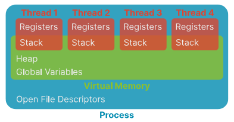

### 16.2.2. Each Process Can Have Multiple Threads

- By default, a process just executes code in its own address space (i.e. **just one thread at start!**)
- Threads allow multiple executions in the same address space
- Threads have lighter weight & are less expensive to create than processes
  - They share code, data, file descriptors, etc.

### 16.2.3. Thread Concurrency Using A Single CPU

- A process can appear like it’s executing in multiple locations at once
  - However, the OS is just context switching within a process
- It may be easier to program concurrently (e.g., handle a web request in a new thread)
  - >
    ```c
    // a single thread can be dedicated to poll for & process requests

    // CPU will context-switch to it (according to scheduler) consistently,
    // but also execute other processes in between

    while (true) {
      struct request *req = get_request();
      create_thread(process_request, req);
    }
    ```

### 16.2.4. Summary of THREADS vs. PROCESSES


| PROCESS                                  | THREAD                                |
| ---------------------------------------- | ------------------------------------- |
| Independent code / data / heap           | Shared code / data / heap             |
| Independent execution                    | Must live within an executing process |
| Has its own stack and registers          | Has its own stack and registers       |
| Expensive creation and context switching | Cheap creation and context switching  |
| Completely removed from OS on exit Stack | removed from process on exi           |

## 16.3. Using Threads in C via `pthread`
### 16.3.1. `pthread_create`
returns 0 on success, error number otherwise (contents of `*thread` are undefined)
```c
int pthread_create(pthread_t* thread,
                   const pthread_attr_t* attr,
                   void* (*start_routine)(void*),
                   void* arg);
```
- `thread` -- creates a handle to a thread at pointer location
- `attr` -- thread attributes (NULL for defaults, more details later)
- `start_routine` -- function to start execution
- `arg` -- value to pass to start\_routine

#### 16.3.1.1. `pthread` Example
Note that I didn't have to do the following (that normally would be needed for forked processes):
- call `wait` to acknowledge child process termination
- need a separately-declared function to run thread code** vs.** forked process code can be run as a conditional block

```c
#include <pthread.h>
#include <stdio.h>

void* run(void*) {
  printf("In run\n");
  return NULL;
}

int main() {
  pthread_t thread;
  pthread_create(&thread, NULL, &run, NULL);
  printf("In main\n");
}
```

### 16.3.2. `pthread_join`
- Returns 0 on success, error number otherwise
- **only call this once per thread!**
  - multiple calls on the same thread leads to undefined behavior
```c
int pthread_join(pthread_t thread,
                 void** retval)
```
- `thread` -- wait for this thread to terminate (thread must be joinable)
- `wait` -- stores exit status of thread (set by `pthread_exit`) to the location pointed by *retval; if cancelled, returns `PTHREAD_CANCELED`; `NULL` is ignored.

#### 16.3.2.1. PRACTICE

- ***Q:*** what will the following code print & why? {.lr}
  ```c
  // pthread-example.c

  #include <pthread.h>
  #include <stdio.h>

  void* run(__attribute__((unused)) void* arg) {
    printf("In run\n");
    return NULL;
  }

  // can think of `main` as a thread too
  int main(void) {
    pthread_t thread;
    pthread_create(&thread, NULL, &run, NULL);
    printf("In main\n");
    return 0;
  }
  ```

> ***A:*** since `pthread_join` is not called, the process exits at `return 0` instead of waiting for the thread to execute (slower than `main` because it has to setup) {.lg}
  -
    ```c
    // ...

    int main(void) {
      pthread_create(&thread, NULL, &run, NULL);
      // ...
      pthread_join(thread, NULL);
      // ...
      return 0;
    }
    ```

  ***Q:*** in what order will the thread vs. `main` code run? {.lr}
  > ***A:*** it is indeterminant (although in most cases `main` will run first) {.lg}

### 16.3.3. `pthread_exit`
- NOTE: `start_routine` returning is equivalent of calling `pthread_exit`
  - analogous to returning from `main` & calling `exit`
- `pthread_exit` is called implicitly when the `start_routine` of a thread returns
- **if `pthread_exit`, the process won't exit until all other threads have finished executing!**
```c
void pthread_exit(void *retval);
```

- `retval` -- return value passed to function that calls `pthread_join`

## 16.4. DETACHED Threads

- Joinable (default) threads
  - wait for `pthread_join` call before they release their resources
- **DETACHED Threads**
  - release resources when execution finishes

### 16.4.1. `pthread_detach`
- Returns 0 on success, error number otherwise
- Calling `pthread_detach` on an already-detached thread is undefined behaviour
```c
int pthread_detach(pthread_t thread);
```
- `thread` -- marks the thread as detached

#### 16.4.1.1. `pthread_attr_setdetachstate`
```c
pthread_attr_setdetachstate(&attributes,
                            PTHREAD_CREATE_JOINABLE);
                        //  PTHREAD_CREATE_DETACHED);
```
- an alternative way to set a thread state to joinable or detached

### 16.4.2. PRACTICE

- ***Q:*** what will the following code print & why? {.lr}
  ```c
  // detached-error.c

  #include <pthread.h>
  #include <stdio.h>

  void* run(void*) {
    printf("In run\n");
    return NULL;
  }

  int main() {
    pthread_t thread;
    pthread_create(&thread, NULL, &run, NULL);
    pthread_detach(thread);
    printf("In main\n");
  }
  ```

> ***A:*** prints `"In main"` only  {.lg}

***Q:*** how do we get thread print statement to show up given that we can't call `pthread_join` on the detached thread? {.lr}
> ***A:*** call `pthread_exit(NULL);` after the `printf("In main\n");` so that [the process does not exit until all threads have finished running](#pthread_exit) {.lg}

***Q:*** can you call `pthread_detach` in the function for that very thread? {.lr}
> ***A:*** yes; use `pthread_self` to get a reference to the running thread as a parameter to `pthread_detach` so that the thread detaches itself. {.lg}

***Q:*** is it faster to create threads or processes? {.lr}
> ***A:*** it is faster to create threads because their shared memory means a smaller resource requirement (see [THREADS vs. PROCESSES](#threads
)) {.lg}

## 16.5. Using ATTRIBUTES To Get/Set Thread Variables
```c
// stack-size.c

#include <pthread.h>
#include <stdio.h>

size_t stacksize;
pthread_attr_t attributes;
pthread_attr_init(&attributes);
pthread_attr_getstacksize(&attributes, &stacksize);
printf("Stack size = %i\n", stacksize);
pthread_attr_destroy(&attributes);
```

- Running the above should show a stack size of 8 MiB

## 16.6. Multiple Threads Example
```c
// multiple-thread-example.c

#include <errno.h>
#include <pthread.h>
#include <stdio.h>
#include <stdlib.h>
#include <sys/types.h>
#include <unistd.h>

void* run(void* arg) {
    int id = *((int *) arg);
    free(arg); // since we no longer need pointer, we can free it
    for (int i = 0; i < 10; ++i) {
        printf("Thread %d: %d\n", id, i);
        usleep(1000);
    }
    return NULL;
}

int new_thread(int id) {
    int * arg = (int *) malloc(sizeof(int));
    *arg = id;
    pthread_t thread;
    int rc = pthread_create(&thread, NULL, run, arg);
    return rc;
}

int main() {
  for (int i = 1; i <= 4; ++i) {
    int err = new_thread(i);
    if (err != 0) {
        return err;
    }
  }
  pthread_exit(0);
  return 0;
}
```

```
OUTPUT
```
```
Process 1: 1
Process 2: 1
Process 3: 1
Process 4: 1
Process 1: 2
Process 3: 1
...
```

***Q:*** how is this similar to `multiple-fork-example.c` (<<ADD LINK>>)? {.lr}
> ***A:*** need to be able to pass a variable to a thread; only way we can do that is through a pointer {.lg}

## 16.7. SUMMARY
We explored how threads enable concurrency, and related them to something we already know (processes)
- Threads are lighter weight, and share memory by default
- Each process can have multiple threads (but just one at the start)


<!--------------------------------{.gray}------------------------------>


<hr style="border:30px solid #FFFF; margin: 100px 0 100px 0; {.gray}"> </hr>


<!--------------------------------{.gray}------------------------------>
<div style="page-break-after: always;"></div>

# 17. Threads Implementation (2023-10-17)
## 17.1. USER vs. KERNEL Level Threads (WHERE do we implement threads?)

- User threads
  - completely in user-space
  - Kernel doesn’t treat your threaded process any differently
  - no system call (all function calls) = very fast to create and destroy & no context switches
  - BUT blocking -- if one thread blocks, it blocks the entire process (kernel can’t distinguish); no kernel support

- Kernel threads
  - are implemented in kernel-space
  - Kernel manages everything for you, and can treat threads specially
- creation involves system calls = slower
- BUT non-blocking -- if one thread blocks, the kernel can schedule another one (useful with multiple CPU cores)

## 17.2. Thread Support Requires a Thread Table
- Similar to the process table we saw previously
  - could be in user-space or kernel-space
- For user threads, there also needs to be a run-time system to determine scheduling

## 17.3. Threading Libraries
- Map user threads to kernel threads
  - all threading libraries run in user-mode

### 17.3.1. User->Kernel Thread MAPPING IMPLEMENTATIONS
- Many-to-one: threads completely implemented in user-space that map to a single kernel thread
  - the kernel only sees one process with one thread
  - pure user-space implementation
- One-to-one: one user thread maps directly to one kernel thread
  - the kernel handles everything
  - just uses the kernel thread implementation
- Many-to-many: many user-level threads map to many kernel level threads
  - hybrid of Many-to-one & One-to-one (e.g. 64 user threads map to 8 kernel threads)

#### 17.3.1.1. MANY-TO-ONE User-Kernel Threads

- PROS {.lg}
  - fast (as outlined before) and portable
  - doesn’t depend on the system, it’s just a library
- CONS {.lr}
  - one thread blocking causes all threads to block
  - we cannot execute threads in parallel (kernel will only schedule a process to run)

#### 17.3.1.2. ONE-TO-ONE User-Kernel Threads

**How It Works:** uses a thin wrapper around the system calls to make it easier to use (actual implementation used in Linux).

- PROS {.lg}
  - exploits the full parallelism of your machine (kernel can schedule multiple threads simultaneously)
- CONS {.lr}
  - need to use a slower system call interface ==> lose some control

#### 17.3.1.3. MANY-TO-MANY User-Kernel Threads

**How It Works:** since there are typically more user-level threads than kernel-level threads, we can cap the number of kernel-level threads to the number we could run in parallel.
(e.g. 64 user threads map to 8 kernel threads --> if one kernel thread blocks, the other 7 kernel threads can continue running)

- PROS {.lg}
  - we can get the most out of multiple CPUs
  - reduce the number of system calls compared to [many-to-many](#many-to-many-user-kernel-threads) ([one-to-one](#one-to-one-user-kernel-threads) doesn't use **any** system calls, so this is still slower than that)
- CONS {.lr}
  - leads to a complicated thread library
  - may randomly block other threads

## 17.4. Thread Details
### 17.4.1. `fork()`-ing With Threads
Linux only copies the single thread that called `fork()` into a new process
- need to recreate new threads
- if it hits `pthread_exit` it’ll always exit with status 0
- there’s `pthread_atfork` (not covered in this course) to control what happens

### 17.4.2. Signals Sent to a Process With Multiple Threads
Linux will just pick one random thread to handle the signal
- Linux will just pick one random thread to handle the signal
  - Makes concurrency hard, any thread could be interrupted
  - need to make sure all threads can handle all signals

### 17.4.3. Thread Pools
Alternative way to achieve same goal as many-to-many thread mapping: avoid thread creation costs (i.e. slow system calls).

1. A thread pool creates a certain number of threads and a queue of tasks (e.g. as many threads as CPUs in the system)
2. As requests come in, wake them up and give them work to do
3. Reuse them, when there’s no work, put them to sleep

## 17.5. Lab 4 Overview **(END OF MIDTERM CONTENT)**
### 17.5.1. Many-To-One State Diagram
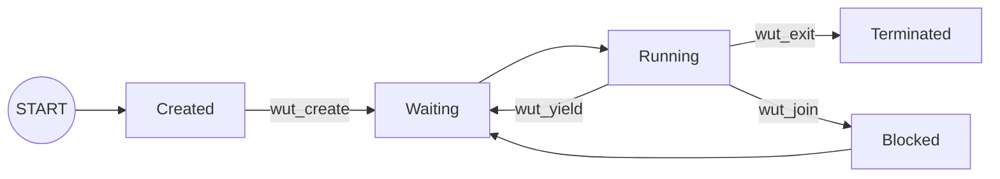

### 17.5.2. Scheduling
Use [Round-Robin](#944-rr-round-robin):
- create a queue (list), run the thread at the front, when it yields at it to the back (FIFO)
  - handle edge cases (e.g. if yields and nothing running, simply run that process again)
- you’ll have to do the context switch (remember, you’ll have to save the registers)
- these are cooperative threads, so they have to be nice (next is preemptive threads)

## 17.6. Thread Races
TLDR:
- `++counter` actually does 3 things (load register, increment, save to register); two simulataneously-executing thread can load the same value by executing the load register part after one another (via context switching), resulting in a race condition
- the fewer executions of thread code (e.g. `for(...; i < 2)` vs. `for(...; i < 10000)`), the less likely a race condition occurs, **but the bug is still there & it can still occur**
- one way to bypass race conditions is have each thread have a local copy of the data (e.g. an array containing an index for each thread), then combine all thread return values after joining
- creating a thread and then immediately joining a thread (i.e. in the same loop; see below) basically just serializes the data processing code (means no data races, but less efficient than single-threading because of the overhead in creating processes):
  - >
    ```c
    // ...
    for (i = 0; i < NUM_THREADS; ++i) {
       pthread_create(...);
       pthread_join(...);
    }
    // ...
    ```

```c
// pthread-datarace.c

#include <pthread.h>
#include <stdio.h>

#define NUM_THREADS 8

static int counter = 0;

void* run(__attribute__((unused)) void* arg) {
    int i;
    for (i = 0; i < 10000; ++i) {
        ++counter;
    }
    return NULL;
}

int main(void) {
    pthread_t thread[NUM_THREADS];
    int i;
    for (i = 0; i < NUM_THREADS; ++i) {
        pthread_create(&thread[i], NULL, &run, NULL);
    }

    for (i = 0; i < NUM_THREADS; ++i) {
        pthread_join(thread[i], NULL);
    }

    printf("counter = %i\n", counter);
    return 0;
}
```

## 17.7. SUMMARY
Both Processes and (Kernel) Threads Enable Parallelization
- Each process can have multiple (kernel) threads
- Most implementations use one-to-one user-to-kernel thread mapping
- The operating system has to manage what happens during a fork, or signals
- We now have synchronization issues


<!--------------------------------{.gray}------------------------------>


<hr style="border:30px solid #FFFF; margin: 100px 0 100px 0; {.gray}"> </hr>


<!--------------------------------{.gray}------------------------------>
<div style="page-break-after: always;"></div>

# 18. Lab 4 Helper Libraries: `ucontext` & `TAILQ` (2023-10-19)
## 18.1. `ucontext-example.c` (Threading Library)

```c
// ucontext-example.c

#include <errno.h> // errno
#include <stddef.h> // NULL
#include <stdio.h> // perror
#include <stdlib.h> // exit
#include <sys/mman.h> // mmap, munmap
#include <sys/signal.h> // SIGSTKSZ
#include <ucontext.h> // getcontext, makecontext, setcontext, swapcontext
#include <valgrind/valgrind.h> // VALGRIND_STACK_REGISTER

static void die(const char* message);
static char* new_stack(void);
static void delete_stack(char* stack);
static void t2_run(void);
static void t1_run(int arg0);

// ---------------------------------------------------

// setup 3 threads
static ucontext_t t0_ucontext;
static ucontext_t t1_ucontext;
static ucontext_t t2_ucontext;

// setup 2 stacks
// no stack for t0 since we will have that has the main thread
static char* t1_stack;
static char* t2_stack;

int main(void) {

    int x = 0;

    /* Initializes the ucontext with the current thread, this copies all its
     * registers, and a pointer to its stack (the default kernel allocated one).
     * Will allow for context-switching.
     */
    getcontext(&t0_ucontext);

    printf("Code after `getcontext` above rexecutes after `setcontext-ing");
    printf("That means this runs again!");

    ++x; // since x was declared before `getcontext`, it will keep incrementing (not resetting back to 0+1)
    printf("%d", x); // prints incremented x


    /* If we setcontext or swapcontext to t0_context, it'll be as if we just
     * returned from that getcontext call. If you uncomment the line below
     * you'll be in an infinite loop! (Assume this line is commented for below code)
     *
     * Sets everything back to how it was when the last time getcontext was called to save registers.
     * Sets everything back to how it was when the last time getcontext was called to save registers.
     */
    /* ASSUME COMMENTED FOR CODE BELOW */ setcontext(&t0_ucontext);

    // ----------------------------------------------------------

    /* Let's create a context that'll execute the run function */
    t1_stack = new_stack();
    getcontext(&t1_ucontext);

    // set stack pointer to point to a specific stack
    t1_ucontext.uc_stack.ss_sp = t1_stack;
    t1_ucontext.uc_stack.ss_size = SIGSTKSZ;

    /* ...UNCOMMENT THE LINE ABOVE, then it will switch to another context when this one ends.
     * By default the process will just exit if a thread makes it to the end
     * of the function.
     *
     * With this `uc_link`, `set_context` is automatically called on the
     * stack of `&t0_ucontext` instead of exiting
     *
     * when t1 exists, switches to thread 2
     * basically just calls `t1_run()` in an infinite loop
     */
    /* ASSUME COMMENTED FOR CODE BELOW */ t1_ucontext.uc_link = &t2_ucontext;

    // with this, we're making the below happen when `setcontext` is used
    // instead of rerunning lines of code from whereever `getcontext` was called
    // (we can also pass as many int arguments as we want)
    makecontext(
        &t1_ucontext, /* The ucontext to use, it must be initialized with
                       * getcontext
                       */
        (void (*)(void)) t1_run, /* The function to start executing */
        1, /* This is how many arguments we're going to pass to the function */
        42 /* This is the argument we pass, we can only pass `int`s */
    );

    // when this line is reached, will call `t1_run()` with arg 42
    // (as setup in `makecontext` above)
    /* ASSUME COMMENTED FOR CODE BELOW */ setcontext(&t1_ucontext);
    // if we don't do anything else, the process will just exit after running
    // `t1_run`; IF WE UNCOMMENT THE LINE ABOVE...

    // ----------------------------------------------------------

    // setup thread 2

    t2_stack = new_stack();
    getcontext(&t2_ucontext);

    t2_ucontext.uc_stack.ss_sp = t2_stack;
    t2_ucontext.uc_stack.ss_size = SIGSTKSZ;

    makecontext(&t2_ucontext,  t2_run,  0);

    /* If we just setcontext here when we run T2 after T1 finishes, we'll
     * get into an infinite loop again. */
    /* ASSUME COMMENTED FOR CODE BELOW */ setcontext(&t1_ucontext);

    swapcontext(&t0_ucontext, &t1_ucontext); // basically starts executing thread 1
    // is equivalent to:
    // `getcontext(&t0_ucontext);` --> t0 would resume here
    // `setcontext(&t1_ucontext);`

    // after running t1_run, uc_link causes an automatic setcontext
    // to thread 2 (t2_run), which deletes the thread 1 stack
    // & setcontexts to t0 (which means it resumes here! Since getcontext was just called on t0 via swapcontext)

    printf("Main is back in town\n");
    delete_stack(t2_stack);

    return 0;
}

// ----------------------------------------------------------

/* prints whatever argument is passed from our `makecontext()` */
static void t1_run(int arg0) {
    printf("Hooray! Got arg0: %d\n", arg0);
    // implicitly does: `setcontext(t0)` if we uncomment `uc_link`
}

static void t2_run(void) {
    printf("T2 should be done, switch back to T0\n");
    delete_stack(t1_stack);
    // will basically inf loop by resuming where `getcontext(&t0_ucontext)`
    // was run at the top of `main()`
    setcontext(&t0_ucontext);
}

// ----------------------------------------------------------

// use to allocate a stack for a new user thread
static char* new_stack(void) {
    char* stack = mmap(
        NULL,
        SIGSTKSZ,
        PROT_READ | PROT_WRITE | PROT_EXEC,
        MAP_ANONYMOUS | MAP_PRIVATE,
        -1,
        0
    );
    if (stack == MAP_FAILED) {
        die("mmap stack failed");
    }
    // `VALGRIND_STACK_REGISTER` is for using valgrind on threads
    // `SIGSTKSZ` is just default stack size
    VALGRIND_STACK_REGISTER(stack, stack + SIGSTKSZ);
    return stack;
}

static void delete_stack(char* stack) {
    if (munmap(stack, SIGSTKSZ) == -1) {
        die("munmap stack failed");
    }
}

static void die(const char* message) {
    int err = errno;
    perror(message);
    exit(err);
}

```

- ***Q:*** what happens if we declare `int x = 0;` after `getcontext()`? {.lr}
- ***A:*** {.lg}
  - `setcontext()` sets the stack pointer to point to whatever stack register (each 4 bytes) it was when `getcontext()` was called
  - when the next line is executed, the stack pointer increments by 4 bytes to get to the next stack register
  - `int x = 0;` overwrites the previous declaration of itself, then it increments, and then it prints, so it will always print 0

***Q:*** is it possible to get a stack overflow error using out setup of `getcontext()` & `setcontext()`? {.lr}
> ***A:*** no; we are not increasing the stack, but merely making the stack pointer point to some stack register that it pointed to previously. {.lg}

## 18.2. `tailq-example.c` (Linked List Library)

Note: only thing that should be in your linked list for the lab is your ready queue.
- You shuold probably not have your process control block as part of a linked list, since all you need to do is keep track of whatever the IDs of the threads are in your waiting or ready queue

```c
// tailq-example.c

#include <assert.h>
#include <stdio.h>
#include <sys/queue.h>

struct list_entry {
    int id;
    TAILQ_ENTRY(list_entry) pointers; // to next, prev
};
// list head doesn't have id,
// just pointers to the front & back of the list
TAILQ_HEAD(list_head, list_entry);
static struct list_head list_head;

void print_list(void) {
    printf("List:");
    struct list_entry* e;
    TAILQ_FOREACH(e, &list_head, pointers) {
        printf(" %d", e->id);
    }
    printf("\n");
}

void print_list_last(void) {
    struct list_entry* e = TAILQ_LAST(&list_head, list_head);
    printf("List last: %d\n", e->id);
}

int main(void) {
    TAILQ_INIT(&list_head);
    assert(TAILQ_EMPTY(&list_head));

    struct list_entry e1;
    e1.id = 1;
    TAILQ_INSERT_TAIL(&list_head, &e1, pointers);
    printf("Inserted 1\n");
    print_list();

    struct list_entry e2;
    e2.id = 2;
    TAILQ_INSERT_TAIL(&list_head, &e2, pointers);
    printf("\nInserted 2\n");
    print_list();
    print_list_last();

    TAILQ_REMOVE(&list_head, &e1, pointers);
    printf("\nRemoved 1\n");
    print_list();

    return 0;
}
```

## 18.3. PRACTICE

***Q:*** Given the following code, what happens if one kernel thread calls `set_contact(&uA)`? {.lr}
```c
// global variables

int i = 0;
ucontext_t uA; // initializaed to execute thread_a()
ucontext_t uB; // initializaed to execute thread_a()
```

```c
void thread_a() {
  int d = 0; // vs. = 1
  while (i < 3) {
    i++;
    printf("A: %s\n", i);
    d = 0;
    getcontext(&uA); // vs. ...(&uB)
    if (d == 0) {
      d = 1;
      setcontext(&uB); // vs. ...(&uA)
    }
  }
}
```

```c
void thread_b() {
  int d = 1; // vs. = 0
  while (i < 3) {
    i++;
    printf("B: %s\n", i);
    d = 0;
    getcontext(&uB); // vs. ...(&uA)
    if (d == 0) {
      d = 1;
      setcontext(&uA); // vs. ...(&uB)
    }
  }
}
```

-  ***A:*** what you need to know... {.lg}
   - `getcontext()` only saves the stack pointer, not anything on the stack
      - `i` is shared between both threads since declared before threads (i.e. global variable)
      - `d` is unique to each thread (since declared in each thread's stack)
   - `uA` & `uB` are *different* ucontext thread variables
     - i.e. `getcontext(&uA)` & `getcontext(&uB)` are saving the stack pointer to two different variables
     - i.e. `setcontext(&uA)` & `setcontext(&uB)` are setting the stack pointer to two different location
   - no `uc_link`, so when the end of a thread is reached, the process simply terminates
   - program prints: {.g}
     ```c
     A: 1
     B: 2
     C: 3
     ```


<!--------------------------------{.gray}------------------------------>


<hr style="border:30px solid #FFFF; margin: 100px 0 100px 0; {.gray}"> </hr>


<!--------------------------------{.gray}------------------------------>
<div style="page-break-after: always;"></div>

# 19. Locks (2023-10-20)
## 19.1. Data Races

Occur whenn two concurrent actions access the same variable **AND** at least one of them is a write operation (i.e. sharing data)

## 19.2. Atomic Instruction/Operation

- Can be assumed to happen all at once
- Cannot be pre-empted (i.e. has either happened or not; cannot execute "halfway")
  - You can be pre-empted between two atomic instructions

## 19.3. Three Address Code (TAC)

- Intermediate code used for analysis and optimization by compilers.
- TAC statements represent one fundamental operation (assume each is atomic)
  - makes it easier to reason about data races & read than assembly
- Statements have the form: $\text{result} := \text{operand}_1\ \text{operator}\ \text{operand}_2$
- **TL;DR - breaks down code into atomic instructions**

### 19.3.1. GIMPLE (TAC used by `gcc`)

- To see the GIMPLE representation of your compilation use:
  - flag `-fdump-tree-gimple`
- To see all the three address code generated by the compiler (gcc) use:
  - flag `-fdump-tree-all`

#### 19.3.1.1. GIMPLE Example

Given the following code in C...
```c
// ...
(*pcount)++;
// ...
```

...we get the following GIMPLE via `gcc`:
```c
D.1 = *pcount;
D.2 = D.1 + 1;
*pcount = D.2;
```

***Q:*** assuming two threads execute `(*pcount)++` once each & initially `*pcount = 0`, what are the possible values of `*pcount`? {.lr}
- ***A:*** `*pcount` can either be **1** (if context switch before last line) or **2** (if context switch after last line) {.lg}
  - considering every possible case, let the read and write from thread 1 be R1 and W1 (R2 and W2 from thread 2); assume no re-ordering of instructions (i.e. always read then write in a thread)
  - when both threads read before any write happens, a data race occurs (resulting in `*pcount` value being as if only one thread executed)

  |     |     |     | Order | `*pcount` |
  | --- | --- | --- | --- | --------- |
  | R1  | W1  | R2  | W2  | 2         |
  | R1  | R2  | W1  | W2  | 1         |
  | R1  | R2  | W2  | W1  | 1         |
  | R2  | W2  | R1  | W1  | 2         |
  | R2  | R1  | W2  | W1  | 1         |
  | R2  | R1  | W1  | W2  | 1         |

## 19.4. Mutexes

A mutex is essentially a lock that can be acquired by a thread before accessing a shared resource, and released after the access is complete.
- used to prevent multiple threads from accessing a shared resource simultaneously

### 19.4.1. STATIC vs. DYNAMIC Mutex Creation

1. Inclusion of attributes requires the dynamic version
```c
// STATIC mutex creation
pthread_mutex_t m1 = PTHREAD_MUTEX_INITIALIZER;

// DYNAMIC mutex creation
pthread_mutex_t m2;
pthread_mutex_init(&m2, NULL); // `NULL` indicates attributes
```

2. Both methods have the same way of freeing mutexes:
```c
pthread_mutex_destroy(&m1);
pthread_mutex_destroy(&m2);
```

### 19.4.2. Critical Sections via `pthread_mutex_lock()` & `pthread_mutex_unlock()`

Everything between mutex lock & unlock is protected (i.e. one thread executing at a time, serially; means no concurrency for that code)
- analogous to using a key & lock system
  - `pthread_mutex_lock()` blocks other threads using a lock that the specific thread only has a key for
  - `pthread_mutex_unlock()` unblocks other threads by opening the lock using its key
- look up `pthread_mutex_trylock()` on your own!

```c
// ...
pthread_mutex_lock(&m1);
// PROTECTED CODE
pthread_mutex_unlock(&m1);
// ...
```

#### 19.4.2.1. How to Choose a Critical Section
1. Safety (aka mutual exclusion)
   - There should only be a single thread in a critical section at once
2. Liveness (aka progress)
   - If multiple threads reach a critical section, one must proceed
   - The critical section can’t depend on outside threads
   - Messing up results in deadlock (threads don't make progress)
3. Bounded waiting (aka starvation-free)
   - A waiting thread must eventually proceed
4. Minimal overhead (aka should be...):
   - Efficient --- don’t want to consume resources while waiting
   - Fair --- want each thread to wait approximately the same time
   - Simple --- should be easy to use, and hard to misuse

### 19.4.3. Lock Preventing Data Race Example
```c
void* run(void* arg) {
    for (int i = 0; i < 100; ++i) {
        pthread_mutex_lock(\&mutex); /*** NEW ***/
        ++counter;
        pthread_mutex_unlock(\&mutex); /*** NEW ***/
    }
}

int main(int argc, char *argv[])
{
    // ...create 8 threads...
    // ...join 8 threads...

    pthread_mutex_destroy(&mutex); /*** NEW ***/
    printf("counter = %i\n", counter);
}
```

### 19.4.4. Similar to Libraries, You Want Layers of Synchronization
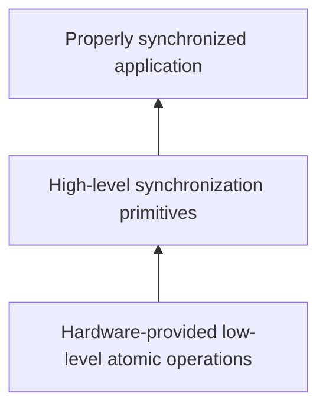

## 19.5. DIY Locks Using a Single CPU/Thread

Assuming a uniprocessor operating system, you could implement locks as follows:

```c
void lock() {
  disable_interrupts();
}
void unlock() {
  enable_interrupts();
}
```

CONS:
- would disable concurrency (assuming it ignores signals and interrupts)
- not going to work on multiprocessors (and OS won’t let you change hardware)

### 19.5.1. DIY Locks in C
```c
void init(int *l) {
  *l = 0; // initially UNLOCKED; i.e. no thread has the lock
}
void lock(int *l) {
  while (*l == 1);  // inf loop waiting for some other thread to unlock

  // *l == 0 at this point, since above loop ended;
  // i.e. no other thread has the lock

  *l = 1; // use current thread to LOCK
}
void unlock(int *l) {
  *l = 0; // UNLOCK the lock
}
```

***Q:*** why is this not recommended? {.lr}
- ***A:***  {.lg}
  - not safe  -- both threads can be in the critical section
  - not efficient -- polling wastes CPU cycles (busy wait)
  - since locking is done manually, we can still end up with the case of R1->R2->W1->W2 causing a data race


<!--------------------------------{.gray}------------------------------>


<hr style="border:30px solid #FFFF; margin: 100px 0 100px 0; {.gray}"> </hr>


<!--------------------------------{.gray}------------------------------>
<div style="page-break-after: always;"></div>

# 20. Locks Implementation (2023-10-24)
## 20.1. Minimal Hardware Requirements for Implementing Locks in Software
Hardware requirements just have to ensure:
1. Loads and stores are atomic
2. Instructions execute in order

Main algorithms used for implementing locks in software (with minimal hardware) are the following, but *they don't scale well & processors execute out-of-order:*{.lr}
- Peterson's algorithm
- Lamport's bakery algorithm

## 20.2. Steps to Build a DIY Lock
### 20.2.1. DIY SPINLOCK via Adding `compare_and_swap()` To Our Naive Implementation
Consider an atomic `compare_and_swap(int *p, int old, int new)` that:
- returns the original value pointed to
- only swaps if the original value equals `old`, and changes it to `new`
- *is a common atomic hardware instruction (`cmpxchq` on x86)*

We can rewrite our DIY lock as follows:
```c
void init(int *l) {
  *l = 0;
}
void lock(int *l) {
  /*** NEW ***/
  // previously: `while (*l == 1);`
  while (compare_and_swap(l, 0, 1));
  /*** NEW ***/
}
void unlock(int *l) {
  *l = 0;
}
```

- PROS: {.lr}
  - no data races (since this is an atomic instruction)
- CONS: {.lg}
  - still inefficient due to polling

***Q:*** what if you can't get the lock? {.lr}
- ***A:*** {.lg}
  - on uniprocessor machine: yield & let the kernel schedule another process (that may free the lock)
  - on multiprocesso machine: try again

### 20.2.2. ADDING A YIELD to our Spinlock
```c
void init(int *l) {
  *l = 0;
}
void lock(int *l) {
  // keep yielding to next thread until unlock
  while (compare_and_swap(l, 0, 1)) {
    /*** NEW ***/
    thread_yield();
    /*** NEW ***/
  }
}
void unlock(int *l) {
  *l = 0;
}
```

- CONS: {.lr}
  - **THUNDERING HERD** problem -- multiple threads may be waiting on the same lock
  - We have no control over who gets the lock next
    - We need to be able to reason about it (FIFO is okay)

### 20.2.3. ADDING A WAIT QUEUE to our Spinlock
```c
void init(int *l) {
  *l = 0;
}
void lock(int *l) {
  while (compare_and_swap(l, 0, 1)) {
    /*** NEW ***/
    // add myself to lock wait queue if I fail compare_and_swap
    thread_sleep(); // sleep until someone else wakes me up (i.e. block until I get waked after a thread unlocks)
    /*** NEW ***/
  }
}
void unlock(int *l) {
  *l = 0;
  /*** NEW ***/
  if (/* threads in wait queue */) {
    // wake up each thread
  }
  /*** NEW ***/
}
```

CONS {.lr}
- [lost wakeup (i.e. thread never gets woken up after `thread_sleep()`)](#20231-lost-wakeup-example)
- [wrong thread gets the lock](#20232-wrong-thread-getting-the-lock-example)

#### 20.2.3.1. Lost Wakeup EXAMPLE
TL;DR -- context-switch to `<<add to wait queue>>` + `thread_sleep()` after `unlock()` so the thread that failed `compare_and_swap()` won't get woken up (i.e. lost wakeup)

Assume we have thread 1 (T1) and thread 2 (T2), thread 2 holds the lock
1. T1 runs & fails `while (compare_and_swap(l, 0, 1)) {`
  - so T1 will run code to add itself to wait queue & sleep, BUT context-switch happens before it can sleep, so...
2. context-switch to T2 that runs all `unlock()` code,
3. context-switch back to T1 that adds itself to the wait queue & sleeps
  - T1 will never get woken up bc T2 unlocked & finished waking all sleeping threads b4 T1 was added to queue!

```c
void lock(int *l) {
  while (compare_and_swap(l, 0, 1)) {
    // add myself to the wait queue
    thread_sleep();
  }
}
void unlock(int *l) {
  *l = 0;
  if (/* threads in wait queue */) {
    // wake up one thread
  }
}
```

#### 20.2.3.2. Wrong Thread Getting the Lock EXAMPLE
TL;DR -- context-switch to `compare_and_swap()` after `unlock()` but before `thread_sleep()` can happen, so the thread that just unlocked the lock can get the lock again (i.e. wrong thread gets the lock)

Assume we have T1, T2, and T3. T2 holds the lock, T3 is in queue.
1. T2 runs line `*l = 0;`,
2. context-switch to T1 which runs line `while (compare_and_swap(l, 0, 1)) {` and succeeds, so now T1 can run the critical section
  - T1 just stole the lock from T3!
  - (recall that `compare_and_swap()` will change the value of `*l` if new/old values are different)
```c
void lock(int *l) {
  while (compare_and_swap(l, 0, 1)) {
    // add myself to the wait queue
    thread_sleep();
  }
}
void unlock(int *l) {
  *l = 0;
  if (/* threads in wait queue */) {
    // wake up one thread
  }
}
```

### 20.2.4. Add LOCK & GUARD Variables to FIX WAIT QUEUE ISSUES
TL;DR -- DIY mutex
- no other thread can interrupt after locking guard
- see [live demo on youtube](https://www.youtube.com/live/LlHnkxgkmoU?si=iU2BX21E3C8WSzVL&t=1133)

```c
typedef struct {  int lock;
                  int guard; // internal spinlock
                  queue_t *q;  } mutex_t;
```
```c
void lock(mutex_t *m) {
  while (
    compare_and_swap(m->guard, 0, 1)
  );
  // =
  // lock(guard)

  // if unlocked...
  if (m->lock == 0) {
    m->lock = 1; // acquire mutex (i.e. lock)
    m->guard = 0; // = unlock(guard)

  // if we cannot lock...
  } else {
    // means locked by another thread
    enqueue(m->q, self); // add to wait queue
    m->guard = 0; // = unlock(guard)
    thread_sleep(); // sleep until someone else wakes me up (i.e. block until I get waked after a thread unlocks)

    // wakeup transfers the lock here
  }
}
```
```c
void unlock(mutex_t *m) {
  while (
    compare_and_swap(m->guard, 0, 1)
  );
  // =
  // lock(guard)

  if (queue_empty(m->q)) {
    // release lock, no one needs it
    m->lock = 0;
  }
  else {
    // direct transfer mutex
    // to next thread
    thread_wakeup(dequeue(m->q));
  }
  m->guard = 0; // = unlock(guard)
}
```

- CONS: {.lr}
  - **still** a data race
    - After a thread calls lock, it could get interrupted right before the `thread_sleep`
    - However, it’s been added to the wait queue, so `thread_wakeup` would try to wake up a thread that’s not sleeping yet (we know it’s about to)
  - We could simply retry the call to `thread_wakeup` until the thread finally calls `thread_sleep`

## 20.3. Read-Write Locks
### 20.3.1. Why Read-Write Locks Can Exist
RECALL: a data race is [when two concurrent actions access the same variable & at least one of them is a **WRITE**](#191-data-races)
- means we could have any many readers as we want (don’t need a mutex as long as nothing writes at the same time)
- need different lock modes for reading and writing

### 20.3.2. Read-Write Lock Details
- With mutexes/spinlocks, you have to lock the data, even for a read since you don’t know if a write could happen; *don't need to lock for reads using read-write locks*
- Reads can happen in parallel, as long as there’s no write
- Multiple threads can hold a read lock (`pthread_rwlock_rdlock`), but only one thread may hold a write lock (`pthread_rwlock_wrlock`) and will wait until the current readers are done

### 20.3.3. Using a Guard Variable to Keep Track of Readers
See [live demo on youtube](https://www.youtube.com/live/LlHnkxgkmoU?si=XAKi8LSdwacQv3J6&t=1872)

```c
typedef struct {
  int nreader;
  lock_t guard;
  lock_t lock;
} rwlock_t;

void write_lock(rwlock_t *l) {
  lock(&l->lock);
}

void write_unlock(rwlock_t *l) {
  unlock(&l->lock);
}
```
```c
void read_lock(rwlock_t *l) {
  lock(&l->guard);
  ++nreader;
  if (nreader == 1) { // first reader locks
    lock(&l->lock);
  }
  unlock(&l->guard);
}

void read_unlock(rwlock_t *l) {
  lock(&l->guard);
  --nreader;
  if (nreader == 0) { // last reader unlocks
    unlock(&l->lock);
  }
  unlock(&l->guard);
}
```

## 20.4. SUMMARY
We should know what data races are, and how to prevent them:
- Mutex or spinlocks are the most straightforward locks
- We need hardware support to implement locks
- We need some kernel support for wake up notifications
- If we know we have a lot of readers, we should use a read-write lock


<!--------------------------------{.gray}------------------------------>


<hr style="border:30px solid #FFFF; margin: 100px 0 100px 0; {.gray}"> </hr>


<!--------------------------------{.gray}------------------------------>
<div style="page-break-after: always;"></div>

# 21. Semaphores (2023-10-26)
## 21.1. Why Semaphores Are Needed: Ordering
Locks:
- **DO**{.lg} enable single threading (mutual exclusion) between `lock` & `unlock` calls
- **DO NOT**{.lr} guarantee ordering of threads

### 21.1.1. Example: Threads Have No Default Order
Threads can execute in any order, so the print output below is non-deterministic.
```c
// ordered-print.c

void* print_first(__attribute__((unused)) void* arg) {
    printf("This is first\n");
    return NULL;
}

void* print_second(__attribute__((unused)) void* arg) {
    printf("I'm going second\n");
    return NULL;
}

int main(__attribute__((unused)) int argc,
         __attribute__((unused)) char *argv[]) {
    pthread_t thread[2];

    pthread_create(&thread[0], NULL, &print_first, NULL);
    pthread_create(&thread[1], NULL, &print_second, NULL);

    pthread_join(thread[0], NULL);
    pthread_join(thread[1], NULL);
    return 0;
}
```
Both outputs are possible:
```
This is first
I'm going second
```
```
I'm going second
This is first
```

***Q:*** how can we modify the code above to make print statements always in order? {.lr}
- ***A:*** join each thread executing a print before creating another thread (in effect making the code sequential instead of concurrent) {.lg}
-
  ```c
  // ordered-print-join.c

  // ...

  int main(__attribute__((unused)) int argc,
           __attribute__((unused)) char *argv[]) {
      pthread_t thread[2];

      pthread_create(&thread[0], NULL, &print_first, NULL);
      pthread_join(thread[0], NULL); // join before creating next thread

      pthread_create(&thread[1], NULL, &print_second, NULL);
      pthread_join(thread[1], NULL);
      return 0;
  }
  ```

### 21.1.2. Example: Unsuccessful DIY Attempt to Maintain Order Using Mutexes
Things that don't work:
- unlocking in a thread but locking in another thread is undefined behaviour
- deadlock if first thread runs to completion before second thread
  - second thread will never run because it is waiting for the first thread to unlock (but first thread already ran unlock code, so it won't run again)

```c

```c
// ordered-print-mutex.c

/*** NEW ***/
static pthread_mutex_t mutex = PTHREAD_MUTEX_INITIALIZER;
/*** NEW ***/

void* print_first(__attribute__((unused)) void* arg) {
    printf("This is first\n");
    /*** NEW ***/
    pthread_mutex_unlock(&mutex);
    /*** NEW ***/
    return NULL;
}

void* print_second(__attribute__((unused)) void* arg) {
    /*** NEW ***/
    pthread_mutex_lock(&mutex);
    // first lock prevents progression beyond second lock
    // until unlock in first thread
    pthread_mutex_lock(&mutex);
    printf("I'm going second\n");
    pthread_mutex_unlock(&mutex); // need to unlock for other threads
    /*** NEW ***/
    return NULL;
}

int main(__attribute__((unused)) int argc,
         __attribute__((unused)) char *argv[]) {
    pthread_t thread[2];

    pthread_create(&thread[0], NULL, &print_first, NULL);
    pthread_create(&thread[1], NULL, &print_second, NULL);

    pthread_join(thread[0], NULL);
    pthread_join(thread[1], NULL);
    return 0;
}
```

- ***Q:*** given the code below, how can we add mutexes to ensure that the words in each sentence are printed in the correct order? {.lr}
  - ↓
    ```c
    // safe-print.c

    void* print_first(__attribute__((unused)) void* arg) {
        write(1, "This ", 5);
        write(1, "is ", 3);
        write(1, "first\n", 6);
        return NULL;
    }

    void* print_second(__attribute__((unused)) void* arg) {
        write(1, "I'm ", 4);
        write(1, "going ", 6);
        write(1, "second\n", 7);
        return NULL;
    }

    int main(__attribute__((unused)) int argc,
             __attribute__((unused)) char *argv[]) {
        pthread_t thread[2];
        pthread_create(&thread[0], NULL, &print_first, NULL);
        pthread_create(&thread[1], NULL, &print_second, NULL);
        pthread_join(thread[0], NULL);
        pthread_join(thread[1], NULL);
        return 0;
    }
    ```
  - e.g. (non-deterministic) output:
    ```
    This I'm going second
    is first
    ```
    ```
    This is I'm first
    going second
    ```

- ***A:***  {.lg}
  ```c
  // safe-print-fixed.c

  #include <pthread.h>
  #include <unistd.h>

  static pthread_mutex_t mutex = PTHREAD_MUTEX_INITIALIZER;

  void* print_first(__attribute__((unused)) void* arg) {
      /*** NEW ***/
      pthread_mutex_lock(&mutex);
      /*** NEW ***/

      write(1, "This ", 5);
      write(1, "is ", 3);
      write(1, "first\n", 6);

      /*** NEW ***/
      pthread_mutex_unlock(&mutex);
      /*** NEW ***/
      return NULL;
  }

  void* print_second(__attribute__((unused)) void* arg) {
      /*** NEW ***/
      pthread_mutex_lock(&mutex);
      /*** NEW ***/

      write(1, "I'm ", 4);
      write(1, "going ", 6);
      write(1, "second\n", 7);

      /*** NEW ***/
      pthread_mutex_unlock(&mutex);
      /*** NEW ***/
      return NULL;
  }

  int main(__attribute__((unused)) int argc,
           __attribute__((unused)) char *argv[]) {
      pthread_t thread[2];
      pthread_create(&thread[0], NULL, &print_first, NULL);
      pthread_create(&thread[1], NULL, &print_second, NULL);
      pthread_join(thread[0], NULL);
      pthread_join(thread[1], NULL);
      return 0;
  }
  ```
  - e.g. (correct, deterministic) output (recall that threads are unordered):
    ```
    This is first
    I'm going second
    ```
    ```
    I'm going second
    This is first
    ```

#### 21.1.2.1. THREAD-SAFE Meaning

**THREAD-SAFE:** code that can be run by multiple threads at the same time without causing problems (value of each call is deterministic)

## 21.2. Semaphore Details

In general, semaphores are used for signaling between processes

- Semaphores have a value that's shared between all threads (& optionally all processes)
  - Think of value as an unsigned integer that is always 0 or greater
  - can be initialized to any value
    - let $x$ be its initial value; then $x$ `wait` calls may occur w/o any `post` calls
    - basically means $x$ threads/processes can run in parallel
- 2 fundamental operations:
  - `wait` -- DECRements the shared value atomically
    - **will not return until shared value is greater than 0!**
    - makes it so that we can never have a negative value
  - `post` -- INCRements the shared value atomically

### 21.2.1. Example: Semaphore Values


## 21.3. Semaphore API

Is similar to [`pthread` Locks](#19-locks-2023-10-20)

```c
#include <semaphore.h>

int sem_init(sem_t *sem, int pshared, unsigned int value)
int sem_destroy(sem_t *sem);

int sem_wait(sem_t *sem);
int sem_trywait(sem_t *sem); // non-blocking wait

int sem_post(sem_t *sem);
```

- all functions return 0 on success
- argument `int pshared` is a boolean
  - Set to 1 to share semaphore between processes (i.e. for IPC, `fork`s)
  - If set to 0, `fork`s will have a unshared, independent copies

### 21.3.1. `sem_init()`
```int sem_init(sem_t *sem, int pshared, unsigned int value)```

Initializes the semaphore pointed to by `sem`. The `pshared` argument determines whether the semaphore is shared between processes (`pshared != 0`) or threads within a process (`pshared == 0`). The `value` argument specifies the initial value of the semaphore.

### 21.3.2. `sem_destroy()`
```int sem_destroy(sem_t *sem)```

Destroys the semaphore pointed to by `sem`. After this call, the semaphore is no longer usable until it is reinitialized by `sem_init`.

### 21.3.3. `sem_wait()`
```int sem_wait(sem_t *sem)```

Decrements (locks) the semaphore pointed to by `sem`. If the semaphore's value is greater than zero, then the decrement proceeds, and the function returns immediately. If the semaphore currently has the value zero, then the call blocks until it becomes possible to perform the decrement.

#### 21.3.3.1. `sem_trywait()`
```int sem_trywait(sem_t *sem)```

Similar to `sem_wait`, but it's non-blocking. If the decrement can't be immediately performed, the function returns an error instead of blocking.

### 21.3.4. `sem_post()`
```int sem_post(sem_t *sem)```

Increments (unlocks) the semaphore pointed to by `sem`. If the semaphore's value consequently becomes greater than zero, then another process or thread blocked in a `sem_wait` call will be woken up and proceed to lock the semaphore.

### 21.3.5. Example: Adding Order to Threads

See [ordered-print.c](#example-threads-have-no-default-order) for how threads can be unordered; see ordering threads using semaphores below for how to fix it:

```c
// ordered-print-fixed.c

static sem_t sem; // global var

void* print_first(__attribute__((unused)) void* arg) {
    printf("This is first\n");
    /*** NEW ***/
    sem_post(&sem); // increment sem
    /*** NEW ***/
    return NULL;
}

void* print_second(__attribute__((unused)) void* arg) {
    /*** NEW ***/
   // will block thread until `sem_post` increments `sem` to 1
   // so that `sem_wait` is able to subtract and get a non-negative result!
    sem_wait(&sem);
    /*** NEW ***/
    printf("I'm going second\n");
    return NULL;
}

int main(__attribute__((unused)) int argc,
         __attribute__((unused)) char *argv[]) {
    /*** NEW ***/
    sem_init(&sem, 0, 0); // `pshared` set to 0 since only 1 process
    /*** NEW ***/

    pthread_t thread[2];
    pthread_create(&thread[0], NULL, &print_first, NULL);
    pthread_create(&thread[1], NULL, &print_second, NULL);
    pthread_join(thread[0], NULL);
    pthread_join(thread[1], NULL);
    return 0;
}
```

- ***Q:*** will the code above work if we set the initial value of `sem` to 1? {.lr}
  ```c
  sem_init(&sem, 0, 1); // originally `sem_init(..., ..., 0);`
  ```
- ***A:*** no; `sem_wait` will return immediately because `sem` is already 1, so `print_second()` can run before `print_first()` runs {.lg}

***Q:*** how can we make the code above work EVEN if we set the initial value of `sem` to 1? {.lr}

> ***A:*** add 2 `sem_wait`s instead of 1 {.lg}

## 21.4. Mutexes Are A Specific Type of Semaphore

- Mutexes are a special case of semaphores
  - `sem_init(&sem, 0, 1);` is equivalent to `pthread_mutex_init(&mutex, NULL);`
  - `sem_wait(&sem);` is equivalent to `pthread_mutex_lock(&mutex);`
  - `sem_post(&sem);` is equivalent to `pthread_mutex_unlock(&mutex);`

```c
// using a semaphore as a mutex with INITIAL VALUE 1

static sem_t sem; /* New */
static int counter = 0;

void* run(void* arg) {
    for (int i = 0; i < 100; ++i) {
        sem_wait(&sem); /* New */
        ++counter;
        sem_post(&sem); /* New */
    }
}

int main(int argc, char *argv[]) {
  sem_init(&sem, 0, 1); /* New */
  /* Initialize, create, and join multiple threads */
  printf("counter = %i\n", counter);
}
```

## 21.5. PRACTICE

See [live demo on youtube](https://www.youtube.com/live/Hb3Oafx5y9I?si=xNMQd5sAxODbikCX&t=1879) of the problem explanation and solution.

- ***Q:*** Can We Come Up with a Solution for a Producer/Consumer Problem? {.lr}
  - Assume you have a circular buffer (each slot is either empty or filled):
    - circular = loops back to beginning at end (i.e. index n points to index 0)
  -
    | [ 0 ] | [ 1 ] | [ ]      | [ ... ] | [ ]      | [ ... ] | [ n - 1 ] |
    | ----- | ----- | -------- | ------- | -------- | ------- | --------- |
    |       |       | ↑        |         | ↑        |         |           |
    |       |       | producer |         | consumer |         |           |
  - will have 2 pools of threads:
    - producers: produce (i.e. write) data & write to buffer (if the buffer is not full)
      - should not overwrite filled slots
    - consumers: consume (i.e. read) data & read from buffer (if the buffer is not empty)
      - should not read from empty slots
  - all producers share an index & all consumers share an index
    - In both cases the index is initially 0 and increases sequentially
    - i.e. for this simplified case, consider no data races
  - after producers fill up all indices, they should wait until a consumer frees one before they can write again (i.e. no overwriting filled slots)


### 21.5.1. Problem 1: Ensure Producers Never Overwrite Filled Slots
```c
static uint32_t buffer_size;

void init_semaphores() {
  sem_init(&empty_slots, 0, /* ? */);
}

void producer() {
  while (/* ... */) {
    /* spend time producing data */
    fill_slot();
  }
}

void consumer() {
  while (/* ... */) {
    empty_slot();
    /* spend time consuming data */
  }
}
```

#### 21.5.1.1. Use a Semaphore to Track the Number of Empty Slots

```c
// use a semaphore to track the number of empty slots

void init_semaphores() {
  sem_init(&empty_slots, 0, buffer_size);
}

void producer() {
  while (/* ... */) {
    /* spend time producing data */
    sem_wait(&empty_slots); /* New */
    fill_slot();
  }
}

void consumer() {
  while (/* ... */) {
    empty_slot();
    sem_post(&empty_slots); /* New */
    /* spend time consuming data */
  }
}
```

### 21.5.2. Problem 2: Ensure Consumers Never Read From Empty Slots
```c
void init_semaphores() {
  sem_init(&empty_slots, 0, buffer_size);
  sem_init(&filled_slots, 0, /* ? */);
}

void producer() {
  while (/* ... */) {
    /* spend time producing data */
    sem_wait(&empty_slots); // decrement num of empty slots
    fill_slot();
  }
}

void consumer() {
   while (/* ... */) {
    empty_slot();
    sem_post(&empty_slots); // increment num of empty slots
    /* spend time consuming data */
  }
}
```

### 21.5.3. Two Semaphores Ensure Proper Order for Producers and Consumers

```c
void init_semaphores() {
  sem_init(&empty_slots, 0, buffer_size); // init num of empty slots to num elements
  sem_init(&filled_slots, 0, 0);          // init num of filled slots to 0
}

void producer() {
  while ( /* ... */ ) {
    /* spend time producing data */
    sem_wait(&empty_slots);
    fill_slot();
    sem_post(&filled_slots); /* New */
  }
}

void consumer() {
  while ( /* ... */ ) {
    sem_wait(&filled_slots); /* New */
    empty_slot();
    sem_post(&empty_slots);
    /* spend time consuming data */
  }
}
```

***Q:*** what happens if we initialize both semaphore values to 0? {.lr}
- ***A:*** deadlock {.lg}
  - both threads will wait forever because they are both waiting for the other to post
    - producer `sem_wait(&empty_slots);` cannot be passed since num empty slots is 0
      - **need this to be nonzero!**
    - consumer `sem_wait(&filled_slots);` cannot be passed since num filled slots is 0

### 21.5.4. FULL SOLUTION

```c
#include <errno.h>
#include <pthread.h>
#include <semaphore.h>
#include <stdbool.h>
#include <stdint.h>
#include <stdio.h>
#include <stdlib.h>
#include <unistd.h>

void empty_slot();
void fill_slot();

static sem_t producer_remaining_sem;
static sem_t consumer_remaining_sem;

static uint32_t producer_ms = 100;
static uint32_t consumer_ms = 120;

static uint32_t buffer_size = 10; // num of elements

static sem_t empty_slots;  // CURR num of empty slots
static sem_t filled_slots; // CURR num of filled slots

void initialize_semaphores() {
    sem_init(&empty_slots, 0, buffer_size); // init num of empty slots to num elements
    sem_init(&filled_slots, 0, 0);          // init num of filled slots to 0
}

void* producer(__attribute__((unused)) void* arg) {
    while (sem_trywait(&producer_remaining_sem) == 0) {
        usleep(producer_ms * 1000); /* simulate doing some work */
        sem_wait(&empty_slots); // wait for at least 1 slot to be empty
        fill_slot();
        sem_post(&filled_slots);
    }
    return NULL;
}

void* consumer(__attribute__((unused)) void* arg) {
    while (sem_trywait(&consumer_remaining_sem) == 0) {
        sem_wait(&filled_slots); // wait for at least 1 slot to be filled
        empty_slot();
        sem_post(&empty_slots);
        usleep(consumer_ms * 1000); /* simulate doing some work */
    }
    return NULL;
}

// ---------------------------------------------------------------------

enum slot {
    SLOT_EMPTY,
    SLOT_FILLED,
};

static enum slot* buffer;
static pthread_mutex_t mutex = PTHREAD_MUTEX_INITIALIZER;
static uint32_t producer_index = 0;
static uint32_t consumer_index = 0;

void fill_slot() {
    pthread_mutex_lock(&mutex);
    printf("Filling slot %u\n", producer_index);
    if (buffer[producer_index] == SLOT_FILLED) {
        printf("  \033[31mSlot is already filled!\033[0m\n");
    }
    buffer[producer_index] = SLOT_FILLED;
    ++producer_index;
    if (producer_index == buffer_size) {
        producer_index = 0;
    }
    pthread_mutex_unlock(&mutex);
}

void empty_slot() {
    pthread_mutex_lock(&mutex);
    printf("Emptying slot %u\n", consumer_index);
    if (buffer[consumer_index] == SLOT_EMPTY) {
        printf("  \033[31mSlot is already empty!\033[0m\n");
    }
    buffer[consumer_index] = SLOT_EMPTY;
    ++consumer_index;
    if (consumer_index == buffer_size) {
        consumer_index = 0;
    }
    pthread_mutex_unlock(&mutex);
}

int main(int argc, char *argv[]) {
    uint32_t num_to_produce = 15;

    if (argc < 3 || argc >= 8) {
        fprintf(stderr,
                "%s <num_producers> <num_consumers> <num_to_produce=%u> <buffer_size=%u> <producer_ms=%u> <consumer_ms=%u>\n",
                argv[0], num_to_produce, buffer_size, producer_ms, consumer_ms);
        return EINVAL;
    }

    /* Initialize the producer threads */
    uint32_t num_producers = atoi(argv[1]);
    if (num_producers <= 0) {
        fprintf(stderr, "Number of producers needs to be greater than 0\n");
        return EINVAL;
    }
    pthread_t* producer_threads = malloc(num_producers * sizeof(pthread_t));

    /* Initialize the consumer threads */
    uint32_t num_consumers = atoi(argv[2]);
    if (num_consumers <= 0) {
        fprintf(stderr, "Number of consumers needs to be greater than 0\n");
        return EINVAL;
    }
    pthread_t* consumer_threads = malloc(num_consumers * sizeof(pthread_t));

    /* Initialize semaphores used to bound the number of calls to fill and empty slots */
    if (argc >= 4) {
        num_to_produce = atoi(argv[3]);
        if (num_to_produce <= 0) {
            fprintf(stderr, "Number to produce needs to be greater than 0\n");
            return EINVAL;
        }
    }
    sem_init(&producer_remaining_sem, 0, num_to_produce);
    sem_init(&consumer_remaining_sem, 0, num_to_produce);

    /* Initialize the buffer */
    if (argc >= 5) {
        buffer_size = atoi(argv[4]);
        if (buffer_size <= 0) {
            fprintf(stderr, "Buffer size needs to be greater than 0\n");
            return EINVAL;
        }
    }
    buffer = malloc(buffer_size * sizeof(enum slot));
    for (uint32_t i = 0; i < buffer_size; ++i) {
        buffer[0] = SLOT_EMPTY;
    }

    /* Set the producer time (in milliseconds) */
    if (argc >= 6) {
        producer_ms = atoi(argv[5]);
        if (producer_ms <= 0 || producer_ms > 1000) {
            fprintf(stderr, "Producer time (in milliseconds) needs to be between 1 and 1000\n");
            return EINVAL;
        }
    }

    /* Set the consumer time (in milliseconds) */
    if (argc >= 7) {
        consumer_ms = atoi(argv[6]);
        if (consumer_ms <= 0 || consumer_ms > 1000) {
            fprintf(stderr, "Consumer time (in milliseconds) needs to be between 1 and 1000\n");
            return EINVAL;
        }
    }

    /* Initialize semaphores used to ensure we don't overrun the buffer */
    initialize_semaphores();

    /* Create the producer threads */
    for (uint32_t i = 0; i < num_producers; ++i) {
        pthread_create(&producer_threads[i], NULL, &producer, NULL);
    }

    /* Create the consumer threads */
    for (uint32_t i = 0; i < num_consumers; ++i) {
        pthread_create(&consumer_threads[i], NULL, &consumer, NULL);
    }

    /* Join the producer threads */
    for (uint32_t i = 0; i < num_producers; ++i) {
        pthread_join(producer_threads[i], NULL);
    }

    /* Join the consumer threads */
    for (uint32_t i = 0; i < num_consumers; ++i) {
        pthread_join(consumer_threads[i], NULL);
    }

    /* Clean up all our resources */
    sem_destroy(&filled_slots);
    sem_destroy(&empty_slots);
    sem_destroy(&producer_remaining_sem);
    sem_destroy(&consumer_remaining_sem);
    free(consumer_threads);
    free(producer_threads);
    free(buffer);

    return 0;
}
```

### 21.5.5. SAMPLE OUTPUTS
Without semaphores (i.e. reading from empty slots & writing to filled slots):
```
Emptying slot 0
  Slot is already empty!
Emptying slot 1
  Slot is already empty!
...
Emptying slot 9
  Slot is already empty!
Filling slot 0
Filling slot 1
...
Filling slot 9
Emptying slot 0
Emptying slot 1
...
```

With semaphores (i.e. no reading from empty slots & no writing to filled slots!):
```
Filled slot 0
Filled slot 1
Emptying slot 0
Emptying slot 1
Filling slot 2
...
```


## 21.6. SUMMARY
Previously we used locks to ensure mutual exclusion, now we can use semaphores to ensure order:
- Semaphores contain an initial value you choose
- You can increment the value using post
- You can decrement the value using wait (it blocks if the current value is 0)
- You still need to be prevent data races


<!--------------------------------{.gray}------------------------------>


<hr style="border:30px solid #FFFF; margin: 100px 0 100px 0; {.gray}"> </hr>


<!--------------------------------{.gray}------------------------------>
<div style="page-break-after: always;"></div>

# 22. Locking (2023-10-27)

## 22.1. Momitors

- Built into some languages for easier use of locking with OOP (e.g. Java)
- Could mark a method as monitored, and let the compiler handle locking
  - An object can only have one thread active in its monitored methods
- It's basically one mutex per object, automatically created by the compiler
  - The compiler inserts calls to lock and unlock for you
- PRO: prevents data races for you
- CON: you only get one mutex per object --> limits code complexity

### 22.1.1. Monitor Example: Java’s `synchronized` Keyword

```java
public class Account {
  int balance;
  public synchronized void deposit(int amount)  { balance += amount; }
  public synchronized void withdraw(int amount) { balance -= amount; }
}

// transforms to (via compiler):

public void deposit(int amount) {
  lock(this.monitor); /* New */
  balance += amount;
  unlock(this.monitor); /* New */
}
public void withdraw(int amount) {
  lock(this.monitor); /* New */
  balance -= amount;
  unlock(this.monitor); /* New */
}
```

## 22.2. Condition Variables (via `pthread`)

Behave like semaphores, but with a queue of waiting threads (instead of just 1 with semaphore) that you can put to sleep or wake up however you want (via `pthread_cond_t *cond`)
- `pthread_cond_wait()` functions add this thread to the queue and put it to sleep (i.e. block it) until woken by `signal` or `broadcast`; **also unlocks the mutex before going to sleep and reacquires it before returning**
  - `pthread_cond_signal` wakes up this thread (i.e. first thread in queue)
  - `pthread_cond_broadcast` wakes up all threads
  - `pthread_cond_timedwait` wakes up this thread after a certain time
```c
#include <pthread.h>

int pthread_cond_init(pthread_cond_t *cond,
                      const pthread_condattr_t *attr)
int pthread_cond_destroy(pthread_cond_t *cond);
int pthread_cond_signal(pthread_cond_t *cond);
int pthread_cond_broadcast(pthread_cond_t *cond);
int pthread_cond_wait(pthread_cond_t *cond, pthread_mutex_t *mutex);
int pthread_cond_timedwait(pthread_cond_t *cond, pthread_mutex_t *mutex,
                           const struct timespec *abstime);
```

### 22.2.1. Condition Variables MUST Be Paired With a Mutex

Since we are managing a queue, we don't want to have data races on the queue itself, so we need a mutex to protect it.

Any calls to `wait` must already hold the mutex
- `signal` and `broadcast` may not

***Q:*** why do any calls to `wait` must already hold the mutex? {.lr}
> ***A:*** needs the mutex as an argument to unlock it before going to sleep (thread will hold the locked `mutex` before and after the call); when it returns back from sleep the first thing it will do is try and reacquire the mutex (still has mutual exclusion) {.lg}

- One mutex can also protect multiple condition variables
  - We'll only consider calls to `wait` and `signal`

### 22.2.2. `pthread_cond_wait()` Does NOT Contain Data Races

Understand what `wait` does (for condition variables!)

The thread calling `pthread_cond_wait()`...
1. ...adds itself to the queue for the condition variable
2. ...unlocks the mutex
3. ...gets blocked (put itself to sleep; can no longer be scheduled to run)

The thread calling `wait` needs another thread to call `signal` or `broadcast`, then if it’s selected...
1. ...it gets unblocked (can be scheduled to run)
2. ...tries to lock the mutex again,`wait` returns when it gets it

#### 22.2.2.1. Example: Using Condition Variables for Producer/Consumer Problem

```c
pthread_mutex_t mutex;
int nfilled;   // single variable to keep track of num slots filled
               // using semaphore would require 2 semaphores
pthread_cond_t has_filled; // cond. var. queue for filled slots
pthread_cond_t has_empty;  // cond. var. queue for filled slots

void producer() {
  // produce data
  pthread_mutex_lock(&mutex); // acquire lock
  while (nfilled == N) { // while all the slots are filled
    // resume at wait call after signal
    pthread_cond_wait(&has_empty, // wait for empty slot
                      &mutex); // put the producer thread to sleep (give mutex after wait)
  }

  // REACHED IF THERE IS AN EMPTY SLOT

  // fill a slot
  ++nfilled;
  pthread_cond_signal(&has_filled); // wake up one of the threads waiting for a filled slot
  pthread_mutex_unlock(&mutex);
}

void consumer() {
  pthread_mutex_lock(&mutex);
  while (nfilled == 0) { // while all the slots are empty
    // resume at wait call after signal
    pthread_cond_wait(&has_filled, // wait for filled slot
                      &mutex); // put the consumer thread to sleep (give mutex after wait)
  }

  // REACHED IF THERE IS A FILLED SLOT

  // empty a slot
  --nfilled;
  pthread_cond_signal(&has_empty); // wake up one of the threads waiting for an empty slot
  pthread_mutex_unlock(&mutex);
  // consume data
}
```

***Q:*** What is the issue with the following code? {.lr}
```c
// Q:

/* Thread 1 */
pthread_mutex_lock(&mutex);
while (!condition) {
  pthread_cond_wait(&cond, &mutex);
}
pthread_mutex_unlock(&mutex);

/* Thread 2 */
condition = true;
pthread_cond_signal(&cond);
```

- ***A:*** idk {.lg}
  - let `condition = false` & condition variable `cond` is empty queue (`[]`) to start off with
  - `pthread_mutex_lock(&mutex);` --- acquire the lock
  - `while (!condition) {` --- check the condition, it's false so we go into the loop
  - <<<SWITCH TO THREAD 2>>>
  - `condition = true;`
  - `pthread_cond_signal(&cond);` --- wake up a thread in the queue (but there is no thread in the queue)
  - <<<SWITCH TO THREAD 1>>>
  - `pthread_cond_wait(&cond, &mutex);` --- add itself to the queue (`[T1]`) and put itself to sleep
  - **PROBLEM:** the thread is asleep and will never wake up because there is no thread in the queue to wake it up = **deadlock**{.lr}

***Q:*** how do we resolve this issue? {.lr}
> ***A:*** make `condition = true;` a critical section **using the same lock as thread 1** {.lg}

```c
// ...

// thread 1 has the lock, so thread 2 will wait until thread 1 releases the lock
// via the `pthread_cond_wait(&cond, &mutex);` call
// i.e. thread 2 will wait until thread 1 is added to the cond. var. queue
pthread_mutex_lock(&mutex);
// after thread 1 unlocks, thread 2 will lock here...
condition = true;
pthread_mutex_unlock(&mutex); // ...which is why we need to unlock it immediately after

pthread_cond_signal(&cond); // wake up thread in queue
```

***Q:*** can we change the `while` loop to an `if` statement? {.lr}
> ***A:*** while it will work for the code above, it does not for the code below; in general it is a good idea to use `while` for the case if the boolean condition can change value multiple times {.lg}

***Q:*** What is the issue with the following code? {.lr}
```c
/* Thread 1 */
pthread_mutex_lock(&mutex);
if (!condition) {
  pthread_cond_wait(&cond, &mutex);
}
// What could happen here?
pthread_mutex_unlock(&mutex);

/* Thread 2 */
pthread_mutex_lock(&mutex);
condition = true;
pthread_mutex_unlock(&mutex);
pthread_cond_signal(&cond);

/* Thread 3 */
pthread_mutex_lock(&mutex);
condition = false;
pthread_mutex_unlock(&mutex);
```

- ***A:*** basically, when we context switch back to right AFTER `pthread_cond_wait(&cond, &mutex);` after thread 2 and 3 run (i.e. `condition` is false), the code is able to continue to the unlock line even instead of looping in the `while (!condition)`, **which is not what we want**{.lr} {.lg}
  - see https://www.youtube.com/live/obmELyGdLyA?si=K9-4aSHTuv89ANOV&t=1672 for a walkthrough

### 22.2.3. Semaphores Are A Special Case of Condition Variables

- Semaphores are a special case of condition variables
  - Semaphores go to sleep when value is 0
  - Semaphores wake up when value is greater than 0
- Is technically possible to implement each one using the other, but can get messy
- For complex conditions condition variables offer much better clarity

## 22.3. Locking Granularity

Locks are needed to prevent data races, but how much of our code should be protected by locks?
- Lock large sections of your program, or divide the locks and use smaller sections?
- What if you want to parallelize your hash table?
- Locks are expensive, so we want to minimize the amount of code protected by locks

### 22.3.1. Considerations for Locking Granularity

1. Overhead
2. Contention
3. Deadlocks

### 22.3.2. Overheads of Locking

The more locks you have, the greater each cost is going to be:

1. Memory allocated
2. Initiailization and destruction time
3. Time for Acquiring and releasing locks

### 22.3.3. Deadlocks

The more locks you have, the more you have to worry about deadlocks.

How many ways can you

#### 22.3.3.1. Conditions for Deadlocks

1. Mutual Exclusion (of course for simple locks)
2. Hold and Wait (you have a lock and try to acquire another)
3. No Preemption (we can't take simple locks away)
4. Circular Wait (waiting for a lock held by another process)

#### 22.3.3.2. Example: High-level Deadlock

Consider two processors trying to get two locks:
```md
**Thread 1**
Get Lock 1
Get Lock 2
Release Lock 2
Release Lock 1
```
```md
**Thread 2**
Get Lock 2
Get Lock 1
Release Lock 1
Release Lock 2
```

***Q:*** how does a deadlock occur above? {.lr}
> ***A:*** Thread 1 gets Lock 1, then Thread 2 gets Lock 2, now they both wait for each other -> **deadlock** {.lg}

#### 22.3.3.3. Ways to Prevent Deadlocks

We can prevent deadlocks by...
1. ...[ensuring order](#preventing-deadlocks-by-ensuring-order)
2. ...[using `trylock`](#preventing-deadlocks-by-using-trylock)

##### 22.3.3.3.1. Preventing Deadlocks by Ensuring Order

This code will not deadlock, you can only get `l2` if you have `l1`
```c
void f1() {
    locktype_lock(&l1);
    locktype_lock(&l2);
    // protected code
    locktype_unlock(&l2);
    locktype_unlock(&ll);
}
```

##### 22.3.3.3.2. Preventing Deadlocks by Using `trylock`

Recall for `pthread` there is a `trylock` function that returns 0 if the lock was acquired, and 1 if it was not (**useful for when we cannot order locks**):

This code will not deadlock, it will give up `l1` if it can’t get `l2`:
```c
void f2() {
    locktype_lock(&l1);
    while (locktype_trylock(&l2) != 0) {
        locktype_unlock(&l1);
        // wait
        locktype_lock(&l1);
    }
    // protected code
    locktype_unlock(&l2);
    locktype_unlock(&ll);
}
```

## 22.4. SUMMARY
We have another tool to ensure order:
- Condition variables are clearer for complex condition signaling
- Locking granularity matters
- You must prevent deadlocks


<!--------------------------------{.gray}------------------------------>


<hr style="border:30px solid #FFFF; margin: 100px 0 100px 0; {.gray}"> </hr>


<!--------------------------------{.gray}------------------------------>
<div style="page-break-after: always;"></div>

# 23. Parallelization Example (2023-10-31)

## 23.1. Overview

This is a simple example of parallelization using pthreads.
- The program simulates a bank with a number of accounts.
- Each account has a unique ID and balance of $1,000.
- The program then performs a number of transfers between random accounts (each transfer is for 10% of the balance of the account).
  - `securely_connect_to_bank()` must be called before starting a transfer
- The program then prints the total balance of all accounts.
- Goal: be faster than 11 seconds

## 23.2. Serial (Inefficient) Code

```c
#include <assert.h>
#include <errno.h>
#include <limits.h>
#include <locale.h>
#include <pthread.h>
#include <stdint.h>
#include <stdio.h>
#include <stdlib.h>
#include <time.h>

#define STARTING_BALANCE 1000
#define NUM_TRANSFERS 10000000
#define NUM_THREADS 8

struct account {
  uint32_t id;
  uint64_t balance;
};

static uint32_t num_accounts = 0;
static struct account* accounts = NULL; // holds all accounts

// simulates time spent connecting to bank
static void securely_connect_to_bank() {
    const int64_t nsec_per_sec = 1000000000;

    /* Calculate the target time to wait until base on the current time */
    struct timespec target;
    clock_gettime(CLOCK_MONOTONIC, &target);
    target.tv_nsec += 1000;
    if (target.tv_nsec >= nsec_per_sec) {
        target.tv_nsec -= nsec_per_sec;
        target.tv_sec += 1;
    }

    /* Busy loop that keeps on reading the time */
    struct timespec current;
    while (1) {
        clock_gettime(CLOCK_MONOTONIC, &current);
        if (current.tv_sec > target.tv_sec) {
            break;
        }
        else if (current.tv_nsec >= target.tv_nsec) {
            break;
        }
    }
}

static void transfer(struct account* from, struct account* to) {
    securely_connect_to_bank();
    uint64_t amount = from->balance / 10;
    from->balance -= amount;
    to->balance += amount;
}

static void* run(void* arg) {
    uint32_t thread_id = *((uint32_t *) arg);
    free(arg);

    return NULL;
}

void check_error(int ret, const char* message) {
    if (ret == 0) {
        return;
    }
    errno = ret;
    perror(message);
    exit(ret);
}

int main(int argc, char* argv[]) {
    if (argc != 2) {
        return EINVAL;
    }

    setlocale(LC_NUMERIC, "");

    /* Get the number of accounts to simulate */
    errno = 0;
    num_accounts = strtoul(argv[1], NULL, 10);
    assert(num_accounts != 0);
    assert(errno == 0);

    size_t accounts_size = num_accounts * sizeof(struct account);
    accounts = malloc(accounts_size);
    assert(accounts != NULL);

    printf("Memory Used: %lu MiB\n", accounts_size / (1024 * 1024));

    for (uint64_t i = 0; i < num_accounts; ++i) {
        accounts[i].id = i + 1;
        accounts[i].balance = STARTING_BALANCE;
    }
    printf("Bank initial funds: $%'lu\n", (uint64_t) STARTING_BALANCE * num_accounts);

    /* INEFFICIENT SERIAL CODE SIMULATING TRANSFERS */
    /* WANT TO PARALLELIZE THIS CODE */
    /* ----------------------------- */
    for (uint64_t i = 0; i < NUM_TRANSFERS; ++i) {
        uint64_t from_index = rand() % num_accounts;
        uint64_t to_index = rand() % num_accounts;
        transfer(&accounts[from_index], &accounts[to_index]);
    }
    /* ----------------------------- */

    uint64_t total_balance = 0;
    for (uint64_t i = 0; i < num_accounts; ++i) {
        total_balance += accounts[i].balance;
    }

    printf("Bank final funds:   $%'lu\n", total_balance);

    free(accounts);

    return 0;
}
```

## 23.3. Parallelized Code (With Data Races)

```c
// ...

static void* run(void* arg) {
  uint32_t thread_id = *((uint32_t *) arg);
  free(arg);

  /* New */
  // for (uint64_t i = 0; i < NUM_TRANSFERS; ++i) {
  for (uint64_t i = 0; i < NUM_TRANSFERS / NUM_THREADS; ++i) {
  /* need to divide workload by num_threads; otherwise no spped again */
    uint64_t from_index = rand() % num_accounts;
    uint64_t to_index = rand() % num_accounts;
    transfer(&accounts[from_index], &accounts[to_index]);
  }
  /* New */

  return NULL;
}

// ...

  pthread_t threads[NUM_THREADS];
  for (uint32_t i = 0; i < NUM_THREADS; ++ i) {
    int* thread_id = malloc(sizeof(uint32_t));
    assert(thread_id != NULL);
    *thread_id = i;
    check_error(pthread_create(&threads[i], NULL, run, thread_id), "pthread_create");
  }

  for (uint32_t i = 0; i < NUM_THREADS; ++ i) {
    check_error(pthread_join(threads[i], NULL), "pthread_join");
  }

  // previously serial code was here

  uint64_t total_balance = 0;
  for (uint64_t i = 0; i < num_accounts; ++i) {
    total_balance += accounts[i].balance;
  }

  printf("Bank final funds:   $%'lu\n", total_balance);

  free(accounts);

  return 0;
```
### 23.3.1. ERRORS

- if we run the code above with 10k accounts each time, the start and final account totals are the same in 15/15 trials
- BUT if we run the code above with 4 accounts, the start and final account totals are wildly different for each of just 3 trials

***Q:*** why? {.lr}
> ***A:*** with 8 threads, a data race can only happen  {.lg}

***Q:*** what issues can happen with the code above? {.lr}
> ***A:*** buffer underflow when transferring money from an account resulting in obscenely large balances {.lg}

#### 23.3.1.1. Thread-safe Code

From reading the `rand()` library function documentation, we know that it is (multi)thread-safe, so we can use it in parallel code and deduce that data races are happening elsewhere.

#### 23.3.1.2. Speeding Up Library Functions From Reading Documentation

Since we know that `rand()`  is thread-safe, we can hypothesize that it likely uses a mutex in the background for each thread; as a result, we can experiment by initializing `rand()` with a specific seed for each thread to avoid the overhead of mutexes (and successfully observe an increase in execution speed).

```c
static void* run(void* arg) {
  uint32_t thread_id = *((uint32_t *) arg);
  free(arg);

  /* New */ uint32_t seed = thread_id + 1; /* New */
  for (uint64_t i = 0; i < NUM_TRANSFERS / NUM_THREADS; ++i) {
    uint64_t from_index = /* New */ rand_r(&seed) /* New */ % num_accounts;
    uint64_t to_index   = /* New */ rand_r(&seed) /* New */ % num_accounts;
    transfer(&accounts[from_index], &accounts[to_index]);
  }

  return NULL;
}
```

#### 23.3.1.3. Solving The Data Race

The `for` loop is independent, and the `seed`, `from_index`, and `to_index` variables are local variables (i.e. thread specific), so the data race must be occurring in the `transfer()` function.

Upon further viewing, we see that the `transfer()` function is not thread-safe because it is accessing the `balance` field of the `from` and `to` accounts without any synchronization and because the code uses non-atomic instructions.

```c
static void transfer(struct account* from, struct account* to) {
  securely_connect_to_bank();
  uint64_t amount = from->balance / 10;
  from->balance -= amount;
  to->balance += amount;
}
```

***Q:*** how can we use mutexes to prevent data races? {.lr}
> ***A:*** start by trying to use one global mutex for the entire bank {.lg}

```c
// ...

static pthread_mutex_t mutex = PTHREAD_MUTEX_INITIALIZER;

// ...

static void transfer(struct account* from, struct account* to) {
  /* New */ pthread_mutex_lock(&mutex); /* New */
  securely_connect_to_bank();
  uint64_t amount = from->balance / 10;
  from->balance -= amount;
  to->balance += amount;
  /* New */ pthread_mutex_unlock(&mutex); /* New */
}
```

***Q:*** how can we speed up this code more (it is not as efficient as possible)? {.lr}
- ***A:*** {.lg}
  - lock after `securely_connect_to_bank();`, since the bank connection is not shared and is not a critical section
  ```c
  static void transfer(struct account* from, struct account* to) {
    securely_connect_to_bank(); // SWITCHED!
    pthread_mutex_lock(&mutex); // SWITCHED!
    uint64_t amount = from->balance / 10;
    from->balance -= amount;
    to->balance += amount;
    pthread_mutex_unlock(&mutex);
  }
  ```
  - use a mutex per account instead of a global mutex
    - works because each thread will be transferring money between different pairs (e.g. thread 1 transfers between accounts 1 and 2, thread 2 transfers between accounts 3 and 4, etc.)

```c
// ...

struct account {
  uint32_t id;
  uint64_t balance;
  /* New */ pthread_mutex_t mutex; /* New */
};

// ...

  for (uint64_t i = 0; i < num_accounts; ++i) {
    accounts[i].id = i + 1;
    accounts[i].balance = STARTING_BALANCE;
    /* NEW */ pthread_mutex_init(&accounts[i].mutex, NULL); /* NEW */
  }

// ...

static void transfer(struct account* from, struct account* to) {
  securely_connect_to_bank();
  /* NEW */
  pthread_mutex_lock(&from->mutex);
  pthread_mutex_lock(&to->mutex);
  /* NEW */
  uint64_t amount = from->balance / 10;
  from->balance -= amount;
  to->balance += amount;
  /* NEW */
  pthread_mutex_lock(&to->mutex);
  pthread_mutex_lock(&from->mutex);
  /* NEW */
}
```

***Q:*** the code hangs, and running `htop` shows very low CPU use, indicating a deadlock; where does this occur and why? {.lr}
- ***A:***  {.lg}
  - consider the case where thread 1 transfers from account 1 to account 2 and thread 2 transfers from account 2 to account 1 (i.e. `transfer(&accounts[0], &accounts[1])` and `transfer(&accounts[1], &accounts[0]`)
  - if thread 1 locks account 1 (`pthread_mutex_lock(&from->mutex)`, where `from` is account 1) and thread 2 locks account 2 (`pthread_mutex_lock(&from->mutex)`, where `from` is account 2), then both threads will be waiting for the other thread to unlock the account it needs to lock in the `pthread_mutex_lock(&to->mutex)` call
  - this is the exact scenario we described for deadlocks previously!


***Q:*** how can we solve this issue? {.lr}
- ***A:***  {.lg}
  - one way could be to lock the accounts in order of their IDs (i.e. lock the account with the lower ID first):

```c
static void transfer(struct account* from, struct account* to) {
  securely_connect_to_bank();
  /* NEW */
  pthread_mutex_t* m1;
  pthread_mutex_t* m2;
  if (from->id < to->id) {
    m1 = &from->mutex;
    m2 = &to->mutex;
  } else {
    m1 = &to->mutex;
    m2 = &from->mutex;
  }
  /* NEW */
  pthread_mutex_lock(/* NEW */ m1 /* NEW */);
  pthread_mutex_lock(/* NEW */ m2 /* NEW */);
  uint64_t amount = from->balance / 10;
  from->balance -= amount;
  to->balance += amount;
  pthread_mutex_lock(/* NEW */ m1 /* NEW */);
  pthread_mutex_lock(/* NEW */ m2 /* NEW */);
}
```

  - we could also use `trylock()` and consequently not have to worry about order (better for code maintainability):

```c
static void transfer(struct account* from, struct account* to) {
  securely_connect_to_bank();
  pthread_mutex_lock(&from->mutex);
  /* NEW */
  while (p_thread_mutex_trylock(&to->mutex) != 0) {
    pthread_mutex_unlock(&from->mutex);
    sched_yield(); // we hold no locks, so yield to next thread
    pthread_mutex_lock(&from->mutex);
  }
  // now we should have both locks
  /* NEW */
  pthread_mutex_lock(&to->mutex);
  uint64_t amount = from->balance / 10;
  from->balance -= amount;
  to->balance += amount;
  pthread_mutex_lock(&to->mutex);
  pthread_mutex_lock(&from->mutex);
}
```

***Q:*** this code still deadlocks; where and why does this occur? {.lr}
- ***A:***  {.lg}
  - consider the case of transfering to the same account (i.e. `transfer(&accounts[0], &accounts[0])`)
  - after `pthread_mutex_lock(&from->mutex);` in a thread, the same thread is waiting for the account that was just locked to be unlocked via `while (p_thread_mutex_trylock(&to->mutex) != 0)`
  - this is a deadlock because the thread is waiting for itself to unlock the account it is waiting to lock (except this time with 100% CPU usage as this code is tried over and over again)
  - can fix by checking if `from` and `to` are the same account and skipping the `while` loop if they are (i.e. non-thread-based solution)

```c
static void transfer(struct account* from, struct account* to) {
  if (from == to) {
    return;
  }

  // ...

}
```

- the code finally works as expected!
- however, while we see a speedup when there are a large amount of accounts, the code actually runs slower when there are only a handful number of accounts (e.g. 8)

***Q:*** why is this? {.lr}
- ***A:*** because the fewer accounts we have, the higher the liklihood that any account is being used by a thread and so another thread won't be able to acquire the lock for that account {.lg}
  - similarly, the more accounts we have, the lower the liklihood that any account is being used by a thread and so another thread will be able to acquire the lock for that account


## 23.4. Tools to Make Thread Debugging Easier
### 23.4.1. `meson` Thread Sanitizer

- can catch circular wait deadlocks
- does not catch all possible race conditions

```bash
$ meson setup -Db_sanitize=thread ...
```

To turn off thread sanitization:

```bash
$ meson setup -Db_sanitize=None ...
```

Can also be used for debugging invalid memory access errors:
```bash
$ meson setup -Db_sanitize=address ...
```